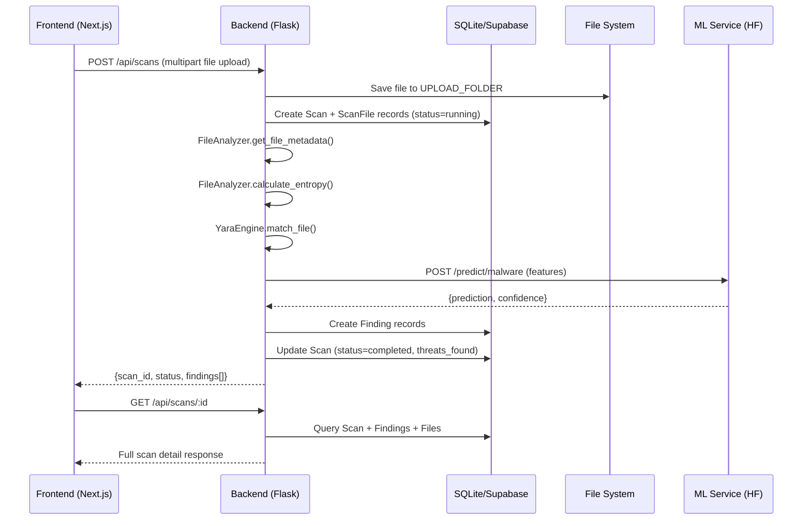
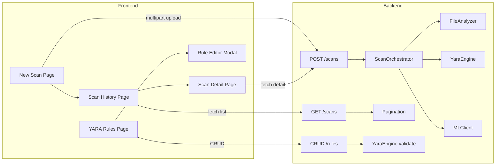

# 🛡️ Phase 3: Core Scanning & YARA Rules — Implementation Plan

> **Phase**: 3 of 5
> **Previous**: Phase 2 (Foundation — Auth, Dashboard Layout, Landing Page) ✅ COMPLETE
> **This Phase**: Implement the core scanning workflow, YARA rule management, backend services, and polished frontend pages
> **Project Root**: `c:\Users\Admin\Desktop\ThreatForge`

---

## 📋 What Phase 2 Already Built (DO NOT REPEAT)

- ✅ Auth backend (`auth.py` — 9 endpoints working)
- ✅ Auth frontend (Login, Signup, AuthContext, ProtectedRoute)
- ✅ Dashboard layout (DashboardShell with sidebar + navbar)
- ✅ Dashboard overview page with charts
- ✅ Landing page with hero, features, stats, footer
- ✅ All ORM models defined (User, Scan, ScanFile, Finding, RuleMatch, YaraRule, ApiKey, ActivityLog)
- ✅ Supabase SQL schema + RLS policies
- ✅ App factory (`__init__.py`) working with db.create_all()
- ✅ ML service (`ml-service/app.py`) with 3 prediction endpoints

---

## 🎯 Phase 3 Goal

After this phase, a user can:
1. Upload files and start a threat scan
2. See real-time scan progress and results
3. View detailed findings with severity levels
4. Create, edit, validate, and test YARA rules
5. Browse scan history with filtering and pagination
6. Delete scans they own

---

## Architecture Flow





---

## Step 1: Backend Services (Implement the TODO stubs)

### 1.1 FileAnalyzer — `backend/app/services/file_analyzer.py`

**OVERWRITE** the entire file. The `calculate_entropy()` method already works — keep it. Implement `get_file_metadata()` and `parse_pe_headers()`.

```python
"""File Analyzer Service"""
import os
import math
import hashlib
from typing import Dict, Any


class FileAnalyzer:
    """Analyze files for metadata, entropy, and PE headers."""

    @staticmethod
    def calculate_entropy(data: bytes) -> float:
        """Calculate Shannon entropy of data."""
        if not data:
            return 0.0
        byte_counts = [0] * 256
        for byte in data:
            byte_counts[byte] += 1
        length = len(data)
        entropy = 0.0
        for count in byte_counts:
            if count > 0:
                probability = count / length
                entropy -= probability * math.log2(probability)
        return round(entropy, 4)

    @staticmethod
    def calculate_file_hash(file_path: str) -> str:
        """Calculate SHA-256 hash of a file."""
        sha256 = hashlib.sha256()
        with open(file_path, 'rb') as f:
            for chunk in iter(lambda: f.read(8192), b''):
                sha256.update(chunk)
        return sha256.hexdigest()

    @staticmethod
    def get_file_metadata(file_path: str) -> Dict[str, Any]:
        """Extract file metadata using python-magic and os.stat."""
        import magic  # python-magic-bin

        stat = os.stat(file_path)
        mime = magic.Magic(mime=True)
        mime_type = mime.from_file(file_path)

        magic_desc = magic.Magic()
        description = magic_desc.from_file(file_path)

        return {
            'filename': os.path.basename(file_path),
            'size': stat.st_size,
            'mime_type': mime_type,
            'magic_description': description,
        }

    @staticmethod
    def parse_pe_headers(file_path: str) -> Dict[str, Any]:
        """Parse PE headers from executable files using pefile."""
        try:
            import pefile
        except ImportError:
            return {'is_pe': False, 'error': 'pefile not installed'}

        try:
            pe = pefile.PE(file_path)
            sections = []
            for section in pe.sections:
                sections.append({
                    'name': section.Name.decode('utf-8', errors='replace').strip('\x00'),
                    'virtual_size': section.Misc_VirtualSize,
                    'raw_size': section.SizeOfRawData,
                    'entropy': round(section.get_entropy(), 4),
                })
            imports = []
            if hasattr(pe, 'DIRECTORY_ENTRY_IMPORT'):
                for entry in pe.DIRECTORY_ENTRY_IMPORT:
                    dll_name = entry.dll.decode('utf-8', errors='replace')
                    funcs = [imp.name.decode('utf-8', errors='replace') for imp in entry.imports if imp.name]
                    imports.append({'dll': dll_name, 'functions': funcs[:20]})

            return {
                'is_pe': True,
                'sections': sections,
                'imports': imports,
                'entry_point': hex(pe.OPTIONAL_HEADER.AddressOfEntryPoint),
                'image_base': hex(pe.OPTIONAL_HEADER.ImageBase),
                'number_of_sections': len(sections),
            }
        except pefile.PEFormatError:
            return {'is_pe': False, 'sections': [], 'imports': [], 'entry_point': None}
        except Exception as e:
            return {'is_pe': False, 'error': str(e)}

    @staticmethod
    def extract_features_for_ml(file_path: str, metadata: Dict, entropy: float, pe_info: Dict) -> list:
        """
        Extract a numeric feature vector for the ML malware classifier.
        Features: [file_size, entropy, is_pe, num_sections, num_imports,
                   has_suspicious_section_name, max_section_entropy, entry_point_int]
        """
        file_size = metadata.get('size', 0)
        is_pe = 1 if pe_info.get('is_pe') else 0
        num_sections = pe_info.get('number_of_sections', 0)
        num_imports = sum(len(imp.get('functions', [])) for imp in pe_info.get('imports', []))

        suspicious_names = ['.rsrc', '.reloc', 'UPX', '.packed']
        has_suspicious = 0
        max_section_entropy = 0.0
        for sec in pe_info.get('sections', []):
            if any(s in sec.get('name', '') for s in suspicious_names):
                has_suspicious = 1
            max_section_entropy = max(max_section_entropy, sec.get('entropy', 0))

        entry_point = 0
        ep_str = pe_info.get('entry_point', '0x0')
        if ep_str:
            try:
                entry_point = int(ep_str, 16)
            except (ValueError, TypeError):
                entry_point = 0

        return [file_size, entropy, is_pe, num_sections, num_imports,
                has_suspicious, max_section_entropy, entry_point]
```

> **Key**: `extract_features_for_ml()` is NEW — it builds the feature vector sent to the ML service.

---

### 1.2 YaraEngine — `backend/app/services/yara_engine.py`

**OVERWRITE** the entire file.

> **IMPORTANT**: `yara-python` may fail to install on Windows. The code handles this with a try/except ImportError fallback that uses regex-based matching instead.

```python
"""YARA Rule Engine Service"""
import os
import re
import tempfile
from typing import List, Dict, Any

try:
    import yara
    YARA_AVAILABLE = True
except ImportError:
    YARA_AVAILABLE = False


class YaraEngine:
    """Compile and match YARA rules against files."""

    def __init__(self, rules_directory: str = None):
        self.rules_directory = rules_directory
        self.compiled_rules = None

    def compile_rules_from_sources(self, rules_list: List[Dict[str, str]]) -> bool:
        """
        Compile YARA rules from a list of {name, content} dicts.
        Returns True if compilation succeeded.
        """
        if not YARA_AVAILABLE:
            return False

        sources = {}
        for rule in rules_list:
            namespace = rule.get('name', 'default')
            sources[namespace] = rule['content']

        try:
            self.compiled_rules = yara.compile(sources=sources)
            return True
        except yara.SyntaxError:
            return False

    def match_file(self, file_path: str, rules_list: List[Dict[str, str]] = None) -> List[Dict[str, Any]]:
        """Match a file against compiled or provided YARA rules."""
        if not YARA_AVAILABLE:
            return self._fallback_match(file_path, rules_list or [])

        if rules_list:
            self.compile_rules_from_sources(rules_list)

        if not self.compiled_rules:
            return []

        try:
            matches = self.compiled_rules.match(file_path)
            results = []
            for match in matches:
                matched_strings = []
                for s in match.strings:
                    for instance in s.instances:
                        matched_strings.append({
                            'offset': instance.offset,
                            'identifier': s.identifier,
                            'data': instance.matched_data.hex()[:100],
                        })
                results.append({
                    'rule_name': match.rule,
                    'namespace': match.namespace,
                    'tags': list(match.tags),
                    'matched_strings': matched_strings,
                })
            return results
        except Exception as e:
            return [{'error': str(e)}]

    def validate_rule(self, rule_content: str) -> Dict[str, Any]:
        """Validate YARA rule syntax."""
        if not YARA_AVAILABLE:
            return self._fallback_validate(rule_content)

        try:
            yara.compile(source=rule_content)
            return {'valid': True, 'errors': []}
        except yara.SyntaxError as e:
            return {'valid': False, 'errors': [str(e)]}
        except Exception as e:
            return {'valid': False, 'errors': [f'Unexpected error: {str(e)}']}

    def test_rule(self, rule_content: str, file_path: str) -> List[Dict[str, Any]]:
        """Test a single rule against a file."""
        temp_rules = [{'name': 'test_rule', 'content': rule_content}]
        return self.match_file(file_path, temp_rules)

    @staticmethod
    def _fallback_validate(rule_content: str) -> Dict[str, Any]:
        """Basic regex validation when yara-python is not available."""
        errors = []
        if not re.search(r'rule\s+\w+', rule_content):
            errors.append('Missing rule declaration (expected: rule RuleName { ... })')
        if rule_content.count('{') != rule_content.count('}'):
            errors.append('Mismatched braces')
        if 'condition:' not in rule_content:
            errors.append('Missing condition section')
        return {'valid': len(errors) == 0, 'errors': errors, 'fallback': True}

    @staticmethod
    def _fallback_match(file_path: str, rules_list: List[Dict[str, str]]) -> List[Dict[str, Any]]:
        """Basic string matching fallback when yara-python is unavailable."""
        results = []
        try:
            with open(file_path, 'rb') as f:
                content = f.read()
            for rule in rules_list:
                string_matches = re.findall(
                    r'strings:\s*(.*?)(?:condition:|$)',
                    rule.get('content', ''), re.DOTALL
                )
                if string_matches:
                    for match_block in string_matches:
                        patterns = re.findall(r'\$\w+\s*=\s*"([^"]+)"', match_block)
                        for pattern in patterns:
                            if pattern.encode() in content:
                                results.append({
                                    'rule_name': rule.get('name', 'unknown'),
                                    'namespace': 'fallback',
                                    'tags': [],
                                    'matched_strings': [{'identifier': pattern, 'data': pattern}],
                                })
        except Exception:
            pass
        return results
```

---

### 1.3 ScanOrchestrator — `backend/app/services/scanner.py`

**OVERWRITE** the entire file.

```python
"""Scan Orchestrator Service"""
import os
import time
from typing import Dict, Any, List
from datetime import datetime, timezone

from .file_analyzer import FileAnalyzer
from .yara_engine import YaraEngine
from .ml_client import MLClient


class ScanOrchestrator:
    """Orchestrates the complete scan workflow for a single file."""

    def __init__(self):
        self.file_analyzer = FileAnalyzer()
        self.yara_engine = YaraEngine()

    def run_scan(self, file_path: str, options: Dict[str, Any],
                 yara_rules: List[Dict[str, str]] = None,
                 ml_service_url: str = None) -> Dict[str, Any]:
        """
        Execute a full scan on a file.

        Steps:
        1. Extract file metadata (hash, type, size)
        2. Calculate entropy
        3. Parse PE headers (if applicable)
        4. Run YARA rules
        5. Send to ML models (if enabled and reachable)
        6. Combine results and determine severity
        """
        start_time = time.time()
        findings = []

        # Step 1: File metadata
        metadata = self.file_analyzer.get_file_metadata(file_path)
        file_hash = self.file_analyzer.calculate_file_hash(file_path)

        # Step 2: Entropy
        with open(file_path, 'rb') as f:
            file_data = f.read()
        entropy = self.file_analyzer.calculate_entropy(file_data)

        # High entropy finding
        if entropy > 7.5:
            findings.append({
                'finding_type': 'entropy',
                'severity': 'medium',
                'title': f'High entropy detected ({entropy})',
                'description': f'File has entropy of {entropy}/8.0, suggesting packed or encrypted content.',
                'confidence': min(entropy / 8.0, 1.0),
                'details': {'entropy': entropy, 'threshold': 7.5},
                'remediation': 'Investigate if the file is packed with UPX or similar. High entropy alone is not malicious.',
            })

        # Step 3: PE headers
        pe_info = self.file_analyzer.parse_pe_headers(file_path)
        if pe_info.get('is_pe'):
            for section in pe_info.get('sections', []):
                if section.get('entropy', 0) > 7.2:
                    findings.append({
                        'finding_type': 'pe_header',
                        'severity': 'high',
                        'title': f'Suspicious PE section: {section["name"]}',
                        'description': f'Section {section["name"]} has entropy {section["entropy"]}, likely packed.',
                        'confidence': 0.75,
                        'details': {'section': section},
                        'remediation': 'Unpack the executable and re-analyze.',
                    })

        # Step 4: YARA rules
        yara_matches = []
        if yara_rules:
            yara_matches = self.yara_engine.match_file(file_path, yara_rules)
            for match in yara_matches:
                if 'error' in match:
                    continue
                findings.append({
                    'finding_type': 'yara',
                    'severity': 'high',
                    'title': f'YARA match: {match["rule_name"]}',
                    'description': f'File matched YARA rule "{match["rule_name"]}".',
                    'confidence': 0.9,
                    'details': {'match': match},
                    'remediation': 'Review the matched rule and quarantine if necessary.',
                })

        # Step 5: ML prediction
        ml_prediction = None
        if options.get('enable_ml', True) and ml_service_url:
            try:
                ml_client = MLClient(base_url=ml_service_url)
                if ml_client.health_check():
                    features = self.file_analyzer.extract_features_for_ml(
                        file_path, metadata, entropy, pe_info
                    )
                    ml_prediction = ml_client.predict_malware({'features': features})

                    if ml_prediction and ml_prediction.get('prediction') not in (None, 'unknown'):
                        pred = ml_prediction['prediction']
                        conf = ml_prediction.get('confidence', 0)
                        if str(pred) == '1' or str(pred).lower() == 'malware':
                            severity = 'critical' if conf > 0.9 else 'high' if conf > 0.7 else 'medium'
                            findings.append({
                                'finding_type': 'malware',
                                'severity': severity,
                                'title': f'ML Malware Detection (confidence: {conf:.1%})',
                                'description': f'Machine learning model classified this file as malicious with {conf:.1%} confidence.',
                                'confidence': conf,
                                'details': {'ml_response': ml_prediction},
                                'remediation': 'Quarantine immediately. Do not execute this file.',
                            })
            except Exception:
                ml_prediction = {'error': 'ML service unreachable'}

        # Step 6: Calculate overall threat score
        duration = round(time.time() - start_time, 2)
        threat_score = self._calculate_threat_score(findings)

        return {
            'metadata': {**metadata, 'sha256': file_hash},
            'entropy': entropy,
            'pe_info': pe_info,
            'yara_matches': yara_matches,
            'ml_prediction': ml_prediction,
            'findings': findings,
            'threat_score': threat_score,
            'duration_seconds': duration,
        }

    @staticmethod
    def _calculate_threat_score(findings: List[Dict]) -> int:
        """0-100 threat score based on findings."""
        if not findings:
            return 0
        severity_weights = {'critical': 40, 'high': 25, 'medium': 10, 'low': 3, 'info': 1}
        score = 0
        for f in findings:
            weight = severity_weights.get(f.get('severity', 'info'), 1)
            confidence = f.get('confidence', 0.5)
            score += weight * confidence
        return min(int(score), 100)
```

---

### 1.4 MLClient — `backend/app/services/ml_client.py`

**NO CHANGES NEEDED** — the existing `ml_client.py` is already fully implemented with `predict_malware()`, `predict_steganography()`, `predict_network()`, and `health_check()`. The only change is making `base_url` not depend on Flask `current_app` (to work outside request context):

```python
"""ML Client Service — HTTP client to Hugging Face Space"""
import os
import requests
from typing import Dict, Any


class MLClient:
    """Client for communicating with the ML inference service on HF Spaces."""

    def __init__(self, base_url: str = None):
        self.base_url = base_url or os.environ.get('ML_SERVICE_URL', 'http://localhost:7860')

    def predict_malware(self, features: Dict[str, Any]) -> Dict[str, Any]:
        """Send file features to malware classifier."""
        try:
            response = requests.post(f'{self.base_url}/predict/malware', json=features, timeout=30)
            response.raise_for_status()
            return response.json()
        except requests.RequestException as e:
            return {'error': str(e), 'prediction': None}

    def predict_steganography(self, image_data: Dict[str, Any]) -> Dict[str, Any]:
        """Send image data to steganography detector."""
        try:
            response = requests.post(f'{self.base_url}/predict/steganography', json=image_data, timeout=30)
            response.raise_for_status()
            return response.json()
        except requests.RequestException as e:
            return {'error': str(e), 'prediction': None}

    def predict_network(self, network_features: Dict[str, Any]) -> Dict[str, Any]:
        """Send network features to anomaly detector."""
        try:
            response = requests.post(f'{self.base_url}/predict/network', json=network_features, timeout=30)
            response.raise_for_status()
            return response.json()
        except requests.RequestException as e:
            return {'error': str(e), 'prediction': None}

    def health_check(self) -> bool:
        """Check if ML service is healthy."""
        try:
            response = requests.get(f'{self.base_url}/health', timeout=5)
            return response.status_code == 200
        except requests.RequestException:
            return False
```

> **Change**: Replaced `current_app.config.get(...)` with `os.environ.get(...)` so the client works both inside and outside Flask request context (important for the ScanOrchestrator).

---
