<p align="center">
  
  
  
</p>

<h1 align="center">🛡️ ThreatForge</h1>

<p align="center">
  <strong>AI-Powered Cybersecurity Threat Analysis Platform</strong><br/>
  <sub>Detect malware, steganography, and network anomalies using Machine Learning + YARA Rules + Shannon Entropy Analysis</sub>
</p>

<p align="center">
  <a href="#-features">Features</a> •
  <a href="#%EF%B8%8F-architecture">Architecture</a> •
  <a href="#-tech-stack">Tech Stack</a> •
  <a href="#-quick-start">Quick Start</a> •
  <a href="#-database-schema">Database</a> •
  <a href="#-security">Security</a> •
  <a href="#-api-reference">API</a> •
  <a href="#-screenshots">Screenshots</a>
</p>

---

## 🎯 Overview

**ThreatForge** is a hybrid threat intelligence platform that combines deterministic **signature-based detection** (YARA rules) with probabilistic **machine learning models** (Random Forest ensemble classifiers) to analyze uploaded files for malware, hidden steganographic payloads, and network traffic anomalies. It achieves an **F1-Score of 0.94** and an **AUC of 0.97** on the SOREL-20M benchmark dataset.

The platform implements a **defense-in-depth** strategy through four analysis layers:

| Layer | Method | Technique |
| :--- | :--- | :--- |
| **Layer 1** | Deterministic | YARA signature matching with O(1) hash lookups |
| **Layer 2** | Probabilistic | Random Forest classifier (100 estimators, 79 PE features) |
| **Layer 3** | External Intel | VirusTotal API cross-referencing |
| **Layer 4** | Heuristic | Shannon entropy analysis for obfuscation detection |

---

## ✨ Features

### Core Capabilities

| Feature | Description |
| :--- | :--- |
| 🔬 **Multi-Engine File Scanner** | Drag-and-drop file upload with 6 configurable scan modules (ML, Stego, YARA, PCAP, Entropy, PE Header) |
| 🤖 **ML Malware Detection** | Random Forest classifier trained on PE header features (imports, sections, entropy) |
| 🖼️ **Steganography Detection** | ML-based pixel analysis for detecting hidden data within images |
| 📡 **Network Traffic Analysis** | Anomaly detection on PCAP files for C2 communications and data exfiltration |
| 📏 **YARA Rule Engine** | Full CRUD management — create, edit, enable/disable, delete custom rules + built-in library |
| 📊 **Real-Time Dashboard** | 8 interactive widgets: threat gauge, severity chart, threat distribution, scan activity, geographic map |
| 📄 **PDF Report Export** | Generate and download comprehensive PDF reports with jsPDF |
| 🔗 **Shareable Reports** | Generate public share links (token-based, no auth required) for external stakeholders |
| 🔐 **MFA Authentication** | TOTP-based two-factor auth with QR enrollment + backup recovery codes |
| 🌐 **Google OAuth 2.0** | Single sign-on with Google accounts |
| 🔔 **Notifications** | In-app, email, and push notifications for scan results and threat alerts |
| 🌙 **Dark/Light Mode** | System-aware theme toggle with persistent preference |
| 📱 **Responsive Design** | Optimized for desktop, tablet, and mobile viewports |

### Dashboard Widgets

```
┌─────────────────────────────────────────────────────────────────┐
│  👋 Welcome back, [User]                         🔔  🌙  👤   │
├──────────┬──────────┬──────────┬──────────────────────────────── │
│ Total    │ Threats  │ Critical │ Clean Rate                     │
│ Scans: 47│ Found: 12│ Issues: 3│ 93.2%                         │
├──────────┴──────────┴──────────┴────────────────────────────────│
│ 🎯 Circular     │ 📊 Severity      │ 🍩 Threat Distribution    │
│ Threat Gauge    │ Breakdown Chart  │ Donut Chart (by type)      │
│ Score: 72/100   │ C:3 H:4 M:3 L:2 │ Malware/Stego/YARA/Net    │
├─────────────────┴──────────────────┴────────────────────────────│
│ 📈 Scan Activity (Line Chart) │ 📋 Recent Scans │ 🗺️ Threat Map│
│ Weekly scan trends over time  │ Latest scan list │ Leaflet geo  │
└───────────────────────────────┴─────────────────┴───────────────┘
```

---

## 🏗️ Architecture

ThreatForge uses a **Service-Oriented Micro-Monolith** architecture — component isolation at the code level with transactional consistency at the data level.

```mermaid
graph TB
    subgraph Client["Client Tier"]
        Browser["🌐 Web Browser"]
        APIClient["🔧 API Scripts"]
    end

    subgraph App["Application Tier"]
        Next["Next.js 16 (Port 3000)
        SSR + App Router"]
        Flask["Flask API (Port 5000)
        Auth + Scans + Rules"]
        ML["FastAPI ML (Port 7860)
        Malware + Stego + Network"]
    end

    subgraph Data["Data Tier"]
        Postgres["PostgreSQL 16
        (Supabase)"]
        Redis["Redis 7
        (Cache + Broker)"]
        S3["S3 Storage
        (File Uploads)"]
    end

    subgraph Observe["Observability"]
        Prometheus["Prometheus"]
        Loki["Loki"]
        Tempo["Tempo"]
        Grafana["Grafana"]
    end

    Browser -->|"HTTPS/TLS 1.3"| Next
    APIClient -->|"REST + JWT"| Flask
    Next -->|"API Calls"| Flask
    Flask -->|"HTTP POST /predict"| ML
    Flask -->|"SQL"| Postgres
    Flask -->|"Pub/Sub"| Redis
    Flask -->|"Upload"| S3
    Flask --> Prometheus
    ML --> Prometheus
    Prometheus --> Grafana
    Loki --> Grafana
    Tempo --> Grafana
```



### Service Map

| Service | Directory | Deploy Target | Port | Purpose |
| :--- | :--- | :--- | :--- | :--- |
| **Frontend** | `frontend/` | Vercel Edge | 3000 | Next.js 16 SSR + React 19 SPA |
| **Backend API** | `backend/` | Railway PaaS | 5000 | Flask REST API (auth, scans, rules, orchestration) |
| **ML Service** | `ml-service/` | Hugging Face Spaces | 7860 | FastAPI ML inference (malware, stego, network) |

### Request Lifecycle


---

## 🧰 Tech Stack

### Frontend

| Technology | Version | Purpose |
| :--- | :--- | :--- |
| **Next.js** | 16.1.6 | App Router, SSR, RSC (React Server Components) |
| **React** | 19.2.3 | UI library with React Compiler auto-memoization |
| **Tailwind CSS** | 4.x | Utility-first styling |
| **Framer Motion** | 12.x | Animations and micro-interactions |
| **Chart.js** | 4.5.1 | Dashboard charts (bar, donut, line) |
| **Leaflet** | 1.9.4 | Interactive geographic threat map |
| **Supabase SSR** | 0.8.x | Auth + real-time subscriptions |
| **jsPDF** | latest | Client-side PDF report generation |
| **Zod** | 4.3.6 | Runtime schema validation |
| **Sonner** | latest | Toast notification system |

### Backend

| Technology | Version | Purpose |
| :--- | :--- | :--- |
| **Python** | 3.11 | Core runtime (+25% performance via PEP 659) |
| **Flask** | 3.1.0 | REST API framework with Blueprint architecture |
| **Gunicorn** | 23.0.0 | WSGI server (pre-fork worker model) |
| **Gevent** | 24.11.1 | Async I/O via greenlet coroutines |
| **Flask-JWT-Extended** | 4.7.1 | JWT authentication (HMAC-SHA256) |
| **Flask-SocketIO** | 5.5.1 | WebSocket real-time updates |
| **YARA-Python** | 4.5.1 | Signature-based threat detection |
| **pefile** | 2024.8 | PE header parsing and analysis |
| **PyOTP** | 2.9.0 | TOTP-based MFA (RFC 6238) |
| **Resend** | 2.7.0 | Transactional email delivery |
| **Flask-Limiter** | latest | Rate limiting (Token Bucket algorithm) |

### ML Service

| Technology | Version | Purpose |
| :--- | :--- | :--- |
| **FastAPI** | 0.109 | High-performance async API |
| **Uvicorn** | 0.27 | ASGI server |
| **scikit-learn** | 1.4 | Random Forest, Isolation Forest classifiers |
| **NumPy** | 1.26 | Feature vector computation |
| **Pandas** | latest | Data preprocessing |
| **Pillow** | 10.2 | Image analysis for steganography |
| **joblib** | 1.3.2 | Model serialization/deserialization |
| **SlowAPI** | 0.1.9 | Rate limiting for ML endpoints |

### Infrastructure & Data

| Technology | Purpose |
| :--- | :--- |
| **PostgreSQL 16** (Supabase) | Primary datastore with RLS (25+ policies) |
| **Redis 7** | Message broker + cache layer |
| **Docker** | Multi-stage containerized builds |
| **Docker Compose** | Local orchestration (all services) |
| **Vercel** | Frontend edge deployment |
| **Railway** | Backend PaaS deployment |
| **Hugging Face Spaces** | ML service hosting |
| **GitHub Actions** | CI/CD pipelines |
| **OpenTelemetry** | Distributed tracing (W3C Trace Context) |
| **Prometheus + Grafana** | Metrics monitoring and visualization |

---

## 🚀 Quick Start

### Prerequisites

- **Node.js** 20+
- **Python** 3.11+
- **Docker & Docker Compose** (recommended)
- **Supabase** account (for database + auth)

### Option 1: Docker Compose (Recommended)

```bash
# Clone the repository
git clone https://github.com/krishna0605/ThreatForge.git
cd ThreatForge

# Configure environment
cp .env.example .env
# Edit .env with your Supabase URL, keys, JWT secret, etc.

# Start all services
docker-compose up --build
```

| Service | URL |
| :--- | :--- |
| Frontend | http://localhost:3000 |
| Backend API | http://localhost:5000 |
| ML Service | http://localhost:7860 |

### Option 2: Manual Setup

**Frontend:**
```bash
cd frontend
npm install
npm run dev
# → http://localhost:3000
```

**Backend:**
```bash
cd backend
pip install -r requirements.txt
python -c "from app import create_app; create_app().run(debug=True)"
# → http://localhost:5000
```

**ML Service:**
```bash
cd ml-service
pip install -r requirements.txt
python app.py
# → http://localhost:7860
```

### Environment Variables

| Variable | Required | Description |
| :--- | :--- | :--- |
| `SUPABASE_URL` | ✅ | Your Supabase project URL |
| `SUPABASE_ANON_KEY` | ✅ | Supabase anonymous (public) key |
| `SUPABASE_SERVICE_KEY` | ✅ | Supabase service role key (backend only) |
| `SECRET_KEY` | ✅ | Flask secret key for sessions |
| `JWT_SECRET_KEY` | ✅ | HMAC-SHA256 signing key for JWT tokens |
| `REDIS_URL` | ⬚ | Redis connection string (default: localhost:6379) |
| `ML_SERVICE_URL` | ⬚ | ML service endpoint (default: http://localhost:7860) |
| `RESEND_API_KEY` | ⬚ | Resend API key for email notifications |

---

## 💾 Database Schema

ThreatForge uses **14 tables** across 5 functional domains, following **Third Normal Form (3NF)** with full ACID compliance.


### Additional Tables

| Table | Purpose |
| :--- | :--- |
| `rule_matches` | YARA rule match details (matched strings, byte offsets) |
| `api_keys` | API key management (SHA-256 hashed) |
| `user_sessions` | Active session tracking (JWT ID, browser, IP) |
| `security_preferences` | Per-user security toggles (login alerts, auto-lock) |
| `ip_whitelist` | IP-based API access control |
| `audit_logs` | Security audit trail |
| `activity_logs` | User activity feed |
| `notification_preferences` | Per-channel notification toggles |

### Row-Level Security

All 14 tables are protected by **25+ RLS policies** ensuring complete tenant isolation:

```sql
-- Example: Users can only view their own scans
CREATE POLICY "Users can view own scans"
    ON public.scans FOR SELECT
    USING (auth.uid() = user_id);
```

---

## 🔐 Security

| Layer | Implementation | Details |
| :--- | :--- | :--- |
| **Password Storage** | Argon2id | Memory-hard KDF (64MB, 3 iterations, 4 parallel lanes) |
| **Authentication** | JWT (HMAC-SHA256) | 15-min access tokens, 30-day refresh tokens |
| **MFA** | TOTP (RFC 6238) | 6-digit codes, 30s window, backup recovery codes |
| **OAuth** | Google OAuth 2.0 | SSO via Supabase Auth |
| **Transport** | TLS 1.3 | Forward secrecy with ECDHE, AEAD ciphers only |
| **Authorization** | Row-Level Security | Database-enforced tenant isolation (25+ policies) |
| **Rate Limiting** | Token Bucket | Flask-Limiter (backend) + SlowAPI (ML service) |
| **API Security** | JWT + API Keys | SHA-256 hashed keys with expiration |
| **Architecture** | Zero Trust (NIST SP 800-207) | Verify explicitly, least privilege, assume breach |

---

## 📡 API Reference

### Authentication

| Method | Endpoint | Description |
| :--- | :--- | :--- |
| `POST` | `/api/auth/register` | Create new account |
| `POST` | `/api/auth/login` | Login (returns JWT or temp_token if MFA) |
| `POST` | `/api/auth/verify-mfa` | Verify TOTP code |
| `POST` | `/api/auth/google` | Exchange Supabase token for backend JWT |
| `POST` | `/api/auth/refresh` | Refresh access token |
| `POST` | `/api/auth/logout` | Revoke session |
| `POST` | `/api/auth/forgot-password` | Send password reset email |

### Scans

| Method | Endpoint | Description |
| :--- | :--- | :--- |
| `POST` | `/api/scans` | Upload file and start scan (multipart/form-data) |
| `GET` | `/api/scans` | List all scans for authenticated user |
| `GET` | `/api/scans/:id` | Get scan details with findings |
| `DELETE` | `/api/scans/:id` | Delete a scan and all findings |

### YARA Rules

| Method | Endpoint | Description |
| :--- | :--- | :--- |
| `GET` | `/api/rules` | List all rules (builtin + custom) |
| `POST` | `/api/rules` | Create new YARA rule |
| `GET` | `/api/rules/:id` | Get rule details |
| `PUT` | `/api/rules/:id` | Update rule content |
| `DELETE` | `/api/rules/:id` | Delete custom rule |
| `POST` | `/api/rules/:id/toggle` | Enable/disable a rule |
| `POST` | `/api/rules/validate` | Validate YARA syntax |

### Reports & Sharing

| Method | Endpoint | Description |
| :--- | :--- | :--- |
| `GET` | `/api/reports` | List all reports |
| `POST` | `/api/scans/:id/share` | Generate shareable link |
| `GET` | `/api/shared/:token` | View shared report (public, no auth) |

### ML Service Endpoints

| Method | Endpoint | Description |
| :--- | :--- | :--- |
| `POST` | `/predict/malware` | Malware classification (Random Forest) |
| `POST` | `/predict/steganography` | Steganography detection |
| `POST` | `/predict/network` | Network anomaly detection (Isolation Forest) |
| `GET` | `/health` | Health check |
| `GET` | `/metrics` | Prometheus metrics |

### Dashboard & Notifications

| Method | Endpoint | Description |
| :--- | :--- | :--- |
| `GET` | `/api/dashboard/stats` | Aggregate threat metrics |
| `GET` | `/api/dashboard/activity` | Scan activity timeline |
| `GET` | `/api/dashboard/severity` | Severity breakdown |
| `GET` | `/api/notifications` | List notifications |
| `POST` | `/api/notifications/read-all` | Mark all as read |

---

## 🗂️ Project Structure

```
ThreatForge/
├── frontend/                    # Next.js 16 Web Application
│   ├── src/
│   │   ├── app/
│   │   │   ├── (auth)/          # Auth pages (login, signup, forgot-password)
│   │   │   ├── (dashboard)/     # Protected pages
│   │   │   │   ├── dashboard/   # Main dashboard with widgets
│   │   │   │   ├── scans/       # Scan history, new scan, scan detail
│   │   │   │   ├── rules/       # YARA rules management
│   │   │   │   ├── reports/     # Report management with bulk actions
│   │   │   │   ├── settings/    # General, Security, Notifications tabs
│   │   │   │   └── threats/     # Threat intelligence (feed, map)
│   │   │   └── (public)/        # Landing page, features, docs
│   │   ├── components/
│   │   │   ├── dashboard/       # 8 dashboard widgets
│   │   │   ├── landing/         # 10 landing page sections
│   │   │   ├── layout/          # DashboardShell (sidebar + nav)
│   │   │   └── auth/            # ProtectedRoute guard
│   │   └── lib/                 # API client, auth context, Supabase
│   └── package.json
│
├── backend/                     # Flask REST API
│   ├── app/
│   │   ├── api/                 # Route blueprints
│   │   │   ├── auth.py          # Authentication endpoints
│   │   │   ├── scans.py         # Scan CRUD + file upload
│   │   │   ├── rules.py         # YARA rule management
│   │   │   ├── dashboard.py     # Dashboard aggregation
│   │   │   └── notifications.py # Notification endpoints
│   │   ├── services/
│   │   │   ├── scanner.py       # Multi-engine scan orchestrator
│   │   │   ├── ml_client.py     # ML service HTTP client
│   │   │   └── yara_engine.py   # YARA rule compiler + matcher
│   │   └── __init__.py          # App factory with blueprint registration
│   ├── requirements.txt
│   └── Dockerfile
│
├── ml-service/                  # FastAPI ML Inference Service
│   ├── app/
│   │   ├── main.py              # FastAPI app with rate limiting
│   │   ├── api/endpoints.py     # /predict/* routes
│   │   └── models/              # Trained .joblib model files
│   ├── training/                # Training scripts + CSV datasets
│   ├── requirements.txt
│   └── Dockerfile
│
├── docker-compose.yml           # Full-stack orchestration
├── .env.example                 # Environment variable template
└── README.md                    # ← You are here
```

---

## 🔍 Scan Engine Details

### Six Analysis Modules

```mermaid
graph LR
    File["📄 Uploaded File"] --> Meta["1. Metadata Extraction
    (name, size, MIME type)"]
    Meta --> Hash["2. SHA-256 Hash
    (integrity fingerprint)"]
    Hash --> Entropy["3. Shannon Entropy
    (obfuscation detection)"]
    Entropy --> PE["4. PE Header Analysis
    (imports, sections, compiler)"]
    PE --> YARA["5. YARA Rule Matching
    (signature patterns)"]
    YARA --> ML["6. ML Classification
    (Random Forest prediction)"]
    ML --> Score["🎯 Threat Score 0-100"]
```



| Module | Input | Output | Algorithm |
| :--- | :--- | :--- | :--- |
| **Metadata** | Raw file | Name, size, MIME, timestamps | File system API |
| **Hashing** | Raw bytes | SHA-256 digest | Merkle-Damgård construction |
| **Entropy** | Byte distribution | H(X) ∈ [0, 8] | Shannon entropy: H = -Σ pᵢ log₂ pᵢ |
| **PE Analysis** | .exe/.dll files | Imports, sections, entry point | pefile library parsing |
| **YARA** | Raw bytes | Rule matches + byte offsets | Aho-Corasick multi-pattern matching |
| **ML** | Feature vector ∈ ℝ⁷⁹ | {prediction, confidence} | Random Forest (n=100, Gini impurity) |

### Threat Score Levels

| Score | Level | Color | Response |
| :--- | :--- | :--- | :--- |
| 0-25 | CLEAN | 🟢 Green | No action needed |
| 26-50 | LOW | 🟡 Yellow | Monitor, likely safe |
| 51-75 | MEDIUM | 🟠 Orange | Investigate within 24 hours |
| 76-90 | HIGH | 🔴 Red | Likely malicious — take action |
| 91-100 | CRITICAL | 🔴 Dark Red | Confirmed malicious — isolate immediately |

---

## 📸 Supported File Types

| Category | Extensions | Max Size |
| :--- | :--- | :--- |
| **Executables** | `.exe`, `.dll`, `.msi` | 50 MB |
| **Images** | `.png`, `.jpg`, `.jpeg`, `.gif`, `.bmp`, `.svg` | 50 MB |
| **Archives** | `.zip`, `.rar`, `.7z`, `.tar`, `.gz` | 50 MB |
| **Documents** | `.pdf`, `.doc`, `.docx` | 50 MB |
| **Network Captures** | `.pcap`, `.pcapng` | 50 MB |
| **Scripts** | `.py`, `.js`, `.bat`, `.ps1`, `.sh` | 50 MB |

---

## 📊 Observability Stack

```mermaid
graph LR
    Backend["Flask API"] -->|"/metrics"| Prom["Prometheus"]
    ML["ML Service"] -->|"/metrics"| Prom
    Backend -->|"Structured JSON"| Loki["Loki"]
    ML -->|"Structured JSON"| Loki
    Backend -->|"OTLP Spans"| Tempo["Tempo"]
    ML -->|"OTLP Spans"| Tempo
    Prom --> Grafana["📊 Grafana Dashboard"]
    Loki --> Grafana
    Tempo --> Grafana
```



| Tool | Purpose | Data |
| :--- | :--- | :--- |
| **Prometheus** | Metrics collection (TSDB) | Request rate, latency percentiles, error rates |
| **Loki** | Log aggregation | Structured JSON logs with trace IDs |
| **Tempo** | Distributed tracing | End-to-end request spans (W3C Trace Context) |
| **Grafana** | Unified visualization | Dashboards combining all three data sources |

---

## 🧪 Testing

ThreatForge follows the **Testing Pyramid** strategy:

| Layer | Framework | Coverage Target |
| :--- | :--- | :--- |
| **Unit Tests** | Pytest (backend), Jest (frontend) | ~70% line coverage |
| **Integration Tests** | Pytest + test client | API endpoint validation |
| **E2E Tests** | Cypress / Playwright | Critical user flows |

```bash
# Backend tests
cd backend && pytest -v --cov=app

# Frontend tests
cd frontend && npm test

# E2E tests
cd frontend && npx cypress run
```

---

## 🗺️ Roadmap

| Phase | Feature | Status |
| :--- | :--- | :--- |
| ✅ | Multi-engine file scanning | Complete |
| ✅ | ML malware detection | Complete |
| ✅ | YARA rule management | Complete |
| ✅ | MFA + Google OAuth | Complete |
| ✅ | PDF export + share links | Complete |
| ✅ | Real-time dashboard | Complete |
| 🔄 | Threat intelligence feed | In Progress |
| 📋 | Graph Neural Networks (GNN) for call-graph analysis | Planned |
| 📋 | Federated Learning for enterprise collaboration | Planned |
| 📋 | Automated SOAR response playbooks | Planned |
| 📋 | Kubernetes orchestration | Planned |

---

## 📚 Documentation

| Document | Description |
| :--- | :--- |
| [Project Documentation](./project_documentation.md) | V5.0.0 Exhaustive Architectural & Theoretical Compendium (23 chapters, 2100+ lines) |
| [User Guide](./user_guide.md) | Comprehensive user guide with Mermaid diagrams for every feature and flow |
| [API Reference](./project_documentation.md#22-appendix-b-complete-api-reference) | Complete API endpoint documentation (50+ endpoints) |

---

## 🤝 Contributing

1. **Fork** the repository
2. **Create** a feature branch (`git checkout -b feature/amazing-feature`)
3. **Commit** your changes (`git commit -m 'Add amazing feature'`)
4. **Push** to the branch (`git push origin feature/amazing-feature`)
5. **Open** a Pull Request

Please ensure your code:
- Passes all existing tests
- Includes tests for new functionality
- Follows the existing code style
- Updates documentation where needed

---

## 📄 License

This project is licensed under the **MIT License** — see the [LICENSE](LICENSE) file for details.

---

<p align="center">
  <strong>ThreatForge v5.0.0</strong> — AI-Powered Threat Detection<br/>
  <sub>Built with ❤️ by the ThreatForge Engineering Team</sub><br/>
  <sub>Python • Flask • FastAPI • Next.js • React • PostgreSQL • scikit-learn • YARA</sub>
</p>
