# Testing & Quality Assurance: 15/100 → 100/100

Take the ThreatForge project from virtually zero test coverage to a production-grade test suite across all three tiers (Backend, ML Service, Frontend), including CI integration with enforced coverage thresholds.

## Current State Analysis


**Critical Problems:**
1. [conftest.py](file:///c:/Users/Admin/Desktop/ThreatForge/backend/tests/conftest.py) imports [db](file:///c:/Users/Admin/Desktop/ThreatForge/backend/tests/conftest.py#24-32) from [extensions.py](file:///c:/Users/Admin/Desktop/ThreatForge/backend/app/extensions.py) — **doesn't exist** → pytest crashes on startup
2. Tests require a live Supabase connection — no mocking → untestable offline
3. [TestingConfig](file:///c:/Users/Admin/Desktop/ThreatForge/backend/app/config.py#59-62) is just `TESTING = True` — no test-specific config
4. Zero test files for: services, middleware, ML service, frontend
5. No `pytest.ini`, no coverage config, no CI coverage gate

## Target State


---

## Architecture

```mermaid
graph TB
    subgraph "Test Layers"
        direction TB
        E2E["🌐 E2E / Browser Tests<br/>(Future — Playwright)"]
        INT["🔗 Integration Tests<br/>Flask test_client + mocked Supabase"]
        UNIT["⚙️ Unit Tests<br/>Pure functions, isolated logic"]
    end

    subgraph "Backend Tests"
        BU["Unit: services, models,<br/>middleware, helpers"]
        BI["Integration: 40+ API<br/>endpoints via test_client"]
    end

    subgraph "ML Service Tests"
        MU["Unit: scoring, feature<br/>extraction, parsers"]
        MI["Integration: FastAPI<br/>TestClient endpoints"]
    end

    subgraph "Frontend Tests"
        FU["Unit: API client,<br/>utils, hooks"]
        FC["Component: auth,<br/>dashboard widgets"]
    end

    UNIT --> BU
    UNIT --> MU
    UNIT --> FU
    INT --> BI
    INT --> MI
    INT --> FC

    subgraph "CI Pipeline"
        CI["GitHub Actions"]
        COV["Coverage Gate ≥ 80%"]
    end

    BU --> CI
    BI --> CI
    MU --> CI
    MI --> CI
    FU --> CI
    FC --> CI
    CI --> COV
```



---

## Proposed Changes

### Phase 1 — Fix Backend Test Infrastructure

Fix the broken test setup so `pytest` can actually run.

---

#### [MODIFY] [conftest.py](file:///c:/Users/Admin/Desktop/ThreatForge/backend/tests/conftest.py)

The current file imports [db](file:///c:/Users/Admin/Desktop/ThreatForge/backend/tests/conftest.py#24-32) from `app.extensions` — this object doesn't exist. The project uses Supabase (not SQLAlchemy), so the entire conftest needs rewriting.

**Replace with:**
- Flask [create_app(TestingConfig)](file:///c:/Users/Admin/Desktop/ThreatForge/backend/app/__init__.py#10-60) fixture
- [client](file:///c:/Users/Admin/Desktop/ThreatForge/backend/tests/conftest.py#18-22) fixture using `app.test_client()`
- `mock_supabase` fixture that patches `app.supabase_client.supabase` globally
- `auth_headers` fixture that creates a fake JWT for authenticated requests
- `mock_user` fixture with realistic user data

```python
# Key design decisions:
# 1. Patch supabase at module level so ALL routes use the mock
# 2. Pre-generate a valid JWT so integration tests can hit protected endpoints
# 3. Use function-scoped fixtures for test isolation
```

---

#### [NEW] [pytest.ini](file:///c:/Users/Admin/Desktop/ThreatForge/backend/pytest.ini)

```ini
[pytest]
testpaths = tests
python_files = test_*.py
python_functions = test_*
addopts = -v --tb=short --strict-markers --cov=app --cov-report=term-missing --cov-fail-under=80
markers =
    unit: Unit tests (no external deps)
    integration: Integration tests (Flask test_client)
    slow: Tests that take >2s
```

---

#### [MODIFY] [requirements.txt](file:///c:/Users/Admin/Desktop/ThreatForge/backend/requirements.txt)

Add test dependencies:
```diff
+pytest==8.0.0
+pytest-cov==4.1.0
+pytest-mock==3.12.0
+responses==0.24.1
+faker==22.0.0
```

---

#### [MODIFY] [config.py](file:///c:/Users/Admin/Desktop/ThreatForge/backend/app/config.py)

Enhance [TestingConfig](file:///c:/Users/Admin/Desktop/ThreatForge/backend/app/config.py#59-62) with test-specific settings:
```python
class TestingConfig(Config):
    TESTING = True
    JWT_SECRET_KEY = 'test-jwt-secret-key-for-testing-only'
    SECRET_KEY = 'test-secret-key'
    SUPABASE_URL = 'http://localhost:54321'
    SUPABASE_KEY = 'test-key'
    RATELIMIT_ENABLED = False    # Disable rate limiting in tests
    ML_SERVICE_URL = 'http://localhost:7860'
    MAX_CONTENT_LENGTH = 1 * 1024 * 1024  # 1MB for tests
```

---

### Phase 2 — Backend Unit Tests (50+ tests)

Isolated tests for services, models, and middleware with **zero external dependencies**.

---

#### [NEW] [tests/unit/\_\_init\_\_.py](file:///c:/Users/Admin/Desktop/ThreatForge/backend/tests/unit/__init__.py)

Empty init for test package discovery.

---

#### [NEW] [test_file_analyzer.py](file:///c:/Users/Admin/Desktop/ThreatForge/backend/tests/unit/test_file_analyzer.py)

Tests for `app.services.file_analyzer.FileAnalyzer` — 12 tests:

| Test Name | What it validates |
|-----------|-------------------|
| `test_entropy_empty_bytes` | Returns `0.0` for empty input |
| `test_entropy_uniform_distribution` | Returns `8.0` for all-unique-256-bytes |
| `test_entropy_single_byte_repeated` | Returns `0.0` for `b'\x00' * 1000` |
| `test_entropy_realistic_binary` | Returns value between 0 and 8 |
| `test_file_hash_sha256` | Matches known SHA-256 for a temp file |
| `test_file_hash_empty_file` | Correct hash for empty file |
| `test_file_metadata_basic` | Returns filename, size, mime_type keys |
| `test_file_metadata_magic_fallback` | Handles missing `python-magic` gracefully |
| `test_pe_headers_non_pe` | Returns `is_pe: False` for text file |
| `test_extract_strings_ascii` | Finds known ASCII strings in binary |
| `test_extract_strings_urls` | Extracts embedded URLs |
| `test_extract_features_vector_length` | Feature vector is exactly 8 elements |

```python
# Example test:
def test_entropy_empty_bytes():
    assert FileAnalyzer.calculate_entropy(b'') == 0.0

def test_entropy_single_byte_repeated():
    assert FileAnalyzer.calculate_entropy(b'\x00' * 1000) == 0.0

def test_entropy_uniform_distribution():
    data = bytes(range(256))
    entropy = FileAnalyzer.calculate_entropy(data)
    assert 7.99 <= entropy <= 8.0
```

---

#### [NEW] [test_yara_engine.py](file:///c:/Users/Admin/Desktop/ThreatForge/backend/tests/unit/test_yara_engine.py)

Tests for `app.services.yara_engine.YaraEngine` — 10 tests:

| Test Name | What it validates |
|-----------|-------------------|
| `test_validate_valid_rule` | Basic rule passes validation |
| `test_validate_invalid_rule_missing_condition` | Catches missing condition |
| `test_validate_invalid_rule_bad_braces` | Catches mismatched braces |
| `test_compile_rules_from_sources` | Compilation succeeds (or fallback) |
| `test_match_file_positive` | Matches a rule against a temp file with known content |
| `test_match_file_negative` | No match returns empty list |
| `test_match_file_no_rules` | No rules compiled returns empty list |
| `test_fallback_validate` | Regex fallback catches basic errors |
| `test_fallback_match` | String-based fallback finds patterns in file |
| `test_test_rule` | [test_rule()](file:///c:/Users/Admin/Desktop/ThreatForge/backend/app/api/rules.py#194-220) wraps match_file correctly |

---

#### [NEW] [test_ml_client.py](file:///c:/Users/Admin/Desktop/ThreatForge/backend/tests/unit/test_ml_client.py)

Tests for `app.services.ml_client.MLClient` — 8 tests using `responses` library:

| Test Name | What it validates |
|-----------|-------------------|
| `test_predict_file_success` | Correct response parsed on 200 |
| `test_predict_file_timeout` | Returns error dict, doesn't crash |
| `test_predict_file_server_error` | Returns error dict on 500 |
| `test_predict_file_not_found` | Returns error for missing file |
| `test_predict_file_malformed_json` | Handles malformed response |
| `test_health_check_healthy` | Returns `True` on 200 |
| `test_health_check_unhealthy` | Returns `False` on 500 |
| `test_health_check_unreachable` | Returns `False` on connection error |

```python
# Example using responses lib:
@responses.activate
def test_predict_file_success(tmp_path):
    responses.add(responses.POST, 'http://test:7860/predict',
                  json={'score': 0.85, 'label': 'malware', 'features': {}}, status=200)
    client = MLClient(base_url='http://test:7860')
    f = tmp_path / "test.exe"
    f.write_bytes(b'\x00' * 100)
    result = client.predict_file(str(f))
    assert result['score'] == 0.85
    assert result['label'] == 'malware'
```

---

#### [NEW] [test_scanner.py](file:///c:/Users/Admin/Desktop/ThreatForge/backend/tests/unit/test_scanner.py)

Tests for `app.services.scanner.ScanOrchestrator` — 10 tests:

| Test Name | What it validates |
|-----------|-------------------|
| `test_run_scan_basic_file` | Full scan runs without error on temp file |
| `test_threat_score_no_findings` | Score = 0 for clean file |
| `test_threat_score_high_entropy` | Entropy finding raises score |
| `test_threat_score_yara_match` | YARA match contributes to score |
| `test_threat_score_ml_positive` | ML positive raises score |
| `test_threat_level_from_score` | Score→level mapping (clean/low/medium/high/critical) |
| `test_run_scan_ml_disabled` | Skips ML when `enable_ml=False` |
| `test_run_scan_yara_disabled` | Skips YARA when no rules passed |
| `test_run_scan_network_file` | Network analysis triggered for .pcap |
| `test_run_scan_image_file` | Stego analysis triggered for .png |

---

#### [NEW] [test_notifications_service.py](file:///c:/Users/Admin/Desktop/ThreatForge/backend/tests/unit/test_notifications_service.py)

Tests for `app.services.notifications` — 6 tests (mocking Supabase + Resend):

| Test Name | What it validates |
|-----------|-------------------|
| `test_get_user_prefs_defaults` | Returns defaults when no DB row |
| `test_notify_scan_complete_saves_in_app` | Always creates in-app notification |
| `test_notify_scan_complete_sends_email` | Sends email when pref enabled |
| `test_notify_threat_detected_critical` | Creates alert for critical threat |
| `test_send_test_notification` | Returns results dict |
| `test_send_email_no_api_key` | Gracefully skips when key missing |

---

#### [NEW] [test_middleware.py](file:///c:/Users/Admin/Desktop/ThreatForge/backend/tests/unit/test_middleware.py)

Tests for `app.middleware.auth_required` and `app.middleware.error_handler` — 6 tests:

| Test Name | What it validates |
|-----------|-------------------|
| `test_auth_required_with_valid_jwt` | Decorated function executes |
| `test_auth_required_missing_token` | Returns 401 |
| `test_admin_required_placeholder` | Current behavior (passes any user) |
| `test_error_handler_404` | Returns `{"error": "Not found"}` |
| `test_error_handler_429` | Returns rate-limit JSON |
| `test_error_handler_500` | Returns `{"error": "Internal server error"}` |

---

#### [NEW] [test_user_model.py](file:///c:/Users/Admin/Desktop/ThreatForge/backend/tests/unit/test_user_model.py)

Tests for `app.models.user.User` — 4 tests:

| Test Name | What it validates |
|-----------|-------------------|
| `test_from_dict_full` | All fields populated correctly |
| `test_from_dict_minimal` | Missing optional fields get defaults |
| `test_from_dict_none` | Returns None for None input |
| `test_user_attributes` | Attribute access works |

---

### Phase 3 — Backend Integration Tests (45+ tests)

Full API endpoint tests using `Flask test_client` with mocked Supabase.


---

#### [NEW] [tests/integration/\_\_init\_\_.py](file:///c:/Users/Admin/Desktop/ThreatForge/backend/tests/integration/__init__.py)

Empty init.

---

#### [NEW] [test_auth_endpoints.py](file:///c:/Users/Admin/Desktop/ThreatForge/backend/tests/integration/test_auth_endpoints.py)

Tests for `/api/auth/*` — 12 tests:

| Test Name | Endpoint | What it validates |
|-----------|----------|-------------------|
| `test_signup_success` | `POST /auth/signup` | 201, returns tokens + user |
| `test_signup_missing_fields` | `POST /auth/signup` | 400 for missing email |
| `test_signup_invalid_email` | `POST /auth/signup` | 400 for bad email format |
| `test_signup_short_password` | `POST /auth/signup` | 400 for <8 char password |
| `test_login_success` | `POST /auth/login` | 200, returns access_token + refresh_token |
| `test_login_wrong_password` | `POST /auth/login` | 401 |
| `test_login_mfa_required` | `POST /auth/login` | Returns `mfa_required: true` |
| `test_get_me_authenticated` | `GET /auth/me` | 200, returns user profile |
| `test_get_me_unauthenticated` | `GET /auth/me` | 401 |
| `test_logout` | `POST /auth/logout` | 200, token revoked |
| `test_refresh_token` | `POST /auth/refresh` | 200, new access_token |
| `test_health_check` | `GET /health` | 200, returns status "ok" |

---

#### [NEW] [test_scan_endpoints.py](file:///c:/Users/Admin/Desktop/ThreatForge/backend/tests/integration/test_scan_endpoints.py)

Tests for `/api/scans/*` — 10 tests:

| Test Name | Endpoint | What it validates |
|-----------|----------|-------------------|
| `test_list_scans_authenticated` | `GET /scans` | 200, returns paginated list |
| `test_list_scans_unauthenticated` | `GET /scans` | 401 |
| `test_list_scans_pagination` | `GET /scans?page=2` | Correct offset/limit |
| `test_create_scan_with_file` | `POST /scans` | 200/201, file uploaded, scan created |
| `test_create_scan_no_file` | `POST /scans` | 400, "No file uploaded" |
| `test_create_scan_invalid_extension` | `POST /scans` | 400, "File type not allowed" |
| `test_get_scan_detail` | `GET /scans/<id>` | 200, full scan with findings |
| `test_get_scan_not_found` | `GET /scans/<bad-id>` | 404 |
| `test_delete_scan` | `DELETE /scans/<id>` | 200, scan removed |
| `test_get_scan_report` | `GET /scans/<id>/report` | 200, formatted report data |

---

#### [NEW] [test_security_endpoints.py](file:///c:/Users/Admin/Desktop/ThreatForge/backend/tests/integration/test_security_endpoints.py)

Tests for `/api/security/*` — 10 tests:

| Test Name | Endpoint | What it validates |
|-----------|----------|-------------------|
| `test_change_password_success` | `PUT /auth/change-password` | 200 |
| `test_change_password_mismatch` | `PUT /auth/change-password` | 400 |
| `test_get_sessions` | `GET /security/sessions` | 200, list of sessions |
| `test_revoke_session` | `DELETE /security/sessions/<id>` | 200 |
| `test_get_preferences` | `GET /security/preferences` | 200, defaults or saved |
| `test_update_preferences` | `PUT /security/preferences` | 200 |
| `test_get_ip_whitelist` | `GET /security/ip-whitelist` | 200 |
| `test_add_ip_whitelist` | `POST /security/ip-whitelist` | 201 |
| `test_remove_ip_whitelist` | `DELETE /security/ip-whitelist/<id>` | 200 |
| `test_get_audit_logs` | `GET /security/audit-logs` | 200, paginated logs |

---

#### [NEW] [test_rules_endpoints.py](file:///c:/Users/Admin/Desktop/ThreatForge/backend/tests/integration/test_rules_endpoints.py)

Tests for `/api/rules/*` — 7 tests:

| Test Name | Endpoint | What it validates |
|-----------|----------|-------------------|
| [test_list_rules](file:///c:/Users/Admin/Desktop/ThreatForge/backend/tests/test_rules.py#4-8) | `GET /rules` | 200, includes builtin |
| `test_create_rule_valid` | `POST /rules` | 201, rule saved |
| `test_create_rule_invalid_syntax` | `POST /rules` | 400, validation error |
| `test_update_rule` | `PUT /rules/<id>` | 200 |
| `test_delete_rule` | `DELETE /rules/<id>` | 200 |
| `test_validate_rule_syntax` | `POST /rules/validate` | 200, returns valid/errors |
| `test_list_rules_unauthenticated` | `GET /rules` | 401 |

---

#### [NEW] [test_dashboard_endpoints.py](file:///c:/Users/Admin/Desktop/ThreatForge/backend/tests/integration/test_dashboard_endpoints.py)

Tests for `/api/dashboard/*` — 6 tests:

| Test Name | Endpoint | What it validates |
|-----------|----------|-------------------|
| `test_get_stats` | `GET /dashboard/stats` | 200, has total_scans, total_threats |
| `test_get_activity` | `GET /dashboard/activity` | 200, 7-day array |
| `test_get_threat_distribution` | `GET /dashboard/threat-distribution` | 200, has categories |
| `test_get_security_health` | `GET /dashboard/security-health` | 200, has gauges |
| `test_get_severity_breakdown` | `GET /dashboard/severity-breakdown` | 200, has counts |
| `test_get_security_actions` | `GET /dashboard/security-actions` | 200, has actions list |

---

#### [NEW] [test_notifications_endpoints.py](file:///c:/Users/Admin/Desktop/ThreatForge/backend/tests/integration/test_notifications_endpoints.py)

Tests for `/api/notifications/*` — 8 tests covering CRUD of notification preferences, history, push subscription, and the test notification endpoint.

---

#### [NEW] [test_shared_endpoints.py](file:///c:/Users/Admin/Desktop/ThreatForge/backend/tests/integration/test_shared_endpoints.py)

Tests for `/api/shared/*` — 4 tests:

| Test Name | Endpoint | What it validates |
|-----------|----------|-------------------|
| `test_create_share_link` | `POST /scans/<id>/share` | 201, returns share_url + token |
| `test_create_share_link_reuse` | `POST /scans/<id>/share` | 200, reused=true |
| `test_get_shared_report_valid` | `GET /shared/<token>` | 200, full scan data (no auth required) |
| `test_get_shared_report_expired` | `GET /shared/<token>` | 410, "expired" |

---

### Phase 4 — ML Service Tests (20+ tests)

Independent test suite for the FastAPI ML service.


---

#### [NEW] [ml-service/tests/conftest.py](file:///c:/Users/Admin/Desktop/ThreatForge/ml-service/tests/conftest.py)

```python
import pytest
from fastapi.testclient import TestClient
from app import app

@pytest.fixture
def client():
    return TestClient(app)

@pytest.fixture
def sample_exe(tmp_path):
    """Create a minimal PE-like file for testing."""
    f = tmp_path / "test.exe"
    f.write_bytes(b'MZ' + b'\x00' * 200)
    return f

@pytest.fixture
def sample_png(tmp_path):
    """Create a minimal PNG file for testing."""
    from PIL import Image
    img = Image.new('RGB', (100, 100), color='red')
    path = tmp_path / "test.png"
    img.save(str(path))
    return path

@pytest.fixture
def sample_pcap(tmp_path):
    """Create a minimal PCAP-like file for testing."""
    f = tmp_path / "test.pcap"
    # PCAP magic header
    f.write_bytes(b'\xd4\xc3\xb2\xa1' + b'\x00' * 200)
    return f
```

---

#### [NEW] [ml-service/tests/test_predict.py](file:///c:/Users/Admin/Desktop/ThreatForge/ml-service/tests/test_predict.py)

| Test Name | What it validates |
|-----------|-------------------|
| `test_predict_valid_file` | 200, returns score + label + features |
| `test_predict_pe_file` | PE analysis fields populated |
| `test_predict_empty_file` | Handles 0-byte file |
| `test_predict_no_file` | 422 validation error |
| `test_predict_large_file_headers` | Returns correct feature keys |
| `test_predict_score_range` | Score between 0 and 100 |
| `test_predict_response_schema` | All expected keys present |

---

#### [NEW] [ml-service/tests/test_stego.py](file:///c:/Users/Admin/Desktop/ThreatForge/ml-service/tests/test_stego.py)

| Test Name | What it validates |
|-----------|-------------------|
| `test_analyze_stego_png` | 200, returns detection, metrics |
| `test_analyze_stego_non_image` | 200, returns error/not-applicable |
| `test_analyze_stego_empty` | Handles gracefully |
| `test_stego_metrics_fields` | Has lsb_ratio, chi_square, etc. |
| `test_stego_clean_image` | Reports clean for normal image |

---

#### [NEW] [ml-service/tests/test_network.py](file:///c:/Users/Admin/Desktop/ThreatForge/ml-service/tests/test_network.py)

| Test Name | What it validates |
|-----------|-------------------|
| `test_analyze_network_pcap` | 200, returns analysis |
| `test_analyze_network_non_pcap` | Handles non-PCAP gracefully |
| `test_analyze_network_empty` | Returns empty results |
| `test_network_ioc_fields` | Has suspicious_ips, dns_queries |
| `test_network_response_schema` | All expected keys present |

---

#### [NEW] [ml-service/tests/test_health.py](file:///c:/Users/Admin/Desktop/ThreatForge/ml-service/tests/test_health.py)

| Test Name | What it validates |
|-----------|-------------------|
| `test_health_returns_200` | Status code 200 |
| `test_health_has_status` | `status: "healthy"` |
| `test_health_has_version` | Version string present |

---

#### [MODIFY] [ml-service/requirements.txt](file:///c:/Users/Admin/Desktop/ThreatForge/ml-service/requirements.txt)

Add test dependencies:
```diff
+pytest==8.0.0
+pytest-cov==4.1.0
+httpx==0.26.0
```

---

### Phase 5 — Frontend Tests (25+ tests)

Set up Jest + React Testing Library for the Next.js frontend.


---

#### [NEW] [jest.config.ts](file:///c:/Users/Admin/Desktop/ThreatForge/frontend/jest.config.ts)

```typescript
import type { Config } from 'jest';
import nextJest from 'next/jest';

const createJestConfig = nextJest({ dir: './' });

const config: Config = {
  testEnvironment: 'jsdom',
  setupFilesAfterSetup: ['<rootDir>/jest.setup.ts'],
  moduleNameMapper: {
    '^@/(.*)$': '<rootDir>/src/$1',
  },
  coverageThreshold: {
    global: { branches: 70, functions: 70, lines: 80, statements: 80 },
  },
};

export default createJestConfig(config);
```

---

#### [NEW] [jest.setup.ts](file:///c:/Users/Admin/Desktop/ThreatForge/frontend/jest.setup.ts)

```typescript
import '@testing-library/jest-dom';

// Mock localStorage
const localStorageMock = { getItem: jest.fn(), setItem: jest.fn(), removeItem: jest.fn(), clear: jest.fn() };
Object.defineProperty(window, 'localStorage', { value: localStorageMock });

// Mock fetch globally
global.fetch = jest.fn();
```

---

#### [NEW] [\_\_tests\_\_/lib/api.test.ts](file:///c:/Users/Admin/Desktop/ThreatForge/frontend/__tests__/lib/api.test.ts)

Tests for [src/lib/api.ts](file:///c:/Users/Admin/Desktop/ThreatForge/frontend/src/lib/api.ts) — 8 tests:

| Test Name | What it validates |
|-----------|-------------------|
| `test_apiGet_adds_auth_header` | Bearer token from localStorage |
| `test_apiGet_no_token` | No Authorization header |
| `test_apiPost_sends_json_body` | Content-Type + body correct |
| `test_handleResponse_401_clears_tokens` | Removes localStorage items |
| `test_handleResponse_401_redirects` | Sets `window.location.href` |
| `test_handleResponse_success` | Parses JSON body |
| `test_handleResponse_error` | Throws with error message |
| `test_apiUpload_no_content_type` | Content-Type not set (browser handles) |

---

#### [NEW] [\_\_tests\_\_/lib/AuthContext.test.tsx](file:///c:/Users/Admin/Desktop/ThreatForge/frontend/__tests__/lib/AuthContext.test.tsx)

Tests for [AuthProvider](file:///c:/Users/Admin/Desktop/ThreatForge/frontend/src/lib/AuthContext.tsx#32-191) + [useAuth](file:///c:/Users/Admin/Desktop/ThreatForge/frontend/src/lib/AuthContext.tsx#192-199) — 6 tests:

| Test Name | What it validates |
|-----------|-------------------|
| `test_initial_state_unauthenticated` | `isAuthenticated: false, user: null` |
| `test_loads_saved_token_on_mount` | Reads from localStorage |
| `test_login_success_sets_user` | Sets user and token |
| `test_login_failure_returns_error` | Returns `{ success: false, error }` |
| `test_login_mfa_required` | Returns `{ mfa_required: true }` |
| `test_logout_clears_state` | Removes all localStorage items |

---

#### [NEW] [\_\_tests\_\_/components/ProtectedRoute.test.tsx](file:///c:/Users/Admin/Desktop/ThreatForge/frontend/__tests__/components/ProtectedRoute.test.tsx)

Tests for `ProtectedRoute` — 3 tests:

| Test Name | What it validates |
|-----------|-------------------|
| `test_renders_children_when_authenticated` | Children visible |
| `test_redirects_when_not_authenticated` | `useRouter().push('/login')` called |
| `test_shows_loading` | Spinner while `isLoading` true |

---

#### [NEW] [\_\_tests\_\_/components/Widget.test.tsx](file:///c:/Users/Admin/Desktop/ThreatForge/frontend/__tests__/components/Widget.test.tsx)

Tests for the dashboard `Widget` wrapper — 3 tests:

| Test Name | What it validates |
|-----------|-------------------|
| `test_renders_title` | Title text visible |
| `test_renders_children` | Child content rendered |
| `test_loading_state` | Loading skeleton shown |

---

#### Frontend package.json changes

Add test script and dev dependencies:
```diff
// package.json scripts
+"test": "jest",
+"test:coverage": "jest --coverage"

// devDependencies
+"jest": "^29.7.0",
+"@testing-library/react": "^16.1.0",
+"@testing-library/jest-dom": "^6.6.0",
+"@testing-library/user-event": "^14.5.0",
+"jest-environment-jsdom": "^29.7.0",
+"ts-node": "^10.9.0"
```

---

### Phase 6 — CI Pipeline Update

#### [MODIFY] [ci.yml](file:///c:/Users/Admin/Desktop/ThreatForge/.github/workflows/ci.yml)

Add test jobs for ML service and frontend, plus coverage enforcement:

```mermaid
graph LR
    subgraph "Updated CI Pipeline"
        LF["lint-frontend"] --> BF["build-frontend"]
        LF --> TF["test-frontend ✨NEW"]
        LB["lint-backend"] --> TB["test-backend<br/>(with --cov-fail-under=80)"]
        TML["test-ml-service ✨NEW"]
    end
```



**Changes:**
1. `test-backend`: Add `--cov=app --cov-fail-under=80` to pytest command
2. `test-frontend`: New job running `npm test -- --coverage`
3. `test-ml-service`: New job running `pytest ml-service/tests/ -v --cov`
4. Add `SUPABASE_URL` and `SUPABASE_KEY` env vars (test values) to test jobs

---

## File Inventory

| Tier | Action | File | Tests |
|------|--------|------|------:|
| Backend | MODIFY | [tests/conftest.py](file:///c:/Users/Admin/Desktop/ThreatForge/backend/tests/conftest.py) | — |
| Backend | NEW | `pytest.ini` | — |
| Backend | MODIFY | [requirements.txt](file:///c:/Users/Admin/Desktop/ThreatForge/backend/requirements.txt) | — |
| Backend | MODIFY | [app/config.py](file:///c:/Users/Admin/Desktop/ThreatForge/backend/app/config.py) | — |
| Backend | NEW | `tests/unit/__init__.py` | — |
| Backend | NEW | `tests/unit/test_file_analyzer.py` | 12 |
| Backend | NEW | `tests/unit/test_yara_engine.py` | 10 |
| Backend | NEW | `tests/unit/test_ml_client.py` | 8 |
| Backend | NEW | `tests/unit/test_scanner.py` | 10 |
| Backend | NEW | `tests/unit/test_notifications_service.py` | 6 |
| Backend | NEW | `tests/unit/test_middleware.py` | 6 |
| Backend | NEW | `tests/unit/test_user_model.py` | 4 |
| Backend | NEW | `tests/integration/__init__.py` | — |
| Backend | NEW | `tests/integration/test_auth_endpoints.py` | 12 |
| Backend | NEW | `tests/integration/test_scan_endpoints.py` | 10 |
| Backend | NEW | `tests/integration/test_security_endpoints.py` | 10 |
| Backend | NEW | `tests/integration/test_rules_endpoints.py` | 7 |
| Backend | NEW | `tests/integration/test_dashboard_endpoints.py` | 6 |
| Backend | NEW | `tests/integration/test_notifications_endpoints.py` | 8 |
| Backend | NEW | `tests/integration/test_shared_endpoints.py` | 4 |
| Backend | DELETE | [tests/test_auth.py](file:///c:/Users/Admin/Desktop/ThreatForge/backend/tests/test_auth.py) | — |
| Backend | DELETE | [tests/test_scans.py](file:///c:/Users/Admin/Desktop/ThreatForge/backend/tests/test_scans.py) | — |
| Backend | DELETE | [tests/test_rules.py](file:///c:/Users/Admin/Desktop/ThreatForge/backend/tests/test_rules.py) | — |
| Backend | DELETE | [tests/test_yara_engine.py](file:///c:/Users/Admin/Desktop/ThreatForge/backend/tests/test_yara_engine.py) | — |
| ML | NEW | `ml-service/tests/conftest.py` | — |
| ML | NEW | `ml-service/tests/test_predict.py` | 7 |
| ML | NEW | `ml-service/tests/test_stego.py` | 5 |
| ML | NEW | `ml-service/tests/test_network.py` | 5 |
| ML | NEW | `ml-service/tests/test_health.py` | 3 |
| ML | MODIFY | [ml-service/requirements.txt](file:///c:/Users/Admin/Desktop/ThreatForge/ml-service/requirements.txt) | — |
| Frontend | NEW | `jest.config.ts` | — |
| Frontend | NEW | `jest.setup.ts` | — |
| Frontend | NEW | `__tests__/lib/api.test.ts` | 8 |
| Frontend | NEW | `__tests__/lib/AuthContext.test.tsx` | 6 |
| Frontend | NEW | `__tests__/components/ProtectedRoute.test.tsx` | 3 |
| Frontend | NEW | `__tests__/components/Widget.test.tsx` | 3 |
| Frontend | MODIFY | [package.json](file:///c:/Users/Admin/Desktop/ThreatForge/frontend/package.json) | — |
| CI | MODIFY | [.github/workflows/ci.yml](file:///c:/Users/Admin/Desktop/ThreatForge/.github/workflows/ci.yml) | — |
| **Total** | | **37 files** | **~143** |

---

## Verification Plan

### Automated Tests

1. **Backend tests:**
   ```bash
   cd backend
   pip install -r requirements.txt
   pytest tests/ -v --cov=app --cov-report=term-missing
   ```
   **Pass criteria:** All tests pass, coverage ≥ 80%

2. **ML service tests:**
   ```bash
   cd ml-service
   pip install -r requirements.txt
   pytest tests/ -v --cov --cov-report=term-missing
   ```
   **Pass criteria:** All tests pass, coverage ≥ 75%

3. **Frontend tests:**
   ```bash
   cd frontend
   npm install
   npm test -- --coverage
   ```
   **Pass criteria:** All tests pass, coverage ≥ 70%

### Manual Verification

1. **Run CI locally** — verify all three test suites pass in sequence
2. **Check coverage report** — view `term-missing` output to confirm no critical paths are uncovered
3. **Push to a PR branch** — verify GitHub Actions CI pipeline runs the new test jobs
