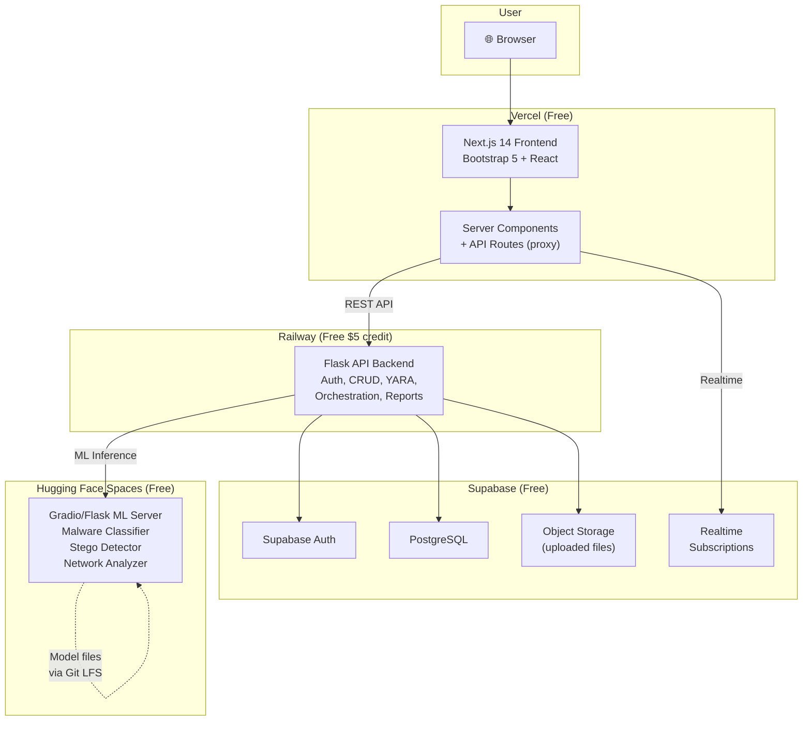
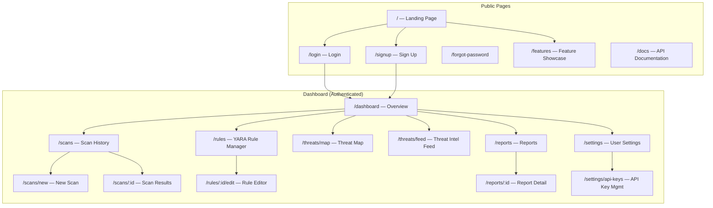
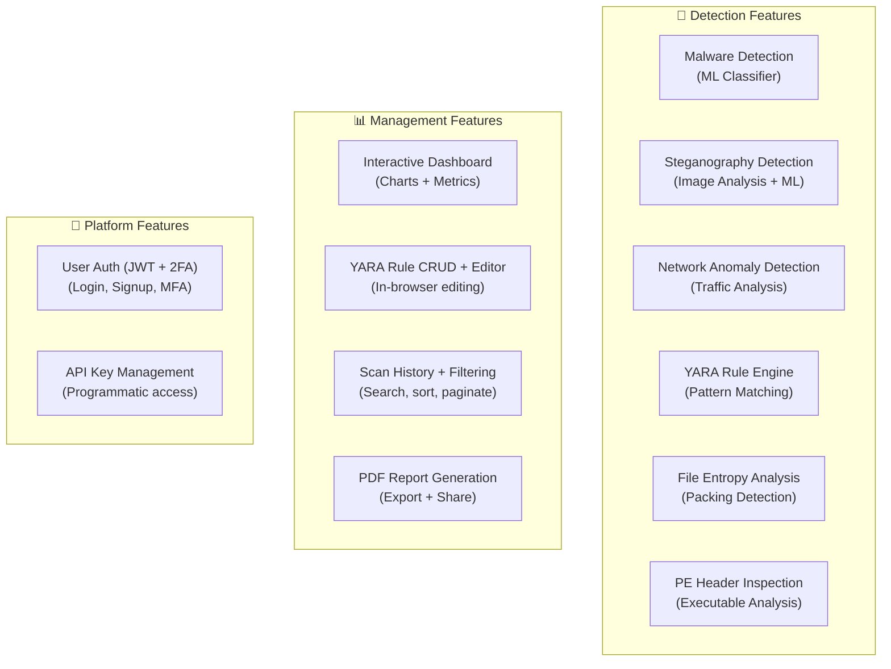
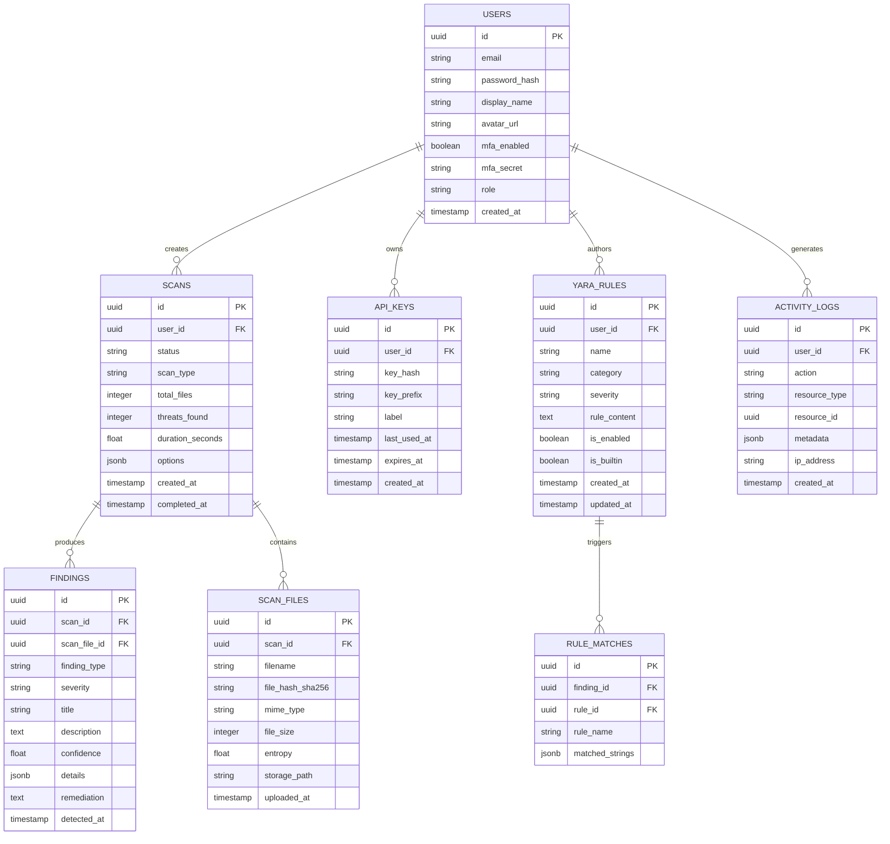
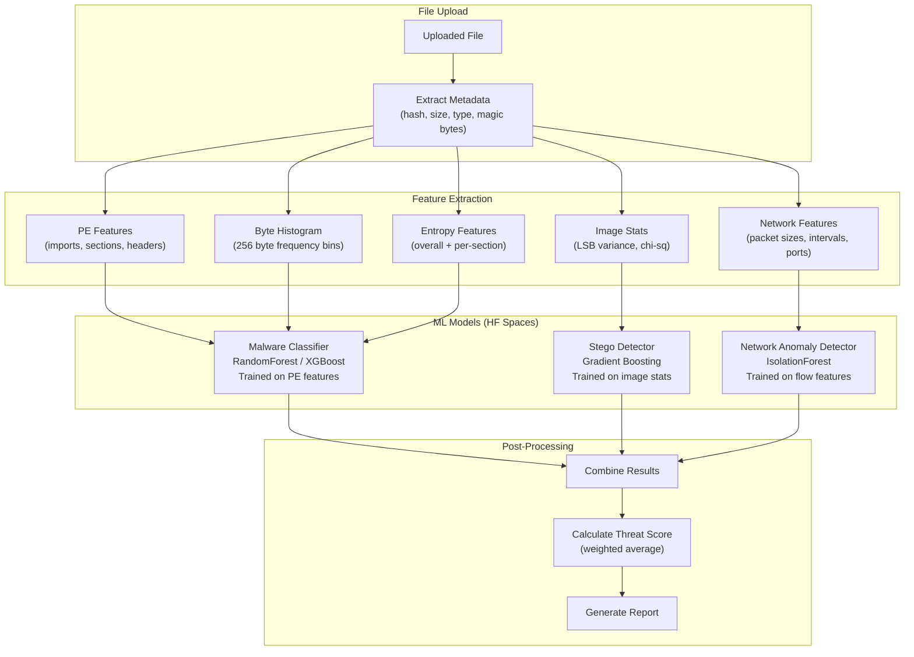
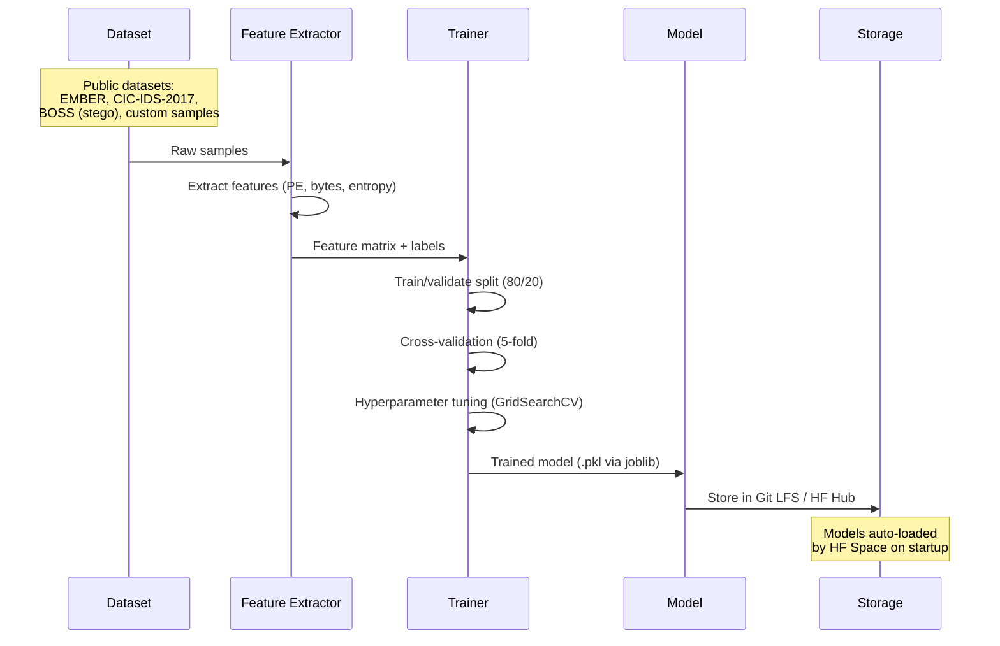
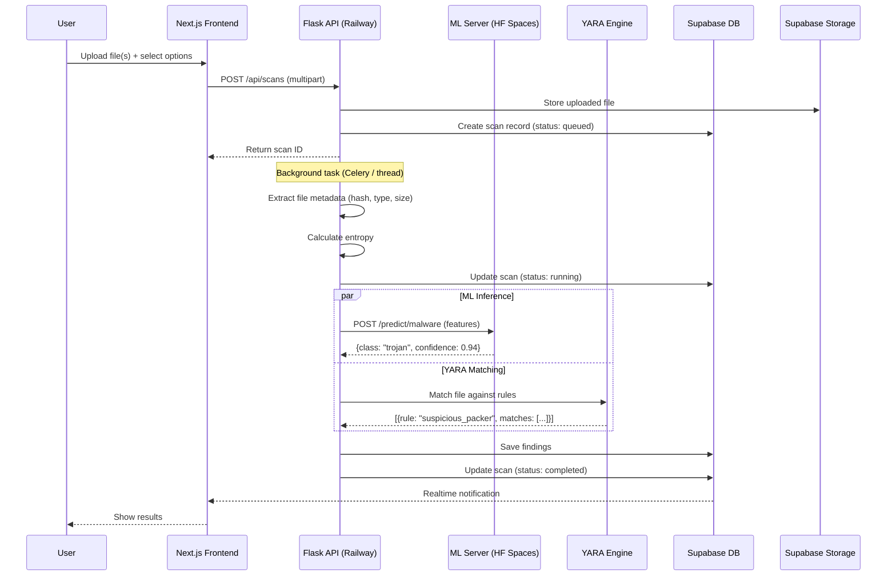
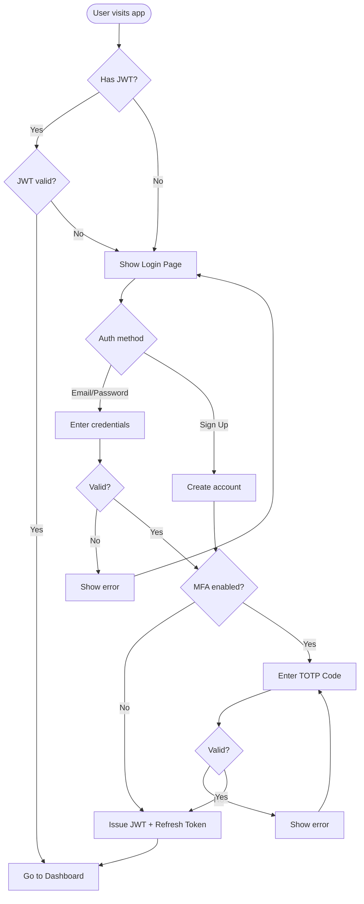
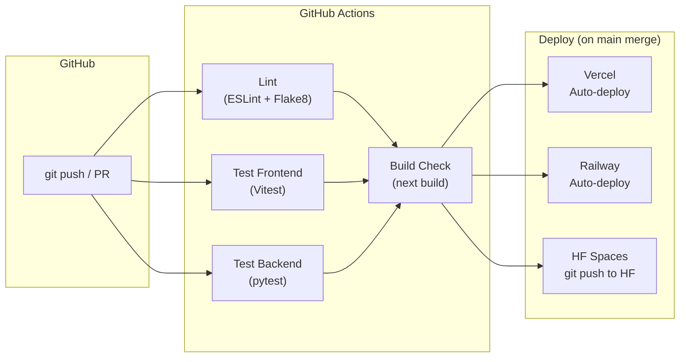
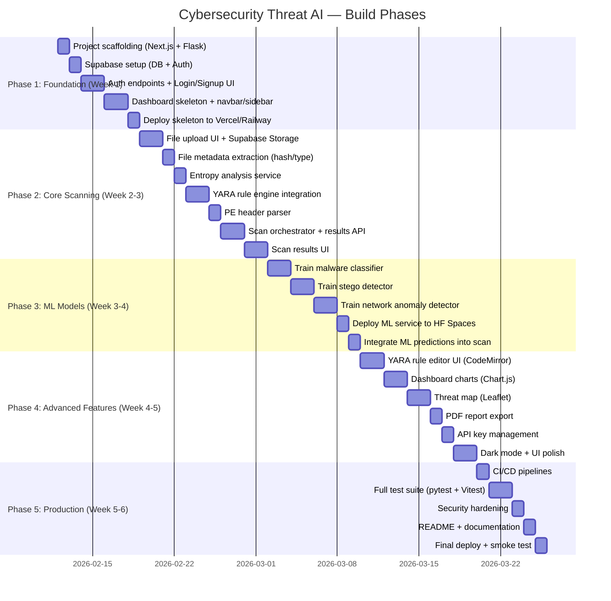

# 🛡️ Cybersecurity Threat AI — Implementation Plan

> Production-level, all-free-tier deployment. Built from scratch to detect malware, steganography, and network threats using ML + YARA rules.

---

## 1. Deployment Architecture (All Free)

| Service | Role | Free Tier |
|---------|------|-----------|
| **Vercel** | Next.js Frontend | 100 GB bandwidth, serverless functions |
| **Railway** | Flask API Backend (auth, CRUD, YARA, orchestration) | $5/month free credit |
| **Hugging Face Spaces** | ML Inference Backend (model serving) | Free CPU Spaces |
| **Supabase** | PostgreSQL DB + Auth + Storage | 500 MB DB, 1 GB storage |
| **GitHub Actions** | CI/CD Pipeline | 2,000 min/month free |
| **Git LFS** | Large ML model file storage | 1 GB free |



> [!IMPORTANT]
> **Why split the backend?** Railway handles fast API responses (auth, CRUD, YARA). Hugging Face handles heavy ML inference with GPU-ready infrastructure and free hosting for ML models — no Git LFS bandwidth limits.

---

## 2. Complete Tech Stack

### Frontend (Vercel)

| Technology | Version | Purpose |
|------------|---------|---------|
| Next.js | 14.x | React framework, App Router, SSR |
| React | 18.x | UI library |
| Bootstrap | 5.3 | Responsive CSS framework (matches CV) |
| react-bootstrap | 2.x | Bootstrap React components |
| Chart.js + react-chartjs-2 | 4.x | Threat visualization charts |
| Framer Motion | 12.x | Animations |
| react-dropzone | 14.x | File upload drag-and-drop |
| react-code-mirror | 6.x | YARA rule syntax editor |
| Leaflet + react-leaflet | 1.9 | Interactive threat map |
| Supabase JS | 2.x | Auth + Realtime client |
| Zod | 3.x | Form validation |
| jsPDF + html2canvas | — | PDF report export |
| Sonner | 2.x | Toast notifications |

### API Backend (Railway)

| Technology | Version | Purpose |
|------------|---------|---------|
| Python | 3.11+ | Runtime |
| Flask | 3.x | Web framework |
| Flask-RESTful | 0.3.x | Structured REST endpoints |
| Flask-CORS | 4.x | Cross-origin requests |
| Flask-JWT-Extended | 4.x | JWT authentication |
| Flask-Limiter | 3.x | Rate limiting |
| Flask-SocketIO | 5.x | Real-time scan progress |
| SQLAlchemy | 2.x | ORM |
| Alembic | 1.x | DB migrations |
| python-yara | 4.x | YARA rule engine |
| python-magic | 0.4.x | File type detection |
| pefile | 2023.x | PE header parsing |
| Celery + Redis | 5.x | Background task queue |
| Gunicorn | 22.x | Production WSGI server |
| Marshmallow | 3.x | Schema validation |
| supabase-py | 2.x | Supabase client |
| Sentry SDK | 2.x | Error monitoring |
| flasgger | 0.9.x | Swagger API docs |

### ML Backend (Hugging Face Spaces)

| Technology | Version | Purpose |
|------------|---------|---------|
| Python | 3.11+ | Runtime |
| Flask / Gradio | — | Serving interface |
| scikit-learn | 1.4+ | ML models |
| pandas | 2.x | Data manipulation |
| numpy | 1.x | Numerical computation |
| Pillow | 10.x | Image analysis (stego) |
| joblib | 1.x | Model serialization |
| scipy | 1.x | Statistical analysis |

---

## 3. Complete Page / UI Map



### 3.1 UI Page Descriptions

#### Landing Page (`/`)
```
┌─────────────────────────────────────────────────────────┐
│  🛡️ Cybersecurity Threat AI                    [Login]  │
│─────────────────────────────────────────────────────────│
│                                                         │
│   ██████████████████████████████████████████████████    │
│   █                                                █    │
│   █   AI-Powered Threat Detection Platform         █    │
│   █   Detect malware, steganography & network      █    │
│   █   threats using machine learning & YARA rules  █    │
│   █                                                █    │
│   █       [Get Started Free]   [View Demo]         █    │
│   █                                                █    │
│   ██████████████████████████████████████████████████    │
│                                                         │
│  ┌─────────┐  ┌─────────────┐  ┌──────────────────┐   │
│  │ 🔬      │  │ 🖼️          │  │ 📡               │   │
│  │ Malware │  │ Steganography│  │ Network Anomaly  │   │
│  │ Detection│  │ Detection   │  │ Detection        │   │
│  │ ML-based│  │ Image hidden │  │ Traffic pattern  │   │
│  │ scanning│  │ data finder  │  │ analysis         │   │
│  └─────────┘  └─────────────┘  └──────────────────┘   │
│                                                         │
│  ┌─────────┐  ┌─────────────┐  ┌──────────────────┐   │
│  │ 📜 YARA │  │ 📊 Dashboard │  │ 🌍 Threat Map   │   │
│  │ Custom  │  │ Real-time   │  │ Global threat    │   │
│  │ rules   │  │ analytics   │  │ visualization    │   │
│  └─────────┘  └─────────────┘  └──────────────────┘   │
│                                                         │
│  ┌─────────────────────────────────────────────────┐   │
│  │  Trusted by security researchers worldwide      │   │
│  │  ★★★★★  "Best open-source threat scanner"       │   │
│  └─────────────────────────────────────────────────┘   │
│                                                         │
│  Footer: About | GitHub | Docs | Privacy | Terms        │
└─────────────────────────────────────────────────────────┘
```

#### Dashboard (`/dashboard`)
```
┌──────────────────────────────────────────────────────────────┐
│  🛡️ CyberThreatAI    [Dashboard] [Scans] [Rules] [⚙️] [👤] │
│──────────────────────────────────────────────────────────────│
│                                                              │
│  Welcome back, User                                 Feb 2026 │
│                                                              │
│  ┌──────────┐ ┌──────────┐ ┌──────────┐ ┌──────────────┐     │
│  │ 🔍 42    │ │ 🚨 12    │ │ ✅ 30    │ │ ⚠️ 5 Critical │  │
│  │ Total    │ │ Threats  │ │ Clean    │ │ Alerts       │    │
│  │ Scans    │ │ Found    │ │ Files    │ │ This Week    │    │
│  └──────────┘ └──────────┘ └──────────┘ └──────────────┘    │
│                                                             │
│  ┌──────────────────────┐  ┌──────────────────────────┐     │
│  │ Threat Distribution  │  │ Scan Activity (7 days)   │     │
│  │ [PIE CHART]          │  │ [LINE CHART]             │     │
│  │ ■ Malware 45%        │  │                          │     │
│  │ ■ Suspicious 30%     │  │  ╱‾‾╲    ╱╲              │     │
│  │ ■ Clean 20%          │  │ ╱    ╲__╱  ╲__           │     │
│  │ ■ Stego 5%           │  │                          │     │
│  └──────────────────────┘  └──────────────────────────┘     │
│                                                             │
│  ┌──────────────────────┐  ┌──────────────────────────┐     │
│  │ Severity Breakdown   │  │ Recent Scans             │     │
│  │ [BAR CHART]          │  │ ─────────────────────    │     │
│  │ Critical ████████ 8  │  │ 📄 report.exe  🔴 Mal   │     │
│  │ High     ██████ 6    │  │ 🖼️ photo.png   🟡 Steg  │     │
│  │ Medium   ████ 4      │  │ 📄 doc.pdf     🟢 Clean │     │
│  │ Low      ██ 2        │  │ 📦 archive.zip 🔴 Mal   │     │
│  └──────────────────────┘  └──────────────────────────┘     │
│                                                             │
│  ┌─────────────────────────────────────────────────────┐    │
│  │  🌍 Threat Map                          [Full View] │    │
│  │  [WORLD MAP WITH THREAT PINS]                       │    │
│  └─────────────────────────────────────────────────────┘    │
└──────────────────────────────────────────────────────────────┘
```

#### New Scan Page (`/scans/new`)
```
┌──────────────────────────────────────────────────────────────┐
│  🔍 New Threat Scan                                          │
│──────────────────────────────────────────────────────────────│
│                                                              │
│  ┌────────────────────────────────────────────────────────┐  │
│  │                                                        │  │
│  │        ╔═══════════════════════════════════╗           │  │
│  │        ║   📁 Drop files here or          ║           │  │
│  │        ║      click to browse             ║           │  │
│  │        ║                                  ║           │  │
│  │        ║   Supports: EXE, DLL, PDF, IMG,  ║           │  │
│  │        ║   ZIP, PCAP, scripts, docs       ║           │  │
│  │        ║   Max: 50 MB per file            ║           │  │
│  │        ╚═══════════════════════════════════╝           │  │
│  │                                                        │  │
│  └────────────────────────────────────────────────────────┘  │
│                                                              │
│  Scan Options:                                               │
│  ┌────────────────────────────────────────────────────────┐  │
│  │ ☑ Malware Detection (ML)                              │  │
│  │ ☑ Steganography Analysis                              │  │
│  │ ☑ YARA Rule Matching                                  │  │
│  │ ☐ Network Traffic Analysis (PCAP only)                │  │
│  │ ☑ File Entropy Analysis                               │  │
│  │ ☑ PE Header Inspection                                │  │
│  │                                                        │  │
│  │ YARA Ruleset: [All Rules          ▼]                  │  │
│  │ Scan Priority: ○ Normal  ● High                       │  │
│  └────────────────────────────────────────────────────────┘  │
│                                                              │
│  Queued Files:                                               │
│  ┌────────────────────────────────────────────────────────┐  │
│  │ 📄 malware_sample.exe    2.3 MB    [Remove]           │  │
│  │ 🖼️ suspicious_image.png  1.1 MB    [Remove]           │  │
│  │ 📦 payload.zip           5.8 MB    [Remove]           │  │
│  └────────────────────────────────────────────────────────┘  │
│                                                              │
│                              [Cancel]  [🔍 Start Scan]       │
└──────────────────────────────────────────────────────────────┘
```

#### Scan Results Page (`/scans/:id`)
```
┌──────────────────────────────────────────────────────────────┐
│  📋 Scan Results — malware_sample.exe                        │
│──────────────────────────────────────────────────────────────│
│  Status: ✅ Complete  |  Duration: 12s  |  Threat: 🔴 HIGH   │
│                                                              │
│  ┌─────────────────────────────────────────────────────────┐│
│  │ THREAT SCORE                                            ││
│  │ ████████████████████████████░░░  87/100  MALICIOUS      ││
│  └─────────────────────────────────────────────────────────┘│
│                                                              │
│  [Overview] [ML Results] [YARA Matches] [Entropy] [Headers]  │
│                                                              │
│  ┌──────────── File Metadata ────────────────────────────┐  │
│  │ Name:     malware_sample.exe                          │  │
│  │ Size:     2.3 MB                                      │  │
│  │ SHA-256:  a1b2c3d4e5f6...                            │  │
│  │ Type:     PE32 executable (GUI) x86                   │  │
│  │ Entropy:  7.82 (HIGH - likely packed/encrypted)       │  │
│  └───────────────────────────────────────────────────────┘  │
│                                                              │
│  ┌──────────── ML Predictions ───────────────────────────┐  │
│  │ 🔬 Malware Classifier:    Trojan (94.2% confidence)   │  │
│  │ 🖼️ Steganography:         Not detected                │  │
│  │ 📊 Anomaly Score:         0.92 (anomalous)            │  │
│  └───────────────────────────────────────────────────────┘  │
│                                                              │
│  ┌──────────── YARA Matches (3) ─────────────────────────┐  │
│  │ 🔴 rule suspicious_packer  — UPX packing detected     │  │
│  │ 🔴 rule trojan_downloader  — URL patterns found       │  │
│  │ 🟡 rule obfuscated_strings — Encoded strings found    │  │
│  └───────────────────────────────────────────────────────┘  │
│                                                              │
│  ┌──────────── Remediation ──────────────────────────────┐  │
│  │ ⚠️ This file is highly suspicious. Recommendations:    │  │
│  │ 1. Do NOT execute this file                           │  │
│  │ 2. Quarantine immediately                             │  │
│  │ 3. Submit hash to VirusTotal for confirmation         │  │
│  │ 4. Check system for related indicators of compromise  │  │
│  └───────────────────────────────────────────────────────┘  │
│                                                              │
│              [📄 Export PDF]  [🔗 Share Report]               │
└──────────────────────────────────────────────────────────────┘
```

#### YARA Rule Editor (`/rules/:id/edit`)
```
┌──────────────────────────────────────────────────────────────┐
│  📜 YARA Rule Editor — trojan_downloader                     │
│──────────────────────────────────────────────────────────────│
│                                                              │
│  ┌──────── Code Editor (CodeMirror) ─────────────────────┐  │
│  │  1 │ rule trojan_downloader {                         │  │
│  │  2 │   meta:                                          │  │
│  │  3 │     author = "CyberThreatAI"                     │  │
│  │  4 │     description = "Detects trojan downloaders"   │  │
│  │  5 │     severity = "critical"                        │  │
│  │  6 │   strings:                                       │  │
│  │  7 │     $url1 = /https?:\/\/[^\s]+\.exe/ nocase      │  │
│  │  8 │     $url2 = "URLDownloadToFile" ascii             │  │
│  │  9 │     $cmd = "cmd.exe /c" nocase                    │  │
│  │ 10 │   condition:                                      │  │
│  │ 11 │     any of them                                   │  │
│  │ 12 │ }                                                 │  │
│  └───────────────────────────────────────────────────────┘  │
│                                                              │
│  ┌──── Rule Properties ──┐  ┌──── Test Results ──────────┐ │
│  │ Name: trojan_download │  │ ✅ Syntax valid             │ │
│  │ Category: [Malware ▼] │  │ 🧪 Test against sample:    │ │
│  │ Severity: [Critical▼] │  │    📄 test.exe → MATCH     │ │
│  │ Tags: trojan, network │  │    📄 clean.exe → NO MATCH │ │
│  │ Enabled: ☑            │  │    📄 doc.pdf → NO MATCH   │ │
│  └───────────────────────┘  └────────────────────────────┘ │
│                                                              │
│         [Delete Rule]    [Test Rule]    [💾 Save Rule]        │
└──────────────────────────────────────────────────────────────┘
```

#### Threat Map (`/threats/map`)
```
┌──────────────────────────────────────────────────────────────┐
│  🌍 Global Threat Map                                        │
│──────────────────────────────────────────────────────────────│
│                                                              │
│  ┌──────────────────────────────────────────────────────┐   │
│  │                    WORLD MAP (Leaflet)                │   │
│  │                                                      │   │
│  │     🔴          🟡                                   │   │
│  │        🔴    🔴       🟡     🔴                      │   │
│  │                 🟡        🔴     🟡                   │   │
│  │           🔴        🟡       🔴                      │   │
│  │                                                      │   │
│  │  🔴 = Critical   🟡 = Medium   🟢 = Low             │   │
│  └──────────────────────────────────────────────────────┘   │
│                                                              │
│  Filter: [All Types ▼] [Last 7 Days ▼] [All Severities ▼]   │
│                                                              │
│  Recent Threats:                                             │
│  ┌──────────────────────────────────────────────────────┐   │
│  │ 🔴 Trojan — Russia   │ 🟡 Adware — USA             │   │
│  │ 🔴 Ransomware — CN   │ 🟢 PUP — Germany            │   │
│  └──────────────────────────────────────────────────────┘   │
└──────────────────────────────────────────────────────────────┘
```

---

## 4. Core Features (12)

### 4.1 Feature Architecture Diagram



### Feature Details

| # | Feature | Description | Backend Location |
|---|---------|-------------|------------------|
| 1 | **Malware Detection** | ML classifier using Random Forest / Gradient Boosting trained on PE features | HF Spaces |
| 2 | **Steganography Detection** | LSB analysis, chi-square test, ML on image statistics | HF Spaces |
| 3 | **Network Anomaly Detection** | Isolation Forest on PCAP/flow features (packet size, frequency, ports) | HF Spaces |
| 4 | **YARA Rule Engine** | Compile & match user-defined + built-in YARA rules against uploaded files | Railway |
| 5 | **File Entropy Analysis** | Shannon entropy calculation to detect packing/encryption | Railway |
| 6 | **PE Header Inspection** | Parse PE headers, imports, sections, detect anomalies | Railway |
| 7 | **Dashboard** | Summary cards, pie/bar/line charts, recent activity, threat map widget | Vercel |
| 8 | **YARA Rule Editor** | CodeMirror-based syntax editor, rule testing, CRUD operations | Vercel + Railway |
| 9 | **Scan History** | Paginated list with filters by status, severity, date, file type | Vercel + Railway |
| 10 | **PDF Reports** | Export detailed scan results as downloadable PDF reports | Vercel |
| 11 | **Auth + 2FA** | JWT-based login/signup with optional TOTP two-factor authentication | Railway + Supabase |
| 12 | **API Keys** | Generate/revoke API keys for programmatic scanning access | Railway |

---

## 5. Suggested Bonus Features (8)

| # | Feature | Impact | Effort |
|---|---------|--------|--------|
| 13 | **Threat Intelligence Feed** | Pull live IoC data from free APIs (AbuseIPDB, OTX) | Medium |
| 14 | **Interactive Threat Map** | Leaflet-based world map with geo-located threats | Medium |
| 15 | **Batch File Processing** | Upload ZIP → auto-extract → scan all files | Low |
| 16 | **Scan Scheduling** | Cron-based recurring scans on monitored directories | Medium |
| 17 | **Email Alerts** | Send email on critical threat detection (free SMTP via Gmail/Resend) | Low |
| 18 | **Scan Comparison** | Diff two scan reports side-by-side | Low |
| 19 | **Dark Mode** | Full dark/light theme toggle | Low |
| 20 | **IoC Database** | Searchable database of known-bad hashes, IPs, domains | Medium |

---

## 6. Database Schema



---

## 7. API Endpoint Catalog

### Auth Endpoints (Railway)
| Method | Endpoint | Description |
|--------|----------|-------------|
| POST | `/api/auth/signup` | Register new user |
| POST | `/api/auth/login` | Login, returns JWT |
| POST | `/api/auth/logout` | Invalidate session |
| POST | `/api/auth/refresh` | Refresh JWT token |
| POST | `/api/auth/forgot-password` | Send reset email |
| POST | `/api/auth/mfa/enroll` | Enable 2FA |
| POST | `/api/auth/mfa/verify` | Verify TOTP code |

### Scan Endpoints (Railway)
| Method | Endpoint | Description |
|--------|----------|-------------|
| POST | `/api/scans` | Create new scan (multipart file upload) |
| GET | `/api/scans` | List user's scans (paginated, filterable) |
| GET | `/api/scans/:id` | Get scan details + findings |
| DELETE | `/api/scans/:id` | Delete a scan |
| GET | `/api/scans/:id/report` | Get formatted report data |
| GET | `/api/scans/:id/export/pdf` | Export scan as PDF |

### YARA Rule Endpoints (Railway)
| Method | Endpoint | Description |
|--------|----------|-------------|
| GET | `/api/rules` | List all rules |
| POST | `/api/rules` | Create new rule |
| PUT | `/api/rules/:id` | Update a rule |
| DELETE | `/api/rules/:id` | Delete a rule |
| POST | `/api/rules/:id/test` | Test rule against a file |
| POST | `/api/rules/validate` | Validate YARA syntax |

### ML Inference Endpoints (Hugging Face Spaces)
| Method | Endpoint | Description |
|--------|----------|-------------|
| POST | `/predict/malware` | Classify file as malware/clean |
| POST | `/predict/steganography` | Detect hidden data in image |
| POST | `/predict/network` | Analyze network traffic data |
| GET | `/models/status` | Check model loading status |
| GET | `/health` | Health check |

### Dashboard & Misc Endpoints (Railway)
| Method | Endpoint | Description |
|--------|----------|-------------|
| GET | `/api/dashboard/stats` | Summary statistics |
| GET | `/api/dashboard/chart/severity` | Severity distribution data |
| GET | `/api/dashboard/chart/timeline` | Scan timeline data |
| GET | `/api/dashboard/recent` | Recent scan activity |
| GET | `/api/threats/feed` | External threat intel feed |
| GET | `/api/threats/map` | Geo-located threat data |
| POST | `/api/api-keys` | Generate new API key |
| GET | `/api/api-keys` | List API keys |
| DELETE | `/api/api-keys/:id` | Revoke an API key |
| GET | `/api/activity` | User activity log |

---

## 8. ML Pipeline Architecture



### ML Model Training Strategy



---

## 9. Scan Orchestration Flow



---

## 10. Authentication & Security



### Security Layers

| Layer | Implementation |
|-------|----------------|
| **Transport** | HTTPS enforced (Vercel + Railway auto-SSL) |
| **Authentication** | JWT (access + refresh) via Flask-JWT-Extended |
| **MFA** | TOTP via pyotp (Google Authenticator compatible) |
| **Authorization** | Role-based (admin, analyst, viewer) |
| **Rate Limiting** | Flask-Limiter (100 req/min general, 10 req/min scans) |
| **Input Validation** | Marshmallow schemas on all endpoints |
| **File Safety** | Uploaded files stored in Supabase Storage, never executed |
| **CORS** | Strict origin whitelist (Vercel domain only) |
| **Headers** | Helmet-equivalent security headers via middleware |
| **DB Security** | Supabase RLS policies per user |

---

## 11. Project Structure

```
cybersecurity-threat-ai/
├── frontend/                          # Next.js 14 (→ Vercel)
│   ├── src/
│   │   ├── app/
│   │   │   ├── (public)/             # Landing, features, docs
│   │   │   │   ├── page.tsx          # Landing page
│   │   │   │   ├── features/page.tsx
│   │   │   │   └── docs/page.tsx
│   │   │   ├── (auth)/              # Login, signup
│   │   │   │   ├── login/page.tsx
│   │   │   │   ├── signup/page.tsx
│   │   │   │   └── forgot-password/page.tsx
│   │   │   ├── (dashboard)/         # Protected routes
│   │   │   │   ├── dashboard/page.tsx
│   │   │   │   ├── scans/
│   │   │   │   │   ├── page.tsx     # Scan list
│   │   │   │   │   ├── new/page.tsx # New scan
│   │   │   │   │   └── [id]/page.tsx# Scan results
│   │   │   │   ├── rules/
│   │   │   │   │   ├── page.tsx     # Rule list
│   │   │   │   │   └── [id]/edit/page.tsx # Rule editor
│   │   │   │   ├── threats/
│   │   │   │   │   ├── map/page.tsx # Threat map
│   │   │   │   │   └── feed/page.tsx
│   │   │   │   ├── reports/
│   │   │   │   │   ├── page.tsx
│   │   │   │   │   └── [id]/page.tsx
│   │   │   │   └── settings/
│   │   │   │       ├── page.tsx
│   │   │   │       └── api-keys/page.tsx
│   │   │   ├── api/                 # Next.js API routes (proxy)
│   │   │   │   └── proxy/[...path]/route.ts
│   │   │   ├── layout.tsx
│   │   │   └── globals.css
│   │   ├── components/
│   │   │   ├── ui/                  # Button, Card, Modal, etc.
│   │   │   ├── dashboard/           # Chart widgets, stat cards
│   │   │   ├── scans/               # File upload, progress, results
│   │   │   ├── rules/               # Rule editor, rule list
│   │   │   ├── threats/             # Map component, feed items
│   │   │   ├── layout/              # Navbar, Sidebar, Footer
│   │   │   └── auth/                # Login form, signup form
│   │   ├── lib/
│   │   │   ├── api.ts               # API client functions
│   │   │   ├── auth.ts              # Auth helpers
│   │   │   └── constants.ts         # Config values
│   │   └── utils/
│   │       ├── supabase/
│   │       │   ├── client.ts
│   │       │   └── server.ts
│   │       └── formatters.ts
│   ├── public/                      # Static assets
│   ├── package.json
│   ├── next.config.mjs
│   └── Dockerfile
│
├── backend/                          # Flask API (→ Railway)
│   ├── app/
│   │   ├── __init__.py              # Flask app factory
│   │   ├── config.py                # Config from env vars
│   │   ├── extensions.py            # DB, JWT, Limiter init
│   │   ├── models/
│   │   │   ├── __init__.py
│   │   │   ├── user.py
│   │   │   ├── scan.py
│   │   │   ├── finding.py
│   │   │   ├── yara_rule.py
│   │   │   ├── api_key.py
│   │   │   └── activity_log.py
│   │   ├── api/
│   │   │   ├── __init__.py          # Blueprint registration
│   │   │   ├── auth.py              # Auth endpoints
│   │   │   ├── scans.py             # Scan CRUD + orchestration
│   │   │   ├── rules.py             # YARA rule CRUD
│   │   │   ├── dashboard.py         # Stats & charts data
│   │   │   ├── reports.py           # Report endpoints
│   │   │   ├── threats.py           # Threat intel & map data
│   │   │   └── api_keys.py          # API key management
│   │   ├── services/
│   │   │   ├── scanner.py           # Scan orchestrator
│   │   │   ├── yara_engine.py       # YARA compile & match
│   │   │   ├── file_analyzer.py     # Entropy, PE, metadata
│   │   │   ├── ml_client.py         # HTTP client to HF Space
│   │   │   └── threat_intel.py      # External API integration
│   │   ├── middleware/
│   │   │   ├── auth_required.py     # JWT decorator
│   │   │   └── error_handler.py     # Global error handler
│   │   └── utils/
│   │       ├── validators.py        # Marshmallow schemas
│   │       └── helpers.py           # Misc utilities
│   ├── migrations/                  # Alembic migrations
│   ├── yara_rules/                  # Built-in YARA rules
│   │   ├── malware/
│   │   ├── suspicious/
│   │   └── packer/
│   ├── tests/
│   │   ├── conftest.py
│   │   ├── test_auth.py
│   │   ├── test_scans.py
│   │   ├── test_rules.py
│   │   └── test_yara_engine.py
│   ├── requirements.txt
│   ├── Procfile                     # Railway: gunicorn
│   ├── Dockerfile
│   └── railway.toml
│
├── ml-service/                       # ML Backend (→ HF Spaces)
│   ├── app.py                       # Flask/Gradio server
│   ├── models/
│   │   ├── malware_classifier.pkl   # Trained model (Git LFS)
│   │   ├── stego_detector.pkl       # Trained model (Git LFS)
│   │   └── network_anomaly.pkl      # Trained model (Git LFS)
│   ├── inference/
│   │   ├── malware.py               # Malware prediction logic
│   │   ├── steganography.py         # Stego prediction logic
│   │   └── network.py               # Network prediction logic
│   ├── features/
│   │   ├── pe_features.py           # PE feature extraction
│   │   ├── image_features.py        # Image stat extraction
│   │   └── network_features.py      # PCAP feature extraction
│   ├── training/                    # Training scripts
│   │   ├── train_malware.py
│   │   ├── train_stego.py
│   │   └── train_network.py
│   ├── requirements.txt
│   └── README.md                    # HF Space metadata
│
├── docker-compose.yml               # Local dev environment
├── .github/
│   └── workflows/
│       ├── ci.yml                   # Test + lint on PR
│       └── deploy.yml               # Auto-deploy pipeline
├── .gitattributes                   # Git LFS tracking
├── .env.example
└── README.md
```

---

## 12. CI/CD Pipeline



---

## 13. Phased Build Roadmap



---

## 14. Verification Plan

### Automated Tests

| Test Suite | Framework | Run Command | Coverage |
|------------|-----------|-------------|----------|
| **Frontend Unit** | Vitest + Testing Library | `cd frontend && npm test` | Components, utils, hooks |
| **Backend Unit** | pytest | `cd backend && pytest` | API endpoints, services, models |
| **Backend Integration** | pytest + fixtures | `cd backend && pytest tests/integration/` | DB operations, scan flow |
| **YARA Engine** | pytest | `cd backend && pytest tests/test_yara_engine.py` | Rule compilation, matching |
| **ML Models** | pytest | `cd ml-service && pytest tests/` | Model loading, prediction accuracy |
| **E2E** | Playwright | `npx playwright test` | Full user flows (login → scan → results) |

### Manual Verification

1. **File Upload Flow**: Upload a test EXE file → verify it reaches Supabase Storage → verify scan record is created → verify findings appear
2. **YARA Rule Test**: Create a custom YARA rule via the editor → test against a known file → verify match/no-match
3. **ML Predictions**: Upload known malware samples → confirm classification with >80% confidence
4. **Auth Flow**: Sign up → log in → enable 2FA → log out → log back in with TOTP → verify access
5. **Dashboard**: Create 5+ scans → verify charts update correctly → verify recent scans list
6. **PDF Export**: Complete a scan → export PDF → verify report content and formatting
7. **API Key Access**: Generate API key → use `curl` to call `/api/scans` with API key header → verify response
8. **Deployment Health**: Hit `/health` on Railway → hit `/health` on HF Space → verify both respond 200

---

> [!TIP]
> **CV Impact Maximizer**: This project touches **ML/AI, Full-Stack, DevOps, and Cybersecurity** — four high-demand domains in a single project. The split deployment (Vercel + Railway + HF Spaces) also demonstrates cloud architecture skills.
