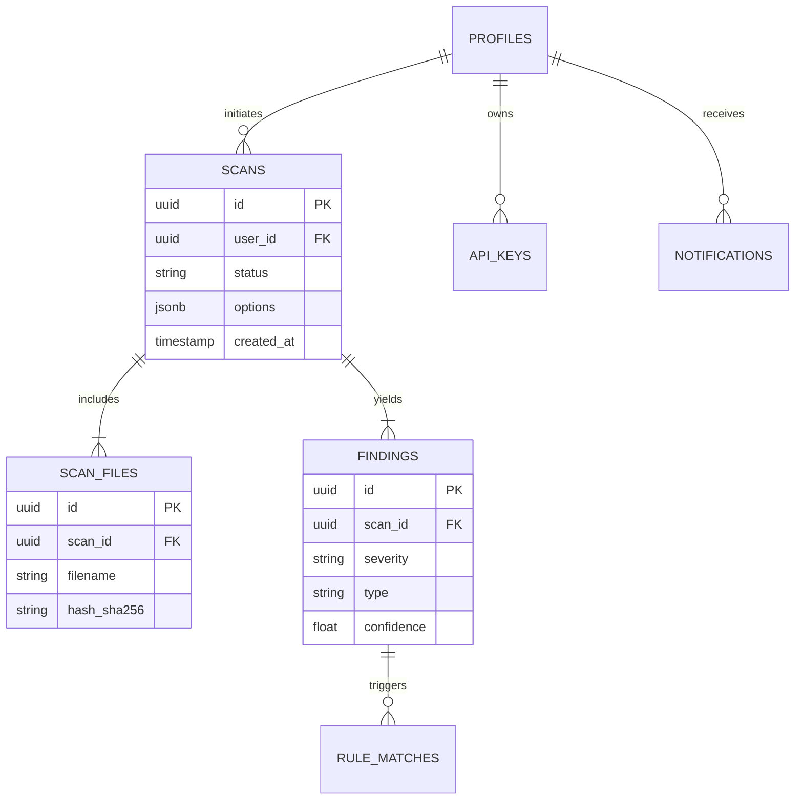
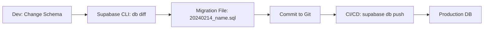

# Implementation Plan: Database & Data Layer Optimization
**Goal**: Elevate Database & Data Layer score from **78/100** → **100/100**

## 1. Gap Analysis

| Critical Gap | Current State | Target State (100/100) |
|--------------|---------------|------------------------|
| **Schema Management** | Monolithic [supabase-setup.sql](file:///c:/Users/Admin/Desktop/ThreatForge/backend/supabase-setup.sql) file. Hard to evolve. | **Versioned Migrations** (Supabase CLI standard). Reproducible history. |
| **Type Safety** | Python `dataclasses` with loose typing. Manual validation. | **Pydantic V2 Models**. Runtime validation, auto-serialization, strict schemas. |
| **Performance** | Basic Primary Keys indexed. Foreign Keys unindexed. | **Optimized Indexes** on all FKs and query filters ([status](file:///c:/Users/Admin/Desktop/ThreatForge/ml-service/tests/test_health.py#12-16), `created_at`). |
| **Data Integrity** | Basic constraints. | **Advanced Constraints** (check constraints, cascade rules verified). |
| **Development** | Manual data setup. | **Automated Seeding** for consistent dev/test environments. |

## 2. Architecture & Diagrams

### Core Entity Relationship Diagram (Target)

### Migration Workflow

## 3. Implementation Phases

### Phase 1: Migration System Restructuring
Move from the single [supabase-setup.sql](file:///c:/Users/Admin/Desktop/ThreatForge/backend/supabase-setup.sql) to a proper versioned migration structure compatible with Supabase CLI.

- [ ] Initialize `supabase/migrations` directory.
- [ ] Create `0000_initial_schema.sql` from current [supabase-setup.sql](file:///c:/Users/Admin/Desktop/ThreatForge/backend/supabase-setup.sql).
- [ ] Verify `supabase db reset` works cleanly.

### Phase 2: Performance & Hardening
Add missing indexes and constraints that are critical for query performance at scale.

- [x] **Create Optimization Migration** (`0001_optimization_indexes.sql`):
    - [x] Index [scans(user_id, status)](file:///c:/Users/Admin/Desktop/ThreatForge/backend/app/api/scans.py#253-314) (for dashboard filtering).
    - [x] Index `scan_files(scan_id)` (for join performance).
    - [x] Index `findings(scan_id, severity)` (for report generation).
    - [x] Index `activity_logs(user_id, created_at)` (for timeline views).
- [ ] **Refine RLS Policies**: Ensure explicitly separate `SELECT`, `INSERT`, `UPDATE`, `DELETE` policies for clarity vs strictly using `ALL`.

### Phase 3: Type Safety Revolution (Pydantic)
Refactor the application to use Pydantic models for all database interactions, ensuring data flowing in and out of Supabase is validated.

- [x] **Install Pydantic**: Ensure `pydantic>=2.0` is in requirements.
- [x] **Create Base Models** (`app/models/base.py`):
    - [x] `SupabaseModel` base class with `model_validate` capabilities.
- [x] **Refactor Models**:
    - [x] [scan.py](file:///c:/Users/Admin/Desktop/ThreatForge/backend/app/models/scan.py) → `ScanModel`, `ScanFileModel`.
    - [x] [finding.py](file:///c:/Users/Admin/Desktop/ThreatForge/backend/app/models/finding.py) → `FindingModel`.
    - [x] [user.py](file:///c:/Users/Admin/Desktop/ThreatForge/backend/app/models/user.py) → `UserModel`.
- [x] **Update Services**:
    - [x] Update [scans.py](file:///c:/Users/Admin/Desktop/ThreatForge/backend/app/api/scans.py) to return Pydantic models instead of dicts.
    - [x] Update [auth.py](file:///c:/Users/Admin/Desktop/ThreatForge/backend/app/api/auth.py) to use Pydantic for user profile handling.

### Phase 4: Automated Seeding
Create robust seed data to allows developers to spin up a fully populated environment instantly.

- [x] **Create Seed Script** (`backend/seed_data.py`):
    - [x] Create test user profiles.
    - [x] Generate 10+ mock scans with various statuses.
    - [x] Insert sample findings and threat reports.
    - [x] Populate mock activity logs.
- [x] **Add CLI Command**: `flask seed-db`.

## 4. Verification Plan

### Database Health Check
- Run `EXPLAIN ANALYZE` on dashboard queries to verify index usage.
- specific check: `SELECT * FROM scans WHERE user_id = ? AND status = 'completed'` should use the new index.

### Type Safety Check
- Run specific tests that attempt to inject invalid data types into the service layer and verify Pydantic raises `ValidationError` before hitting the DB.
