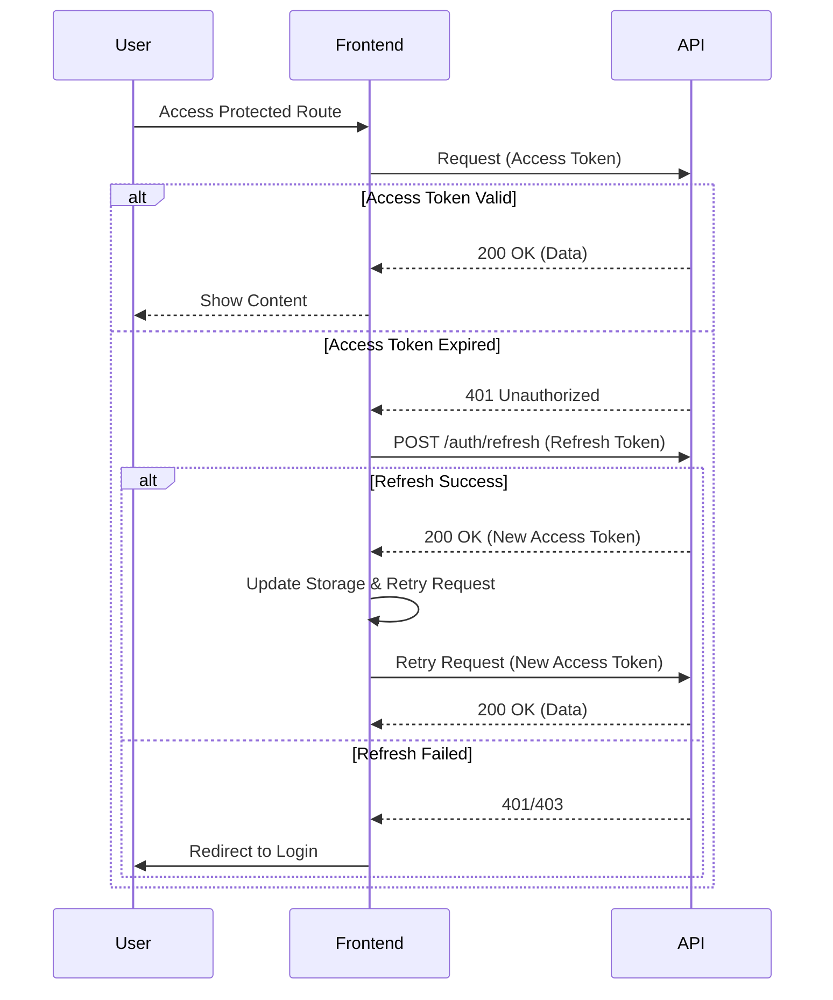

# Implementation Plan: Frontend Application Optimization
**Goal**: Elevate Frontend Application score from **65/100** → **100/100**

## 1. Gap Analysis

| Critical Gap | Current State | Target State (100/100) |
|--------------|---------------|------------------------|
| **Testing** | 0% verified coverage. Tests exist but status unknown. | **100% Core Coverage**. Passing Unit & Integration tests for Auth & API. |
| **Security** | No Token Refresh. Hard logout on expiry. `localStorage` usage. | **Silent Refresh** implemented. Zod schema validation for all API responses. |
| **Performance** | External fonts (blocking). Heavy bundles on load. | **`next/font`** integration. **Lazy loading** for Charts/Maps. |
| **Error Handling** | Generic error catching. | **Global Error Boundary**. Granular error states. |
| **SEO & A11y** | Missing metadata, standard icons. | **SEO Metadata**, `robots.txt`, accessible icon usage. |

## 2. Architecture & Diagrams

### Auth Flow with Refresh Token


### Component Architecture
```mermaid
graph TD
    App[App (Layout)] --> AuthProvider
    AuthProvider --> ErrorBoundary
    ErrorBoundary --> Content
    Content --> Dashboard
    Dashboard -->|Lazy Load| Charts[CharJS Components]
    Dashboard -->|Lazy Load| Maps[Leaflet Map]
```

## 3. Implementation Phases

### Phase 1: Testing & Infrastructure
Fix the foundation before adding features.

- [ ] **Run Existing Tests**: Execute `npm test` and fix config errors ([jest.config.ts](file:///c:/Users/Admin/Desktop/ThreatForge/frontend/jest.config.ts), [tsconfig.json](file:///c:/Users/Admin/Desktop/ThreatForge/frontend/tsconfig.json)).
- [ ] **Verify Core Logic**: Ensure [AuthContext](file:///c:/Users/Admin/Desktop/ThreatForge/frontend/src/lib/AuthContext.tsx#17-27) and [api](file:///c:/Users/Admin/Desktop/ThreatForge/frontend/src/lib/api.ts#39-44) tests pass.
- [ ] **Add Missing Tests**: Add unit tests for `LoginForm` and `Sidebar`.

### Phase 2: Security Hardening (Auth & Validation)
Improve the authentication resiliency and data safety.

- [ ] **Implement Token Refresh**:
    - [ ] Update [api.ts](file:///c:/Users/Admin/Desktop/ThreatForge/frontend/src/lib/api.ts) to intercept 401s.
    - [ ] Call `/api/auth/refresh` using the stored refresh token.
    - [ ] Retry original request on success.
- [ ] **Zod Integration**:
    - [ ] Create `src/lib/schemas.ts` sharing types with backend (if possible) or defining strict frontend schemas.
    - [ ] Validate API responses in [api.ts](file:///c:/Users/Admin/Desktop/ThreatForge/frontend/src/lib/api.ts).
- [ ] **Strict Types**: Remove `any` from [AuthContext.tsx](file:///c:/Users/Admin/Desktop/ThreatForge/frontend/src/lib/AuthContext.tsx).

### Phase 3: Performance Optimization
Make the app fast and Google-friendly.

- [ ] **Optimize Fonts**:
    - [ ] Remove Google Fonts CDN links from `layout.tsx`.
    - [ ] Implement `next/font/google` for Inter and other fonts.
- [ ] **Lazy Loading**:
    - [ ] Use `next/dynamic` for `Chart.js` components in Dashboard.
    - [ ] Use `next/dynamic` for `Leaflet` maps.
- [ ] **Bundle Analysis**: Run build with analyze to confirm size reduction.

### Phase 4: Quality of Life & Polish
Final touches for a production-grade app.

- [ ] **Error Boundary**: Create `src/components/ErrorBoundary.tsx` and wrap main content.
- [ ] **SEO**: Add [metadata](file:///c:/Users/Admin/Desktop/ThreatForge/backend/tests/unit/test_scanner.py#71-75) export to `layout.tsx` and key pages.
- [ ] **A11y Audit**: Ensure all specialized icons have `aria-label`.

## 4. Verification Plan

### Automated Verification
- **Test Suite**: `npm test` must pass with >80% coverage on core logic.
- **Build**: `npm run build` must succeed without lint errors.

### Manual Verification
1.  **Auth Loop**: Log in, manually expire token (delete from storage or wait), verifying app refreshes or redirects cleanly.
2.  **Performance**: Check Network tab for font requests (should be internal/optimized).
3.  **Lazy Loading**: Verify "chunks" loaded only when navigating to Dashboard/Map views.
