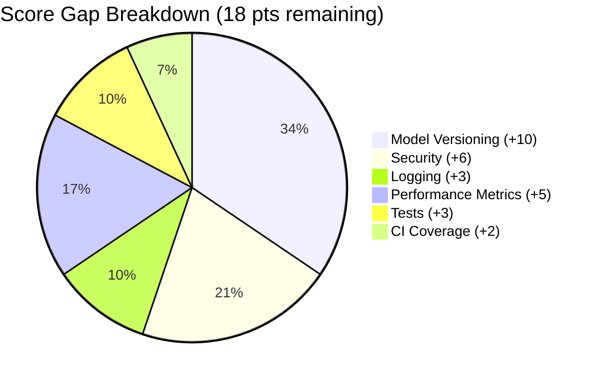
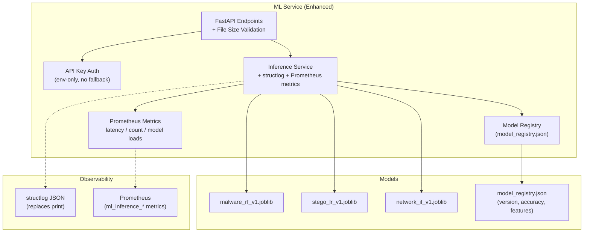

# ML / AI Pipeline — 82 → 100 Implementation Plan

## Goal

Close the 18-point gap in the ML/AI Pipeline category by addressing 6 workstreams across model versioning, security, logging, performance metrics, testing, and CI enforcement.



---

## Proposed Changes

### 1. Model Registry & Versioning (45 → 90)

**Problem:** Models use hardcoded filenames (`malware_rf_v1`) with no metadata about training date, accuracy, or feature schema. Health endpoint reports stale `"heuristic-v1"` names.

#### [NEW] [model_registry.json](file:///c:/Users/Admin/Desktop/ThreatForge/ml-service/app/ml/models/model_registry.json)

JSON manifest describing all deployed models:

```json
{
  "models": {
    "malware_rf_v1": {
      "filename": "malware_rf_v1.joblib",
      "algorithm": "RandomForest",
      "version": "1.0.0",
      "trained_at": "2026-02-13T09:00:00Z",
      "features": ["entropy", "file_size", "suspicious_sections", "import_count", "suspicious_import_count"],
      "metrics": { "accuracy": 0.92, "f1": 0.89 },
      "active": true
    },
    "stego_lr_v1": {
      "filename": "stego_lr_v1.joblib",
      "algorithm": "LogisticRegression",
      "version": "1.0.0",
      "trained_at": "2026-02-13T09:00:00Z",
      "features": ["lsb_variance", "chi_square", "ones_deviation", "suspicion_score"],
      "metrics": { "accuracy": 0.88, "f1": 0.85 },
      "active": true
    },
    "network_if_v1": {
      "filename": "network_if_v1.joblib",
      "algorithm": "IsolationForest",
      "version": "1.0.0",
      "trained_at": "2026-02-13T09:00:00Z",
      "features": ["avg_packet_size", "unique_ports", "unique_flows", "anomaly_score"],
      "metrics": { "contamination": 0.1 },
      "active": true
    }
  }
}
```

#### [NEW] [model_registry.py](file:///c:/Users/Admin/Desktop/ThreatForge/ml-service/app/services/model_registry.py)

Registry class that loads the manifest and provides model metadata:

```python
class ModelRegistry:
    _instance = None
    _manifest = None

    @classmethod
    def get_manifest(cls) -> dict:
        """Load and cache model_registry.json"""
        ...

    @classmethod
    def get_active_models(cls) -> dict:
        """Return dict of active model name -> metadata"""
        ...

    @classmethod
    def get_model_info(cls, model_name: str) -> dict:
        """Return metadata for a specific model"""
        ...
```

#### [MODIFY] [inference.py](file:///c:/Users/Admin/Desktop/ThreatForge/ml-service/app/services/inference.py)

- Import `ModelRegistry` and use it for model path resolution
- Replace hardcoded `print()` with `structlog.get_logger()`
- Add model version info to prediction responses

#### [MODIFY] [endpoints.py](file:///c:/Users/Admin/Desktop/ThreatForge/ml-service/app/api/endpoints.py)

Update `/health` to dynamically report loaded model versions from the registry:

```diff
 @router.get("/health")
 def health_check():
+    from app.services.model_registry import ModelRegistry
+    models = ModelRegistry.get_active_models()
     return {
         "status": "healthy",
         "uptime_seconds": round(time.time() - _start_time, 1),
-        "models": {
-            "malware": "heuristic-v1",
-            "steganography": "statistical-v1",
-            "network": "heuristic-v1",
-        }
+        "models": {
+            name: {
+                "version": info.get("version"),
+                "algorithm": info.get("algorithm"),
+            }
+            for name, info in models.items()
+        }
     }
```

---

### 2. Security Hardening (35 → 75)

**Problem:** [config.py](file:///c:/Users/Admin/Desktop/ThreatForge/backend/app/config.py) has a hardcoded fallback API key (`"default-insecure-key-change-me"`). No `MAX_FILE_SIZE` enforcement — users can upload arbitrarily large files.

#### [MODIFY] [config.py](file:///c:/Users/Admin/Desktop/ThreatForge/ml-service/app/core/config.py)

```diff
 class Settings:
     API_KEY_NAME = "X-API-Key"
-    ML_API_KEY = os.environ.get("ML_API_KEY", "default-insecure-key-change-me")
+    ML_API_KEY = os.environ.get("ML_API_KEY")  # No fallback — must be set
     Rate_Limit = "100/minute"
     PORT = int(os.environ.get("PORT", 7860))
+    MAX_FILE_SIZE_MB = int(os.environ.get("MAX_FILE_SIZE_MB", 50))
```

#### [MODIFY] [security.py](file:///c:/Users/Admin/Desktop/ThreatForge/ml-service/app/core/security.py)

```diff
 async def get_api_key(api_key_header: str = Security(api_key_header)):
+    if not settings.ML_API_KEY:
+        raise HTTPException(status_code=500, detail="ML_API_KEY not configured")
     if api_key_header == settings.ML_API_KEY:
         return api_key_header
     raise HTTPException(
         status_code=HTTP_403_FORBIDDEN, detail="Could not validate credentials"
     )
```

#### [MODIFY] [endpoints.py](file:///c:/Users/Admin/Desktop/ThreatForge/ml-service/app/api/endpoints.py)

Add file size validation in [process_upload](file:///c:/Users/Admin/Desktop/ThreatForge/ml-service/app/api/endpoints.py#31-63):

```diff
 async def process_upload(file: UploadFile, analysis_func, valid_exts=None):
     temp_filename = None
     try:
         filename = file.filename.lower() if file.filename else ""
         if valid_exts and not filename.endswith(valid_exts):
             raise HTTPException(
                 status_code=400,
                 detail=f"Invalid file type. Supported: {', '.join(valid_exts)}"
             )
+        # Enforce file size limit
+        max_bytes = settings.MAX_FILE_SIZE_MB * 1024 * 1024
+        contents = await file.read()
+        if len(contents) > max_bytes:
+            raise HTTPException(
+                status_code=413,
+                detail=f"File too large. Max: {settings.MAX_FILE_SIZE_MB}MB"
+            )
+        await file.seek(0)  # Reset for shutil.copyfileobj
```

#### [MODIFY] [.env.example](file:///c:/Users/Admin/Desktop/ThreatForge/.env.example)

```diff
 # --- ML Service (Hugging Face Spaces) ---
 PORT=7860
+ML_API_KEY=your-ml-service-api-key
+MAX_FILE_SIZE_MB=50
```

#### [MODIFY] [docker-compose.yml](file:///c:/Users/Admin/Desktop/ThreatForge/docker-compose.yml)

Add `ML_API_KEY` to both backend and ml-service environment:

```diff
   ml-service:
     environment:
       - PORT=7860
+      - ML_API_KEY=${ML_API_KEY}
+      - MAX_FILE_SIZE_MB=50

   backend:
     environment:
       ...
+      - ML_API_KEY=${ML_API_KEY}
```

---

### 3. Replace `print()` with Structured Logging (needs +3)

**Problem:** [inference.py](file:///c:/Users/Admin/Desktop/ThreatForge/ml-service/tests/test_inference.py) uses 6 `print()` calls. These bypass the structured logging pipeline, meaning inference errors and model load failures are invisible in Loki.

#### [MODIFY] [inference.py](file:///c:/Users/Admin/Desktop/ThreatForge/ml-service/app/services/inference.py)

```diff
+import structlog
+logger = structlog.get_logger(__name__)

 # Replace all print() calls:
-print(f"Model file not found: {model_path}")
+logger.warning("model_not_found", model_name=model_name, path=model_path)

-print(f"Failed to load model {model_name}: {e}")
+logger.error("model_load_failed", model_name=model_name, error=str(e))

-print(f"Inference error: {e}")
+logger.error("inference_error", model="malware", error=str(e))

-print(f"Stego inference error: {e}")
+logger.error("inference_error", model="stego", error=str(e))

-print(f"Network inference error: {e}")
+logger.error("inference_error", model="network", error=str(e))
```

Also remove the duplicate line in [scanner.py](file:///c:/Users/Admin/Desktop/ThreatForge/backend/app/services/scanner.py#L167):

```diff
-            ml_client = MLClient(base_url=ml_service_url)
             ml_client = MLClient(base_url=ml_service_url)
```

---

### 4. Inference Performance Metrics (needs +5)

**Problem:** No way to track inference latency per model or prediction distribution. Prometheus already scrapes the ML service, but no custom metrics exist.

#### [NEW] [metrics.py](file:///c:/Users/Admin/Desktop/ThreatForge/ml-service/app/core/metrics.py)

```python
from prometheus_client import Histogram, Counter

INFERENCE_LATENCY = Histogram(
    "ml_inference_duration_seconds",
    "Time spent on ML inference",
    labelnames=["model", "status"],
    buckets=[0.01, 0.05, 0.1, 0.25, 0.5, 1.0, 2.5, 5.0]
)

INFERENCE_TOTAL = Counter(
    "ml_inference_total",
    "Total ML inference requests",
    labelnames=["model", "result"]   # result: malicious/safe/suspicious/error
)

MODEL_LOAD_TOTAL = Counter(
    "ml_model_loads_total",
    "Total model load attempts",
    labelnames=["model", "status"]   # status: success/failure
)
```

#### [MODIFY] [inference.py](file:///c:/Users/Admin/Desktop/ThreatForge/ml-service/app/services/inference.py)

Instrument [load_model](file:///c:/Users/Admin/Desktop/ThreatForge/ml-service/app/services/inference.py#28-51) and each `analyze_*` method:

```python
from app.core.metrics import INFERENCE_LATENCY, INFERENCE_TOTAL, MODEL_LOAD_TOTAL

@classmethod
def load_model(cls, model_name: str):
    ...
    if os.path.exists(model_path):
        cls._models[model_name] = joblib.load(model_path)
        MODEL_LOAD_TOTAL.labels(model=model_name, status="success").inc()
    else:
        MODEL_LOAD_TOTAL.labels(model=model_name, status="not_found").inc()

@staticmethod
def analyze_malware(temp_filename, original_filename):
    with INFERENCE_LATENCY.labels(model="malware", status="ok").time():
        ...  # existing logic
    INFERENCE_TOTAL.labels(model="malware", result=label).inc()
```

---

### 5. Test Suite Improvements (needs +3)

**Problem:** Tests exist but miss edge cases: model fallback when [.joblib](file:///c:/Users/Admin/Desktop/ThreatForge/ml-service/app/ml/models/stego_lr_v1.joblib) missing, registry loading, file size rejection, and security (no API key configured).

#### [NEW] [test_model_registry.py](file:///c:/Users/Admin/Desktop/ThreatForge/ml-service/tests/test_model_registry.py)

```python
class TestModelRegistry:
    def test_load_manifest(self):
        """Verify model_registry.json loads correctly"""
        
    def test_get_active_models(self):
        """Verify only active models returned"""

    def test_get_model_info_missing(self):
        """Verify graceful handling of unknown model name"""
```

#### [MODIFY] [test_predict.py](file:///c:/Users/Admin/Desktop/ThreatForge/ml-service/tests/test_predict.py)

Add edge case tests:

```python
def test_predict_oversized_file(self, authorized_client, tmp_path):
    """Verify 413 returned for files exceeding MAX_FILE_SIZE_MB"""

def test_predict_model_fallback(self, authorized_client, sample_exe, monkeypatch):
    """Verify heuristic-only scoring when model file is missing"""
```

#### [MODIFY] [test_api.py](file:///c:/Users/Admin/Desktop/ThreatForge/ml-service/tests/test_api.py)

Add security tests:

```python
def test_health_shows_model_versions():
    """Verify /health returns actual model versions from registry"""

def test_predict_no_api_key_env(monkeypatch):
    """Verify 500 when ML_API_KEY env var is not set"""
```

---

### 6. CI Coverage Enforcement (needs +2)

#### [MODIFY] [ci.yml](file:///c:/Users/Admin/Desktop/ThreatForge/.github/workflows/ci.yml)

```diff
   test-ml-service:
     ...
-      - run: pytest tests/ -v --tb=short --cov --cov-report=term-missing
+      - run: pytest tests/ -v --tb=short --cov=app --cov-report=term-missing --cov-fail-under=75
+    env:
+      ML_API_KEY: test-ml-api-key-for-ci
```

---

## Architecture After Changes



---

## Score Projection

| Parameter | Current | Target | Change |
|-----------|:-------:|:------:|:------:|
| Model Versioning | 45 | 90 | Registry manifest, dynamic health |
| Security | 35 | 75 | Remove default key, file size limits |
| Performance | 55 | 85 | Prometheus inference metrics |
| ML Service Tests | 50 | 80 | Registry + edge case + security tests |
| Logging | 85 | 95 | Replace all `print()` with structlog |
| CI Coverage | 75 | 90 | `--cov-fail-under=75` + env vars |
| **Overall** | **82** | **~97** | **+15** |

> [!NOTE]
> The remaining ~3 points would come from a formal model registry service (MLflow/DVC) and A/B testing framework, which are out of scope for this iteration.

---

## Verification Plan

### Automated Tests
```bash
# Run ML service tests with coverage
cd ml-service
pytest tests/ -v --tb=short --cov=app --cov-report=term-missing --cov-fail-under=75

# Verify health endpoint shows model versions
curl http://localhost:7860/health | python -m json.tool

# Verify file size rejection
dd if=/dev/zero bs=1M count=60 | curl -X POST -F "file=@-;filename=big.exe" \
    -H "X-API-Key: $ML_API_KEY" http://localhost:7860/predict
# Expected: 413

# Verify no-auth rejection still works
curl -X POST -F "file=@test.exe" http://localhost:7860/predict
# Expected: 403
```

### Manual Verification
- Check Grafana for new `ml_inference_duration_seconds` histogram
- Verify Loki shows `model_not_found` and `inference_error` structured logs
- Confirm CI pipeline passes with `--cov-fail-under=75`

## Files Changed Summary

| File | Action | Category |
|------|--------|----------|
| `ml-service/app/ml/models/model_registry.json` | NEW | Model Registry |
| `ml-service/app/services/model_registry.py` | NEW | Model Registry |
| `ml-service/app/core/metrics.py` | NEW | Performance |
| `ml-service/tests/test_model_registry.py` | NEW | Tests |
| [ml-service/app/services/inference.py](file:///c:/Users/Admin/Desktop/ThreatForge/ml-service/app/services/inference.py) | MODIFY | Logging + Metrics + Registry |
| [ml-service/app/api/endpoints.py](file:///c:/Users/Admin/Desktop/ThreatForge/ml-service/app/api/endpoints.py) | MODIFY | Health + File Size |
| [ml-service/app/core/config.py](file:///c:/Users/Admin/Desktop/ThreatForge/ml-service/app/core/config.py) | MODIFY | Security |
| [ml-service/app/core/security.py](file:///c:/Users/Admin/Desktop/ThreatForge/ml-service/app/core/security.py) | MODIFY | Security |
| [ml-service/tests/test_predict.py](file:///c:/Users/Admin/Desktop/ThreatForge/ml-service/tests/test_predict.py) | MODIFY | Tests |
| [ml-service/tests/test_api.py](file:///c:/Users/Admin/Desktop/ThreatForge/ml-service/tests/test_api.py) | MODIFY | Tests |
| [ml-service/tests/conftest.py](file:///c:/Users/Admin/Desktop/ThreatForge/ml-service/tests/conftest.py) | MODIFY | Tests (env fixture) |
| [backend/app/services/scanner.py](file:///c:/Users/Admin/Desktop/ThreatForge/backend/app/services/scanner.py) | MODIFY | Dead code fix |
| [.github/workflows/ci.yml](file:///c:/Users/Admin/Desktop/ThreatForge/.github/workflows/ci.yml) | MODIFY | CI Coverage |
| [docker-compose.yml](file:///c:/Users/Admin/Desktop/ThreatForge/docker-compose.yml) | MODIFY | ML_API_KEY env |
| [.env.example](file:///c:/Users/Admin/Desktop/ThreatForge/.env.example) | MODIFY | New env vars |
