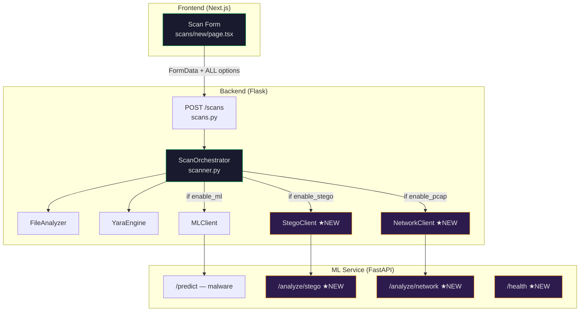
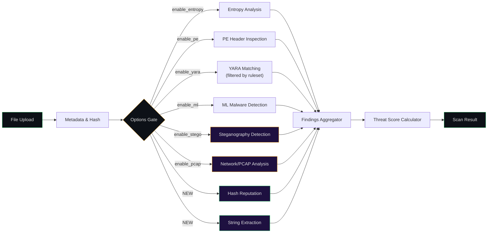

# Scan Options — Full Implementation Plan

## Current State Audit

After a thorough audit of all 3 layers (Frontend → Backend → ML Service), here is the status of every scan option:

| Scan Option | Frontend Toggle | Sent to Backend | Backend Logic | ML Service Endpoint | **Status** |
|---|---|---|---|---|---|
| **Malware Detection (ML)** | ✅ `scanOptions.ml` | ✅ `enable_ml` | ✅ [scanner.py](file:///c:/Users/Admin/Desktop/ThreatForge/backend/app/services/scanner.py) calls [MLClient](file:///c:/Users/Admin/Desktop/ThreatForge/backend/app/services/ml_client.py#7-44) | ⚠️ `/predict` (heuristic only) | **Partial** |
| **Steganography Analysis** | ✅ `scanOptions.stego` | ❌ Not sent | ❌ No service | ❌ No endpoint | **Not Working** |
| **YARA Rule Matching** | ✅ `scanOptions.yara` | ✅ `enable_yara` | ✅ `YaraEngine.match_file()` | N/A (runs on backend) | **Working** |
| **Network Traffic (PCAP)** | ✅ `scanOptions.pcap` | ❌ Not sent | ❌ No service | ❌ No endpoint | **Not Working** |
| **File Entropy Analysis** | ✅ `scanOptions.entropy` | ❌ Not sent | ⚠️ Always runs (not gated) | N/A (runs on backend) | **Partial** |
| **PE Header Inspection** | ✅ `scanOptions.pe` | ❌ Not sent | ⚠️ Always runs (not gated) | N/A (runs on backend) | **Partial** |
| **YARA Ruleset Filter** | ✅ `yaraRuleset` | ❌ Not sent | ❌ No filtering | N/A | **Not Working** |
| **Scan Priority** | ✅ `highPriority` | ❌ Not sent | ❌ Not stored | N/A | **Not Working** |

> [!CAUTION]
> Only **2 of 8** scan options are fully functional (YARA and partial ML). The remaining 6 are UI-only — toggling them has no effect on the actual scan.

## Architecture



---

## Proposed Changes

### Phase 1 — Wire All Options End-to-End

This is the **foundation**. Right now the frontend collects 8 options but only transmits 2.

---

#### [MODIFY] [page.tsx](file:///c:/Users/Admin/Desktop/ThreatForge/frontend/src/app/(dashboard)/scans/new/page.tsx)

Update [handleSubmit()](file:///c:/Users/Admin/Desktop/ThreatForge/frontend/src/app/%28dashboard%29/scans/new/page.tsx#66-88) to send **all** options in the FormData:

```diff
  formData.append('enable_ml', String(scanOptions.ml));
  formData.append('enable_yara', String(scanOptions.yara));
+ formData.append('enable_stego', String(scanOptions.stego));
+ formData.append('enable_pcap', String(scanOptions.pcap));
+ formData.append('enable_entropy', String(scanOptions.entropy));
+ formData.append('enable_pe', String(scanOptions.pe));
+ formData.append('yara_ruleset', yaraRuleset);
+ formData.append('priority', highPriority ? 'high' : 'normal');
```

---

#### [MODIFY] [scans.py](file:///c:/Users/Admin/Desktop/ThreatForge/backend/app/api/scans.py)

Parse all new options from `request.form`:

```diff
  enable_ml = request.form.get('enable_ml', 'true').lower() == 'true'
  enable_yara = request.form.get('enable_yara', 'true').lower() == 'true'
+ enable_stego = request.form.get('enable_stego', 'true').lower() == 'true'
+ enable_pcap = request.form.get('enable_pcap', 'false').lower() == 'true'
+ enable_entropy = request.form.get('enable_entropy', 'true').lower() == 'true'
+ enable_pe = request.form.get('enable_pe', 'true').lower() == 'true'
+ yara_ruleset = request.form.get('yara_ruleset', 'all')
+ priority = request.form.get('priority', 'normal')
```

Store in the `options` dict and pass to `orchestrator.run_scan()`. Store `priority` on the scan record. Filter YARA rules by `yara_ruleset` before passing them.

---

#### [MODIFY] [scanner.py](file:///c:/Users/Admin/Desktop/ThreatForge/backend/app/services/scanner.py)

Gate each analysis step behind its option flag:

```python
# Step 2: Entropy (only if enabled)
if options.get('enable_entropy', True):
    entropy = self.file_analyzer.calculate_entropy(file_data)
    if entropy > 7.5:
        findings.append(...)

# Step 3: PE headers (only if enabled)
if options.get('enable_pe', True):
    pe_info = self.file_analyzer.parse_pe_headers(file_path)
    ...

# Step 4: Steganography (NEW)
if options.get('enable_stego', False):
    stego_result = self._run_stego_analysis(file_path, ml_service_url)
    ...

# Step 5: Network/PCAP (NEW)
if options.get('enable_pcap', False):
    network_result = self._run_network_analysis(file_path, ml_service_url)
    ...
```

---

### Phase 2 — Steganography Analysis

Implement real image analysis for detecting hidden data.

---

#### [MODIFY] [image_features.py](file:///c:/Users/Admin/Desktop/ThreatForge/ml-service/features/image_features.py)

Implement [extract()](file:///c:/Users/Admin/Desktop/ThreatForge/ml-service/features/network_features.py#8-29) using Pillow + numpy:

- **LSB variance**: Extract least-significant-bit plane, compute variance
- **Chi-square test**: Statistical test on pixel pair distributions
- **Pixel statistics**: Mean, std deviation, entropy of pixel values
- **Color channel deviations**: Per-channel analysis (R, G, B)

---

#### [MODIFY] [app.py](file:///c:/Users/Admin/Desktop/ThreatForge/ml-service/app.py)

Add new endpoint:

```python
@app.post("/analyze/stego")
async def analyze_steganography(file: UploadFile = File(...)):
    """Detect hidden data in images using statistical analysis."""
    # 1. Check if file is an image (PIL.Image.open)
    # 2. Extract features via ImageFeatureExtractor
    # 3. Classify using heuristic thresholds or SteganographyDetector
    # Return: {has_hidden_data, confidence, method, features}
```

---

#### [NEW] stego_client.py (file:///c:/Users/Admin/Desktop/ThreatForge/backend/app/services/stego_client.py)

Create HTTP client (similar to [MLClient](file:///c:/Users/Admin/Desktop/ThreatForge/backend/app/services/ml_client.py#7-44)) that calls `/analyze/stego`. Integrated into [scanner.py](file:///c:/Users/Admin/Desktop/ThreatForge/backend/app/services/scanner.py) as a new step.

---

### Phase 3 — Network Traffic Analysis (PCAP)

Implement PCAP file parsing and anomaly detection.

---

#### [MODIFY] [network_features.py](file:///c:/Users/Admin/Desktop/ThreatForge/ml-service/features/network_features.py)

Implement [extract()](file:///c:/Users/Admin/Desktop/ThreatForge/ml-service/features/network_features.py#8-29) using `dpkt`:

- **Packet stats**: Count, avg/std size, protocol distribution
- **Flow analysis**: Duration, inter-arrival times, burst detection
- **Port analysis**: Unique ports, well-known vs ephemeral ratio
- **DNS extraction**: Domains queried, suspicious TLDs
- **IOC detection**: Known malicious IPs/domains from hardcoded lists

---

#### [MODIFY] [app.py](file:///c:/Users/Admin/Desktop/ThreatForge/ml-service/app.py)

Add new endpoint:

```python
@app.post("/analyze/network")
async def analyze_network(file: UploadFile = File(...)):
    """Analyze PCAP file for network anomalies and IOCs."""
    # 1. Parse PCAP with dpkt
    # 2. Extract features via NetworkFeatureExtractor
    # 3. Detect anomalies using NetworkAnomalyDetector or heuristics
    # Return: {is_anomalous, anomaly_score, packets, flows, iocs_found, dns_queries}
```

---

#### [NEW] network_client.py (file:///c:/Users/Admin/Desktop/ThreatForge/backend/app/services/network_client.py)

HTTP client calling `/analyze/network`, integrated into [scanner.py](file:///c:/Users/Admin/Desktop/ThreatForge/backend/app/services/scanner.py).

---

### Phase 4 — YARA Ruleset Category Filtering

The dropdown shows "Malware Signatures", "Network IOCs", "Custom Rules" — wire it to filter which rules run.

---

#### Database Migration

Add `category` column to `yara_rules` table:

```sql
ALTER TABLE yara_rules ADD COLUMN category TEXT DEFAULT 'custom'
  CHECK (category IN ('malware', 'network', 'custom'));
```

---

#### [MODIFY] [scans.py](file:///c:/Users/Admin/Desktop/ThreatForge/backend/app/api/scans.py)

Filter YARA rules by category when `yara_ruleset != 'all'`:

```python
rules_query = supabase.table('yara_rules').select('name, rule_content, category')\
    .eq('is_enabled', True)\
    .or_(f"user_id.eq.{user_id},is_builtin.eq.true")

if yara_ruleset != 'all':
    rules_query = rules_query.eq('category', yara_ruleset)
```

---

#### Seed Built-in Rules

Create 3-5 built-in YARA rules per category:
- **malware**: Detect packed executables, suspicious strings, ransomware patterns
- **network**: Detect C2 beacons, suspicious URLs, base64-encoded IPs

---

### Phase 5 — ML Service Enhancement

Upgrade `/predict` from heuristic scoring to proper ML pipeline.

---

#### [MODIFY] [app.py](file:///c:/Users/Admin/Desktop/ThreatForge/ml-service/app.py)

- Add model loading at startup (sklearn RandomForest or similar)
- Add `/health` endpoint returning service status and model info
- Wire [MalwarePredictor](file:///c:/Users/Admin/Desktop/ThreatForge/ml-service/inference/malware.py#6-36) class with the loaded model
- Fall back to current heuristic scoring if model file is missing

---

### Phase 6 — Scan Priority

---

#### [MODIFY] [scans.py](file:///c:/Users/Admin/Desktop/ThreatForge/backend/app/api/scans.py)

Store `priority` in the scan record. For the synchronous scan flow, priority is informational. For future async (Celery/Redis), priority controls queue ordering.

---

### Phase 7 — Suggested New Scan Features

These features would significantly enhance ThreatForge's value:

| Feature | Description | Difficulty | Impact |
|---|---|---|---|
| **Hash Reputation Lookup** | Check SHA-256 against VirusTotal/MalwareBazaar APIs | Easy | High |
| **String Extraction** | Extract ASCII/Unicode strings, flag suspicious patterns (URLs, IPs, registry keys) | Easy | High |
| **Macro/VBA Detection** | Detect and analyze macros in Office files (oletools) | Medium | High |
| **Certificate Validation** | Verify digital signatures on signed executables | Medium | Medium |
| **Sandbox Behavioral Analysis** | Describe what the file *would do* based on imports + strings | Hard | Very High |
| **File Similarity** | Compare uploaded file against known malware samples via ssdeep fuzzy hashing | Medium | High |

> [!IMPORTANT]
> I recommend implementing **Hash Reputation Lookup** and **String Extraction** first — they're easy to add, require no external services, and provide high user value.

### Hash Reputation Lookup

- Add to [scanner.py](file:///c:/Users/Admin/Desktop/ThreatForge/backend/app/services/scanner.py) as an optional step
- Use free MalwareBazaar API (no key required): `POST https://mb-api.abuse.ch/api/v1/`
- Query by SHA-256 hash after file metadata extraction
- Return: known malware family, first/last seen dates, tags

### String Extraction

- Add to [file_analyzer.py](file:///c:/Users/Admin/Desktop/ThreatForge/backend/app/services/file_analyzer.py) as `extract_strings()`
- Extract ASCII strings ≥ 6 chars and Unicode strings ≥ 6 chars
- Flag suspicious patterns: URLs, IP addresses, email addresses, registry paths, API names
- Categorize: benign, suspicious, IOC

---

## Scan Pipeline — After Implementation



---

## Verification Plan

### Automated Tests
- Upload a `.exe` file with all options enabled → verify findings include entropy, PE, YARA, ML results
- Upload an image (`.png`) with steganography option → verify stego analysis result
- Upload a `.pcap` file with network analysis → verify packet/flow data returned
- Select "Malware Signatures" YARA ruleset → verify only malware-category rules are matched
- Upload with high priority → verify `priority: 'high'` stored in scan record

### Manual Verification
- Toggle each scan option off individually and verify the corresponding analysis step is skipped
- Check scan detail page shows results from each enabled analysis module
- Verify the "YARA Ruleset" dropdown filters correctly

---

## Implementation Order

```mermaid
gantt
    title Scan Options Implementation
    dateFormat X
    axisFormat %s

    section Phase 1
    Wire options end-to-end           :p1, 0, 3
    
    section Phase 2
    Steganography analysis            :p2, after p1, 4
    
    section Phase 3
    Network/PCAP analysis             :p3, after p1, 4
    
    section Phase 4
    YARA ruleset filtering            :p4, after p1, 2
    
    section Phase 5
    ML service enhancement            :p5, after p2, 3
    
    section Phase 6
    Scan priority                     :p6, after p4, 1
    
    section Phase 7
    Hash reputation + String extraction :p7, after p6, 3
```



> [!NOTE]
> Phases 2, 3, and 4 can run concurrently after Phase 1 is complete.
