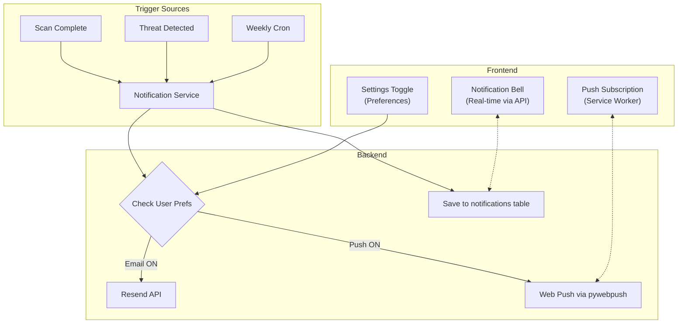
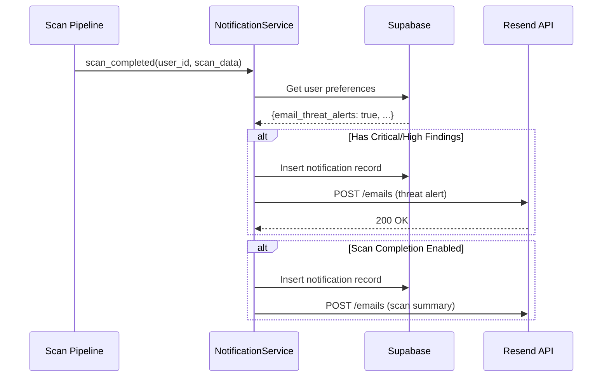

# Notifications System — Implementation Plan

Build a fully functional notification system with **email alerts** (Resend free tier) and **browser push notifications** (Web Push API). Remove Slack Alerts.

## Architecture



## Email Flow



## Proposed Changes

### Database

#### [MODIFY] [supabase-setup.sql](file:///c:/Users/Admin/Desktop/ThreatForge/backend/supabase-setup.sql)

Two new tables:

```sql
-- User notification preferences (persisted toggles)
notification_preferences (
    user_id UUID PK → profiles(id),
    email_threat_alerts     BOOLEAN DEFAULT TRUE,
    email_scan_completions  BOOLEAN DEFAULT TRUE,
    email_weekly_digest     BOOLEAN DEFAULT FALSE,
    push_critical_alerts    BOOLEAN DEFAULT TRUE,
    push_scan_updates       BOOLEAN DEFAULT FALSE,
    push_subscription       JSONB,        -- Web Push subscription object
    updated_at              TIMESTAMPTZ
)

-- Notification history (bell icon feed)
notifications (
    id UUID PK,
    user_id UUID → profiles(id),
    type TEXT,           -- 'threat_alert' | 'scan_complete' | 'weekly_digest'
    channel TEXT,        -- 'email' | 'push' | 'in_app'
    title TEXT,
    message TEXT,
    metadata JSONB,      -- {scan_id, severity, ...}
    is_read BOOLEAN DEFAULT FALSE,
    created_at TIMESTAMPTZ
)
```

---

### Backend — Notification Service

#### [NEW] [notifications.py](file:///c:/Users/Admin/Desktop/ThreatForge/backend/app/services/notifications.py)

Core service class:

| Method | Trigger | What It Does |
|--------|---------|--------------|
| `notify_scan_complete(user_id, scan_data)` | After scan finishes | Checks prefs → sends email + push if enabled |
| `notify_threat_detected(user_id, threat_data)` | When critical/high findings found | Email + push for threat alerts |
| `send_weekly_digest(user_id)` | Scheduled (cron/manual) | Aggregates past 7 days → emails summary |
| `_send_email(to, subject, html)` | Internal | Calls Resend API |
| `_send_push(subscription, payload)` | Internal | Calls `pywebpush` |

#### [NEW] [email_templates.py](file:///c:/Users/Admin/Desktop/ThreatForge/backend/app/services/email_templates.py)

HTML email templates for:
- **Threat Alert** — severity badge, file name, finding details, link to scan
- **Scan Complete** — scan summary stats (files, threats, duration)
- **Weekly Digest** — table of scans from past week, top threats, overall stats

#### [NEW] [notifications_api.py](file:///c:/Users/Admin/Desktop/ThreatForge/backend/app/api/notifications_api.py)

Blueprint with endpoints:

| Endpoint | Method | Purpose |
|----------|--------|---------|
| `/notifications/preferences` | GET/PUT | Get/update notification toggle preferences |
| `/notifications` | GET | Fetch notification history (paginated) |
| `/notifications/<id>/read` | PUT | Mark as read |
| `/notifications/read-all` | PUT | Mark all as read |
| `/notifications/unread-count` | GET | Badge count for bell icon |
| `/notifications/push/subscribe` | POST | Store Web Push subscription |
| `/notifications/push/unsubscribe` | POST | Remove subscription |
| `/notifications/test` | POST | Send a test notification |

---

### Backend — Integration Hooks

#### [MODIFY] [scans.py](file:///c:/Users/Admin/Desktop/ThreatForge/backend/app/api/scans.py)

At the end of [create_scan()](file:///c:/Users/Admin/Desktop/ThreatForge/backend/app/api/scans.py#25-218) (after scan completes and findings are saved):
```python
# After scan is done and DB updated
from ..services.notifications import notify_scan_complete, notify_threat_detected

notify_scan_complete(user_id, scan_result_summary)
if threat_level in ('critical', 'high'):
    notify_threat_detected(user_id, threat_details)
```

---

### Frontend

#### [MODIFY] [settings/page.tsx](file:///c:/Users/Admin/Desktop/ThreatForge/frontend/src/app/(dashboard)/settings/page.tsx)

- Remove **Slack Alerts** from Push Notifications section
- Wire toggles to `/notifications/preferences` API (persist on toggle)
- Add a **"Send Test"** button to verify email/push delivery
- Load saved preferences on mount

#### [NEW] [sw.js](file:///c:/Users/Admin/Desktop/ThreatForge/frontend/public/sw.js)

Service Worker for receiving push notifications:
- Handles `push` events → shows browser notification
- Handles `notificationclick` → opens ThreatForge to relevant page

#### [MODIFY] [api.ts](file:///c:/Users/Admin/Desktop/ThreatForge/frontend/src/lib/api.ts)

Add helpers: `getNotificationPrefs`, `updateNotificationPrefs`, `subscribePush`, `unsubscribePush`, `getNotifications`, `markRead`, `getUnreadCount`

#### [MODIFY] [Navbar](file:///c:/Users/Admin/Desktop/ThreatForge/frontend/src/components/layout/Navbar.tsx)

Add notification bell icon with unread badge count and a dropdown showing recent notifications.

---

### Configuration

#### [MODIFY] [config.py](file:///c:/Users/Admin/Desktop/ThreatForge/backend/app/config.py)

```python
# Resend (free tier: 100 emails/day)
RESEND_API_KEY = os.environ.get('RESEND_API_KEY', '')
RESEND_FROM_EMAIL = os.environ.get('RESEND_FROM_EMAIL', 'noreply@threatforge.dev')

# Web Push (VAPID keys)
VAPID_PUBLIC_KEY = os.environ.get('VAPID_PUBLIC_KEY', '')
VAPID_PRIVATE_KEY = os.environ.get('VAPID_PRIVATE_KEY', '')
VAPID_CLAIMS_EMAIL = os.environ.get('VAPID_CLAIMS_EMAIL', 'admin@threatforge.dev')
```

#### [MODIFY] [requirements.txt](file:///c:/Users/Admin/Desktop/ThreatForge/backend/requirements.txt)

Add: `resend`, `pywebpush`

---

## User Review Required

> [!IMPORTANT]
> **Resend API Key needed.** Sign up at [resend.com](https://resend.com) (free tier = 100 emails/day, 3,000/month). You'll need to provide your API key as `RESEND_API_KEY` in [.env](file:///c:/Users/Admin/Desktop/ThreatForge/backend/.env).

> [!IMPORTANT]
> **VAPID keys for Web Push.** I'll auto-generate these during implementation using `pywebpush`. No signup needed — they're just a key pair.

> [!NOTE]
> **Weekly Digest** will require a scheduled job. For dev, I'll add a manual trigger endpoint. For production, this would use Supabase Edge Functions (cron) or a simple scheduler like APScheduler.

## Verification Plan

### Automated Tests
- `POST /notifications/test` → verify email sends + push fires
- Toggle preferences → verify persisted to DB
- Create scan → verify notification record created in DB

### Manual Verification
- Enable email notifications → run a scan → check Resend dashboard for sent email
- Enable push → grant browser permission → run scan → see browser notification
- Toggle notification off → run scan → confirm no notification sent
- Check notification bell in navbar shows correct unread count
