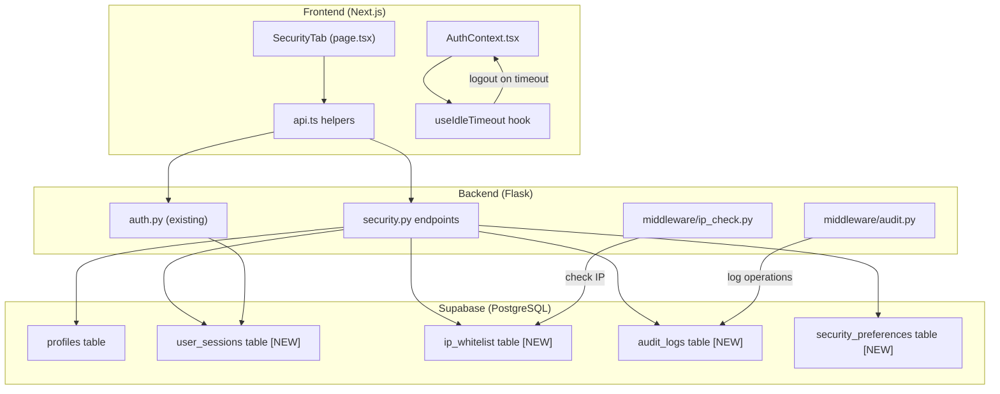
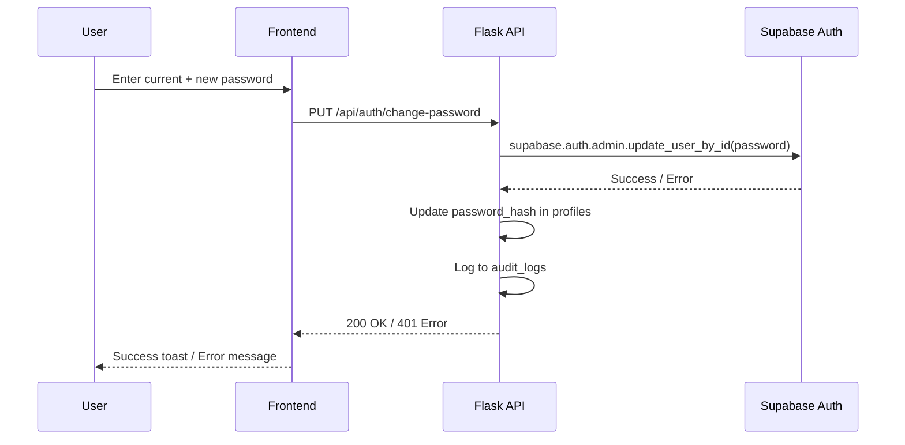
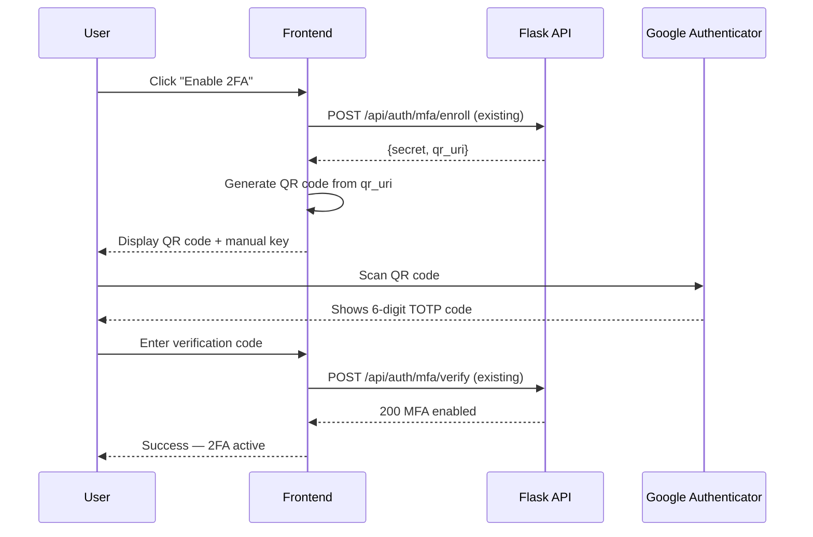
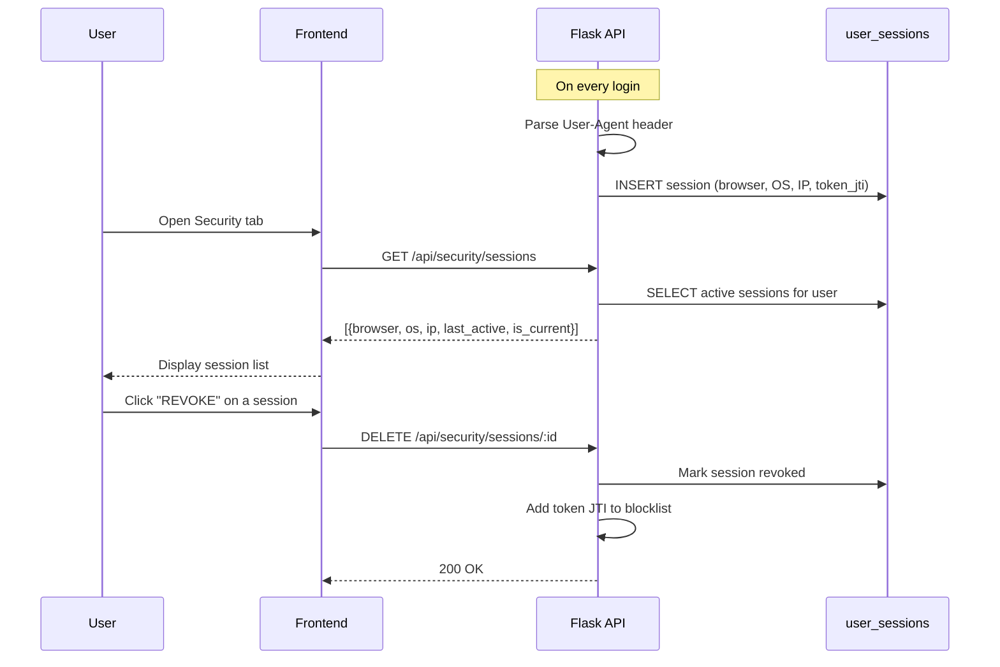

# Security Settings — Full Functional Implementation

Implement all five features in the Settings → Security tab so they work end-to-end: **Change Password**, **Two-Factor Authentication (TOTP)**, **Session Auto-Timeout**, **IP Whitelisting**, **Verbose Audit Logging**, and **Active Sessions** with real browser/IP data.

## Architecture Overview



## User Review Required

> [!IMPORTANT]
> **New database tables required.** Four new tables (`user_sessions`, `ip_whitelist`, `audit_logs`, `security_preferences`) will be added. You will need to run the SQL migration in Supabase SQL Editor.

> [!WARNING]
> **Session auto-timeout** uses a client-side idle timer. If the user is inactive for 15 minutes, they will be automatically logged out. The timer resets on mouse/keyboard/touch activity.

---

## Feature Flow Diagrams

### Change Password Flow



### 2FA Enrollment Flow



### Active Sessions Flow



---

## Proposed Changes

### Database Layer

#### [MODIFY] [supabase-setup.sql](file:///c:/Users/Admin/Desktop/ThreatForge/backend/supabase-setup.sql)

Add four new tables before the RLS section:

**`user_sessions`** — tracks login sessions with device/IP info
| Column | Type | Purpose |
|--------|------|---------|
| id | UUID PK | Session ID |
| user_id | UUID FK → profiles | Owner |
| token_jti | TEXT UNIQUE | JWT ID for revocation |
| browser | TEXT | e.g. "Chrome 120" |
| os | TEXT | e.g. "Windows 11" |
| ip_address | TEXT | Login IP |
| last_active_at | TIMESTAMPTZ | Last API call time |
| is_revoked | BOOLEAN | Soft-delete for revocation |
| created_at | TIMESTAMPTZ | Login time |

**`security_preferences`** — per-user toggle states
| Column | Type | Purpose |
|--------|------|---------|
| user_id | UUID PK FK → profiles | One row per user |
| session_timeout_enabled | BOOLEAN | 15-min idle timeout |
| session_timeout_minutes | INT | Configurable timeout |
| ip_whitelist_enabled | BOOLEAN | IP restriction toggle |
| audit_logging_enabled | BOOLEAN | Verbose log toggle |

**`ip_whitelist`** — allowed CIDR ranges per user
| Column | Type | Purpose |
|--------|------|---------|
| id | UUID PK | Entry ID |
| user_id | UUID FK → profiles | Owner |
| cidr_range | TEXT | e.g. "192.168.1.0/24" |
| label | TEXT | e.g. "Office Network" |
| created_at | TIMESTAMPTZ | When added |

**`audit_logs`** — verbose operation logs
| Column | Type | Purpose |
|--------|------|---------|
| id | UUID PK | Log ID |
| user_id | UUID FK → profiles | Actor |
| action | TEXT | e.g. "password_changed", "scan_created" |
| resource_type | TEXT | e.g. "scan", "profile", "yara_rule" |
| resource_id | UUID | ID of affected resource |
| details | JSONB | Extra context |
| ip_address | TEXT | Request IP |
| created_at | TIMESTAMPTZ | Timestamp |

Add RLS policies for each table (users can only access own data).

---

### Backend API

#### [NEW] [security.py](file:///c:/Users/Admin/Desktop/ThreatForge/backend/app/api/security.py)

New `security_bp` blueprint with these endpoints:

| Method | Endpoint | Purpose |
|--------|----------|---------|
| `PUT` | `/auth/change-password` | Change password via Supabase Auth Admin API |
| `GET` | `/security/sessions` | List active sessions for current user |
| `DELETE` | `/security/sessions/<id>` | Revoke a specific session |
| `GET` | `/security/preferences` | Get user's security preference toggles |
| `PUT` | `/security/preferences` | Update toggles (timeout, IP whitelist, audit) |
| `GET` | `/security/ip-whitelist` | List whitelisted IP ranges |
| `POST` | `/security/ip-whitelist` | Add a CIDR range |
| `DELETE` | `/security/ip-whitelist/<id>` | Remove a CIDR range |
| `GET` | `/security/audit-logs` | Get paginated audit logs |

#### [MODIFY] [auth.py](file:///c:/Users/Admin/Desktop/ThreatForge/backend/app/api/auth.py)

- **Login endpoint**: After successful auth, create a `user_sessions` record with parsed `User-Agent` (browser name, OS) and `request.remote_addr` IP. Store the JWT `jti` for future revocation.
- **MFA enroll/verify**: Update provisioning URI issuer to `ThreatForge` (currently `CyberThreatAI`).

#### [MODIFY] [__init__.py](file:///c:/Users/Admin/Desktop/ThreatForge/backend/app/__init__.py)

Register `security_bp` blueprint and configure JWT blocklist checking (for session revocation).

#### [MODIFY] [extensions.py](file:///c:/Users/Admin/Desktop/ThreatForge/backend/app/extensions.py)

Add JWT blocklist storage (in-memory set + DB check for revoked JTIs).

#### [MODIFY] [user.py](file:///c:/Users/Admin/Desktop/ThreatForge/backend/app/models/user.py)

No model changes needed — we already have `mfa_enabled` and `mfa_secret`.

---

### Frontend

#### [MODIFY] [settings/page.tsx](file:///c:/Users/Admin/Desktop/ThreatForge/frontend/src/app/(dashboard)/settings/page.tsx)

Rewrite [SecurityTab](file:///c:/Users/Admin/Desktop/ThreatForge/frontend/src/app/%28dashboard%29/settings/page.tsx#214-302) to be fully functional:

**Change Password section:**
- State: `currentPassword`, `newPassword`, `confirmPassword`
- Validation: min 8 chars, passwords match
- Calls `PUT /api/auth/change-password`
- Shows success/error toast with animated feedback

**2FA section:**
- If `user.mfa_enabled` → show "2FA Active" badge + "Disable 2FA" button
- If not enabled → "Enable 2FA" button → calls `/auth/mfa/enroll` → shows QR code modal (using `qrcode.react`) → user enters 6-digit code → calls `/auth/mfa/verify`
- QR code displays in a styled modal with manual secret key fallback

**Security Preferences section:**
- Toggles load from `GET /security/preferences` on mount
- Each toggle calls `PUT /security/preferences` on change
- Session timeout, IP whitelisting, audit logging — all persisted server-side

**IP Whitelist section (conditionally shown):**
- Only visible when IP Whitelisting toggle is ON
- Shows list of CIDR entries with delete buttons
- Add new entry form (CIDR + label)

**Active Sessions section:**
- Loads from `GET /security/sessions`
- Shows browser name, OS, IP, last active time, "CURRENT" badge on current session
- "REVOKE" button on other sessions with confirmation

#### [MODIFY] [api.ts](file:///c:/Users/Admin/Desktop/ThreatForge/frontend/src/lib/api.ts)

Add security API helper functions:
- `changePassword(currentPassword, newPassword)`
- `getSecurityPreferences()` / `updateSecurityPreferences(prefs)`
- `getSessions()` / `revokeSession(id)`
- `getIpWhitelist()` / `addIpWhitelist(cidr, label)` / `removeIpWhitelist(id)`
- `getAuditLogs(page)`
- `enrollMFA()` / `verifyMFA(code)` / `disableMFA(code)`

#### [NEW] [useIdleTimeout.ts](file:///c:/Users/Admin/Desktop/ThreatForge/frontend/src/hooks/useIdleTimeout.ts)

Custom React hook for session auto-timeout:
- Listens to `mousemove`, `keydown`, `click`, `scroll`, `touchstart`
- Resets a timer on each event
- When timer expires (default 15 min), calls [logout()](file:///c:/Users/Admin/Desktop/ThreatForge/backend/app/api/auth.py#242-256) from AuthContext
- Shows a warning modal 1 minute before timeout

#### [MODIFY] [AuthContext.tsx](file:///c:/Users/Admin/Desktop/ThreatForge/frontend/src/lib/AuthContext.tsx)

- Integrate `useIdleTimeout` hook when session timeout is enabled
- Fetch security preferences on auth load to determine if timeout is active

#### [NEW] Install `qrcode.react` package

```bash
npm install qrcode.react
```

Required for rendering the TOTP QR code in the 2FA enrollment flow.

---

## Verification Plan

### Automated Tests
1. `python -m pytest` — Run backend tests for new security endpoints
2. `npm run build` — Verify frontend compiles with no errors

### Manual Verification
1. **Change Password**: Log in → Settings → Security → Change password → Log out → Log in with new password
2. **2FA**: Enable 2FA → Scan QR with Google Authenticator → Verify code → Log out → Log in with TOTP
3. **Session Timeout**: Enable timeout → Wait 15 min idle → Verify auto-logout (or set to 1 min for testing)
4. **Active Sessions**: Log in from two browsers → Check session list → Revoke one → Verify it's logged out
5. **IP Whitelist**: Enable + add current IP → Verify access → Remove IP → Verify blocked
6. **Audit Logs**: Perform various actions → Check logs appear with correct details
