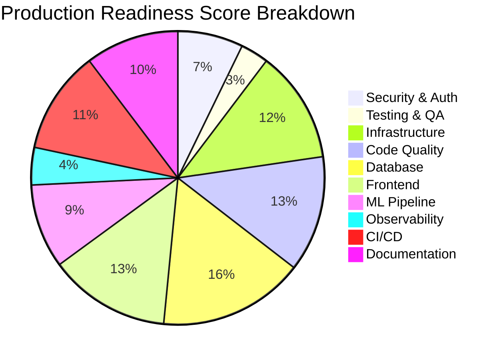
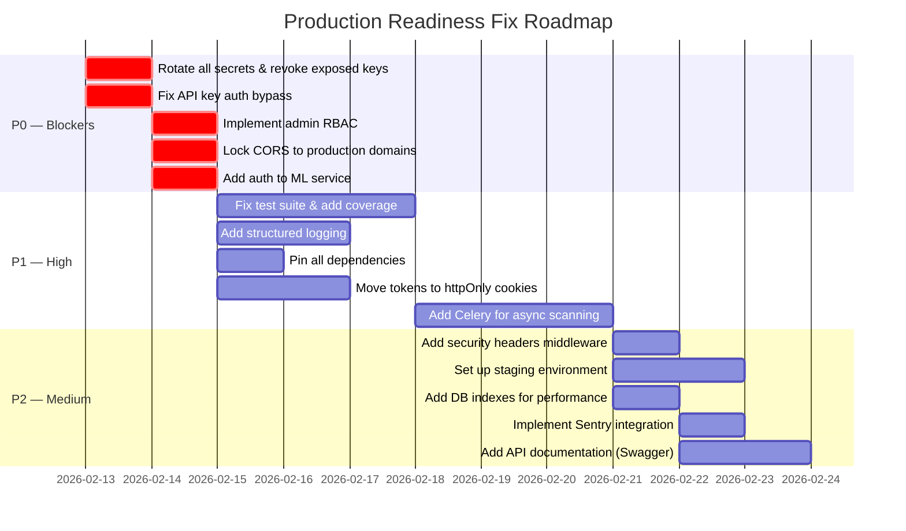

# 🛡️ ThreatForge — Production Readiness Report

**Date:** February 13, 2026
**Reviewer:** Senior Engineer (Automated Deep Audit)
**Project:** ThreatForge — AI-Powered Cybersecurity Threat Detection Platform
**Overall Verdict:** ⚠️ **NOT PRODUCTION-READY** — Critical blockers found

---

## Overall Score: 52 / 100

````carousel

<!-- slide -->
| Category | Score | Verdict |
|----------|:-----:|---------|
| 🔒 Security & Authentication | **35/100** | 🔴 CRITICAL |
| 🧪 Testing & Quality Assurance | **15/100** | 🔴 CRITICAL |
| 🏗️ Infrastructure & DevOps | **60/100** | 🟡 NEEDS WORK |
| 💻 Code Quality & Architecture | **62/100** | 🟡 NEEDS WORK |
| 🗄️ Database & Data Layer | **78/100** | 🟢 GOOD |
| 🖥️ Frontend Application | **65/100** | 🟡 NEEDS WORK |
| 🤖 ML / AI Pipeline | **45/100** | 🟠 POOR |
| 📊 Observability & Monitoring | **20/100** | 🔴 CRITICAL |
| 🚀 CI/CD & Deployment | **55/100** | 🟡 NEEDS WORK |
| 📝 Documentation & Onboarding | **50/100** | 🟡 NEEDS WORK |
````

---

## 🔒 Security & Authentication — 35/100 🔴

> [!CAUTION]
> Multiple critical security vulnerabilities must be fixed before any production deployment.

### Parameter Scores

| Parameter | Score | Finding |
|-----------|:-----:|---------|
| Secrets Management | **5/100** | 🔴 Supabase service key + DB password committed to [.env](file:///c:/Users/Admin/Desktop/ThreatForge/backend/.env) |
| CORS Policy | **15/100** | 🔴 Defaults to `*` (all origins) in production config |
| API Key Auth | **0/100** | 🔴 `TODO: Validate API key` — auth completely bypassed |
| Admin RBAC | **0/100** | 🔴 `TODO: Check user role` — no role enforcement |
| JWT Token Revocation | **30/100** | 🟠 In-memory `set()` — lost on restart, no Redis |
| Password Policy | **50/100** | 🟡 Minimum 8 chars only — no complexity requirements |
| Rate Limiting | **40/100** | 🟡 In-memory storage (`memory://`) — resets on restart |
| MFA Implementation | **75/100** | 🟢 TOTP via `pyotp` — functional but secret stored plaintext |
| Input Validation | **40/100** | 🟡 Basic email/password checks; no Zod/schema validation on backend |
| File Upload Security | **55/100** | 🟡 Extension whitelist + `secure_filename` but no AV scan |
| Error Exposure | **45/100** | 🟡 Raw exception [str(e)](file:///c:/Users/Admin/Desktop/ThreatForge/backend/app/services/file_analyzer.py#144-204) leaked to client in many endpoints |
| Session Management | **60/100** | 🟡 Sessions tracked in DB but no forced expiry cleanup |
| HTTPS Enforcement | **30/100** | 🟠 No `Strict-Transport-Security` or HTTPS redirect |
| CSP / Security Headers | **10/100** | 🔴 No Content-Security-Policy, X-Frame-Options, etc. |

### Critical Findings

**1. Hardcoded Secrets in Repository** — [.env](file:///c:/Users/Admin/Desktop/ThreatForge/backend/.env)
```
SECRET_KEY=generate-a-random-secret-key-here          ← placeholder, not rotated
JWT_SECRET_KEY=generate-another-random-key-here        ← placeholder
DATABASE_URL=postgresql+psycopg://postgres:Krishna...  ← REAL password committed
SUPABASE_SERVICE_KEY=eyJhbGciOiJIUzI1NiIs...          ← REAL service key committed
```
> The Supabase service role key grants **full admin access** to the entire database, bypassing all RLS. This is the single most dangerous finding.

**2. API Key Auth Completely Unimplemented** — [auth_required.py](file:///c:/Users/Admin/Desktop/ThreatForge/backend/app/middleware/auth_required.py#L12-L15)
```python
api_key = request.headers.get('X-API-Key')
if api_key:
    # TODO: Validate API key
    pass     # ← ANY X-API-Key header bypasses JWT auth entirely
```

**3. Admin Role Check Stub** — [auth_required.py](file:///c:/Users/Admin/Desktop/ThreatForge/backend/app/middleware/auth_required.py#L27-L35)
```python
def admin_required(fn):
    verify_jwt_in_request()
    identity = get_jwt_identity()
    # TODO: Check user role   ← Any user can access admin routes
    return fn(*args, **kwargs)
```

**4. CORS Allows All Origins** — [config.py](file:///c:/Users/Admin/Desktop/ThreatForge/backend/app/config.py#L16)
```python
CORS_ORIGINS = os.environ.get('CORS_ORIGINS', '*').split(',')
```

**5. MFA Secret Stored as Plaintext** — [auth.py](file:///c:/Users/Admin/Desktop/ThreatForge/backend/app/api/auth.py#L311)
```python
supabase.table('profiles').update({'mfa_secret': secret}).eq('id', user_id).execute()
```
The TOTP secret is stored unencrypted in the `profiles` table. Anyone with DB access can clone authenticator tokens.

---

## 🧪 Testing & Quality Assurance — 15/100 🔴

> [!CAUTION]
> Test coverage is virtually nonexistent. The test suite cannot even run.

### Parameter Scores

| Parameter | Score | Finding |
|-----------|:-----:|---------|
| Test Coverage | **5/100** | 🔴 Only 4 trivial test functions across 5 files |
| Test Suite Runnable | **0/100** | 🔴 [conftest.py](file:///c:/Users/Admin/Desktop/ThreatForge/backend/tests/conftest.py) imports [db](file:///c:/Users/Admin/Desktop/ThreatForge/backend/tests/conftest.py#24-32) from `extensions` — doesn't exist |
| Unit Tests | **10/100** | 🔴 No service, model, or utility unit tests |
| Integration Tests | **5/100** | 🔴 Auth tests don't mock Supabase — require live connection |
| E2E / Browser Tests | **0/100** | 🔴 None exist |
| Frontend Tests | **0/100** | 🔴 No React component or hook tests |
| ML Service Tests | **0/100** | 🔴 Zero tests for ML service |
| Load / Stress Testing | **0/100** | 🔴 None |
| Security Testing (SAST/DAST) | **0/100** | 🔴 No security scanning in CI |
| Regression Testing | **0/100** | 🔴 No strategy |

### Critical Findings

**1. Test Suite is Broken** — [conftest.py](file:///c:/Users/Admin/Desktop/ThreatForge/backend/tests/conftest.py#L4)
```python
from app.extensions import db as _db  # ← 'db' does not exist in extensions.py
```
[extensions.py](file:///c:/Users/Admin/Desktop/ThreatForge/backend/app/extensions.py) only exports `jwt`, `limiter`, `socketio`, and `revoked_tokens`. This means **`pytest` crashes immediately** on import.

**2. Only 4 Test Functions Exist** — Total test LoC: ~50 lines
- [test_auth.py](file:///c:/Users/Admin/Desktop/ThreatForge/backend/tests/test_auth.py) — 2 shallow tests (signup, login) that require a live Supabase connection
- [test_scans.py](file:///c:/Users/Admin/Desktop/ThreatForge/backend/tests/test_scans.py) — 2 tests checking 401 for unauthenticated access
- [test_rules.py](file:///c:/Users/Admin/Desktop/ThreatForge/backend/tests/test_rules.py) — 1 test (6 lines)
- [test_yara_engine.py](file:///c:/Users/Admin/Desktop/ThreatForge/backend/tests/test_yara_engine.py) — 1 test (9 lines)

**3. No Frontend Tests at All** — No `__tests__`, no `*.test.tsx`, no Jest/Vitest config

**4. No ML Service Tests** — The ML service has zero tests for `/predict`, `/analyze/stego`, or `/analyze/network`

---

## 🏗️ Infrastructure & DevOps — 60/100 🟡

### Parameter Scores

| Parameter | Score | Finding |
|-----------|:-----:|---------|
| Docker Compose | **75/100** | 🟢 All 4 services defined correctly |
| Backend Dockerfile | **55/100** | 🟡 Runs as root, Gunicorn config issues |
| Frontend Dockerfile | **70/100** | 🟢 Multi-stage build, standalone output |
| ML Dockerfile | **50/100** | 🟡 Python 3.9 (inconsistent), runs as root |
| Environment Config | **40/100** | 🟡 No [.env](file:///c:/Users/Admin/Desktop/ThreatForge/backend/.env) validation, no config documentation |
| Health Checks | **60/100** | 🟡 Backend & ML have `/health`, no Docker healthchecks |
| Scaling Strategy | **35/100** | 🟠 Single-worker Gunicorn, synchronous scans |
| Backup / DR | **0/100** | 🔴 No backup strategy documented |
| Infrastructure as Code | **50/100** | 🟡 Docker Compose only, no Terraform/Pulumi |
| SSL / TLS | **70/100** | 🟢 Handled by Vercel/Railway (platform-managed) |

### Key Findings

**1. Gunicorn Misconfigured** — [Dockerfile](file:///c:/Users/Admin/Desktop/ThreatForge/backend/Dockerfile#L23)
```dockerfile
CMD ["gunicorn", "--worker-class", "eventlet", "-w", "1", "app:create_app()", "--bind", "0.0.0.0:5000"]
```
- Only **1 worker** — a single long-running scan blocks all users
- `eventlet` worker class but `eventlet` is not in [requirements.txt](file:///c:/Users/Admin/Desktop/ThreatForge/backend/requirements.txt)
- `app:create_app()` syntax may fail — usually needs `run:app` or WSGI callable

**2. Backend Runs as Root** — Neither the backend nor ML Dockerfiles create a non-root user

**3. Python Version Mismatch** — Backend uses Python 3.11, ML service uses Python 3.9

**4. No Docker Healthchecks** — [docker-compose.yml](file:///c:/Users/Admin/Desktop/ThreatForge/docker-compose.yml) has no `healthcheck` directives

**5. Synchronous Scan Processing** — Scans run inline in the HTTP request handler. A 50MB file analysis can take 30+ seconds, blocking the single Gunicorn worker.

---

## 💻 Code Quality & Architecture — 62/100 🟡

### Parameter Scores

| Parameter | Score | Finding |
|-----------|:-----:|---------|
| Code Organization | **75/100** | 🟢 Clean module structure with blueprints |
| Separation of Concerns | **70/100** | 🟢 Services layer separate from API routes |
| Error Handling | **40/100** | 🟡 Bare `except Exception`, inconsistent patterns |
| Type Safety | **55/100** | 🟡 TypeScript on frontend, no typing on backend |
| Dependency Management | **45/100** | 🟡 Unpinned versions in [requirements.txt](file:///c:/Users/Admin/Desktop/ThreatForge/backend/requirements.txt) |
| Code Duplication | **60/100** | 🟡 Some repeated patterns (user lookup, response formatting) |
| Technical Debt Markers | **25/100** | 🟠 Multiple `TODO` and `Phase 4` placeholders |
| API Design | **70/100** | 🟢 RESTful patterns, pagination, filtering |
| Logging Practice | **30/100** | 🟠 Only `print()` statements, no structured logging |
| Dead Code | **50/100** | 🟡 Unused imports, placeholder endpoints |

### Key Findings

**1. Extensive TODO/Placeholder Debt** — Found across the codebase:
- [auth_required.py](file:///c:/Users/Admin/Desktop/ThreatForge/backend/app/middleware/auth_required.py): `# TODO: Validate API key` + `# TODO: Check user role`
- [scans.py](file:///c:/Users/Admin/Desktop/ThreatForge/backend/app/api/scans.py) line 461: `PDF export will be available in Phase 4`
- [config.py](file:///c:/Users/Admin/Desktop/ThreatForge/backend/app/config.py) line 33: `# Celery (Phase 4)` — Celery never implemented
- [scanner.py](file:///c:/Users/Admin/Desktop/ThreatForge/backend/app/services/scanner.py) line 194: File handle leaked in stego analysis (`open()` without `with`)

**2. `print()` Instead of Logging** — Every error/debug output uses `print()`:
```python
print(f"Supabase Error (get_user_by_email): {e}")
print(f"Session tracking error: {e}")
print(f"Notification error (non-fatal): {notif_err}")
```
No `logging` module, no structured output, impossible to filter/search in production.

**3. Unpinned Python Dependencies** — [requirements.txt](file:///c:/Users/Admin/Desktop/ThreatForge/backend/requirements.txt)
```
flask           ← no version
flask-cors      ← no version
flask-jwt-extended ← no version
```
Only `supabase==2.11.0` is pinned. Builds are not reproducible.

**4. File Handle Leak** — [scanner.py](file:///c:/Users/Admin/Desktop/ThreatForge/backend/app/services/scanner.py#L194)
```python
files={'file': (os.path.basename(file_path), open(file_path, 'rb'))}
# ↑ opened but never closed
```

---

## 🗄️ Database & Data Layer — 78/100 🟢

### Parameter Scores

| Parameter | Score | Finding |
|-----------|:-----:|---------|
| Schema Design | **85/100** | 🟢 Well-normalized, 14 tables, proper FKs |
| Row Level Security | **90/100** | 🟢 RLS enabled on all tables with user-scoped policies |
| Data Types & Constraints | **80/100** | 🟢 CHECK constraints on enums, UUIDs, JSONB |
| Indexing | **40/100** | 🟡 No explicit indexes beyond PKs and UNIQUEs |
| Migration Strategy | **30/100** | 🟠 Single monolithic SQL file, no migration tool |
| Cascade Deletes | **85/100** | 🟢 Proper `ON DELETE CASCADE` on child tables |
| Trigger / Functions | **80/100** | 🟢 Auto-profile creation trigger works correctly |
| Data Validation | **70/100** | 🟢 CHECK constraints on status/role/severity enums |
| Backup/Recovery | **50/100** | 🟡 Supabase managed — but no documented strategy |
| Connection Pooling | **60/100** | 🟡 Supabase client handles this; no explicit config |

### Key Findings

**1. Missing Performance Indexes** — No indexes on frequently queried columns:
```sql
-- These columns are queried via .eq() in every API call but lack indexes:
-- scans.user_id (every scan list query)
-- scans.status (filtered queries)
-- scans.created_at (ORDER BY in every list)
-- findings.scan_id (joined in scan details)
-- activity_logs.user_id + created_at (audit log queries)
-- user_sessions.user_id + is_revoked (session lookups)
```

**2. No Migration Framework** — Schema is a single [supabase-setup.sql](file:///c:/Users/Admin/Desktop/ThreatForge/backend/supabase-setup.sql) file that starts with `DROP TABLE IF EXISTS ... CASCADE`. Running it again wipes all data. No Alembic, Flyway, or versioned migrations.

**3. Shared Reports Table Exists but Unused** — `shared_reports` is defined in SQL but no backend API routes reference it.

---

## 🖥️ Frontend Application — 65/100 🟡

### Parameter Scores

| Parameter | Score | Finding |
|-----------|:-----:|---------|
| Framework / Stack | **85/100** | 🟢 Next.js 16, React 19, TypeScript |
| Auth State Management | **60/100** | 🟡 Tokens in `localStorage` — XSS vulnerable |
| API Client Design | **70/100** | 🟢 Centralized [api.ts](file:///c:/Users/Admin/Desktop/ThreatForge/frontend/src/lib/api.ts) with auto-401 redirect |
| Error Handling (UI) | **50/100** | 🟡 Generic error catching, no error boundaries |
| Performance | **65/100** | 🟡 React Compiler enabled, but external font loading |
| Accessibility | **40/100** | 🟡 Material Icons via CDN, no a11y audit |
| SEO | **55/100** | 🟡 Basic metadata, missing OG tags, robots.txt |
| State Management | **65/100** | 🟡 Context API adequate for current scale |
| Bundle Optimization | **60/100** | 🟡 Large dependencies (Chart.js, Leaflet, jsPDF) |
| Responsive Design | **70/100** | 🟢 Bootstrap + Tailwind, generally responsive |

### Key Findings

**1. JWT Tokens Stored in localStorage** — [AuthContext.tsx](file:///c:/Users/Admin/Desktop/ThreatForge/frontend/src/lib/AuthContext.tsx#L100-L102)
```typescript
localStorage.setItem('access_token', data.access_token);
localStorage.setItem('refresh_token', data.refresh_token);
localStorage.setItem('user', JSON.stringify(data.user));
```
`localStorage` is accessible to any XSS payload. Industry standard is `httpOnly` cookies.

**2. Token Refresh Not Implemented** — The [refresh](file:///c:/Users/Admin/Desktop/ThreatForge/backend/app/api/auth.py#272-279) endpoint exists on the backend, but the frontend never calls it. Expired tokens cause a hard redirect to `/login`.

**3. External Fonts Loaded via `<link>` Tags** — [layout.tsx](file:///c:/Users/Admin/Desktop/ThreatForge/frontend/src/app/layout.tsx#L23-L34)
Three external font requests on every page load (Google Fonts + Material Icons + Material Symbols). This:
- Creates render-blocking requests
- Adds external dependency
- Should use `next/font` (only Inter uses it, others don't)

**4. `suppressHydrationWarning` on `<html>`** — Suggests unresolved SSR hydration mismatches.

---

## 🤖 ML / AI Pipeline — 45/100 🟠

### Parameter Scores

| Parameter | Score | Finding |
|-----------|:-----:|---------|
| Model Quality | **20/100** | 🔴 No actual ML model — purely heuristic scoring |
| Inference Architecture | **55/100** | 🟡 FastAPI serves endpoints correctly |
| Model Versioning | **10/100** | 🔴 No model registry, no versioning |
| Feature Engineering | **60/100** | 🟢 PE analysis, entropy, string extraction — solid |
| Steganography Detection | **55/100** | 🟡 Statistical LSB/chi-square — reasonable |
| Network Analysis | **50/100** | 🟡 Basic PCAP parsing, heuristic IOC matching |
| Error Handling | **50/100** | 🟡 Graceful degradation with fallback returns |
| Performance | **40/100** | 🟡 Reads entire file into memory; no streaming |
| Security of ML Service | **15/100** | 🔴 No authentication on ML endpoints |
| Unused Dependencies | **30/100** | 🟠 `torch` + `transformers` in requirements — never used |

### Critical Findings

**1. "ML" is Not Machine Learning — It's Heuristic Scoring** — [app.py](file:///c:/Users/Admin/Desktop/ThreatForge/ml-service/app.py#L84-L109)
```python
# 2. Heuristic Scoring
score = 0
if entropy > 7.0:
    score += 50
if has_suspicious_sections:
    score += 30
if suspicious_imports:
    score += min(len(suspicious_imports) * 5, 20)
```
There is **no trained model**, **no neural network**, **no scikit-learn classifier**. The `/predict` endpoint uses hardcoded if-else rules. The project claims "ML-powered" detection, which is misleading.

**2. Massive Unused Dependencies** — [requirements.txt](file:///c:/Users/Admin/Desktop/ThreatForge/backend/requirements.txt) includes:
```
torch==2.1.2          ← ~2GB download, NEVER imported
transformers==4.36.2  ← NEVER imported
scikit-learn==1.3.2   ← NEVER imported
```
These bloat the Docker image by **~3GB** without being used anywhere in the code.

**3. No Auth on ML Service** — The ML FastAPI application has **zero authentication**. Anyone who discovers the URL can submit files for analysis, consuming compute resources.

**4. Entire File Read Into Memory** — [app.py](file:///c:/Users/Admin/Desktop/ThreatForge/ml-service/app.py#L45)
```python
content = await file.read()  # ← reads entire 50MB file into RAM
```
With the 50MB upload limit, a single request can allocate 50MB+ of memory. No streaming or chunked processing.

---

## 📊 Observability & Monitoring — 20/100 🔴

> [!CAUTION]
> Zero monitoring infrastructure. Impossible to detect or diagnose production issues.

### Parameter Scores

| Parameter | Score | Finding |
|-----------|:-----:|---------|
| Structured Logging | **0/100** | 🔴 Only `print()` statements |
| Application Monitoring (APM) | **0/100** | 🔴 Sentry DSN config exists but SDK not installed |
| Metrics Collection | **0/100** | 🔴 No Prometheus/StatsD/DataDog |
| Alerting | **0/100** | 🔴 No alerts configured |
| Error Tracking | **10/100** | 🔴 `SENTRY_DSN` env var defined but unused |
| Request Tracing | **0/100** | 🔴 No distributed tracing |
| Health Checks | **65/100** | 🟡 Backend + ML have `/health` endpoints |
| Uptime Monitoring | **0/100** | 🔴 No external uptime checks |
| Log Aggregation | **0/100** | 🔴 No ELK/Loki/CloudWatch |
| Performance Profiling | **0/100** | 🔴 No profiling tools |

### Critical Findings

**1. Sentry Configured but Never Initialized** — [config.py](file:///c:/Users/Admin/Desktop/ThreatForge/backend/app/config.py#L38)
```python
SENTRY_DSN = os.environ.get('SENTRY_DSN', '')
```
The config reads the DSN, but `sentry-sdk` is not in [requirements.txt](file:///c:/Users/Admin/Desktop/ThreatForge/backend/requirements.txt) and `sentry_sdk.init()` is never called.

**2. All Logging is `print()`** — In production on Railway/HF Spaces, `print()` output is ephemeral and unstructured. No log levels, no JSON format, no correlation IDs.

---

## 🚀 CI/CD & Deployment — 55/100 🟡

### Parameter Scores

| Parameter | Score | Finding |
|-----------|:-----:|---------|
| CI Pipeline | **65/100** | 🟡 Lint + build + test (but tests are broken) |
| CD Pipeline | **60/100** | 🟡 Auto-deploy to Vercel/Railway/HF on `main` push |
| Environment Separation | **30/100** | 🟠 No staging environment |
| Deployment Verification | **10/100** | 🔴 No smoke tests post-deploy |
| Rollback Strategy | **20/100** | 🔴 No documented rollback procedure |
| Secrets in CI | **70/100** | 🟢 GitHub Secrets used for tokens |
| Branch Protection | **50/100** | 🟡 CI runs on PR, but unclear if required to pass |
| Dependency Caching | **75/100** | 🟢 npm + pip caching in CI |
| Artifact Storage | **40/100** | 🟡 No build artifacts saved |
| Multi-env Deploy | **30/100** | 🟠 Deploys straight to production |

### Key Findings

**1. CI Tests Will Always Fail** — The `test-backend` job runs `pytest tests/` but [conftest.py](file:///c:/Users/Admin/Desktop/ThreatForge/backend/tests/conftest.py) has a broken import (`from app.extensions import db` — doesn't exist). The CI pipeline is broken.

**2. No Staging Environment** — Both CI and CD go directly to production (`--prod` flag on Vercel). No preview deployments for PRs.

**3. ML Deploy Strategy is Risky** — [deploy.yml](file:///c:/Users/Admin/Desktop/ThreatForge/.github/workflows/deploy.yml#L41-L49)
```yaml
git push space main --force
```
Force-pushing to HF Spaces on every `main` push with no verification or rollback.

---

## 📝 Documentation & Onboarding — 50/100 🟡

### Parameter Scores

| Parameter | Score | Finding |
|-----------|:-----:|---------|
| README Quality | **65/100** | 🟡 Good structure but light on details |
| API Documentation | **20/100** | 🟠 No Swagger/OpenAPI spec |
| Architecture Docs | **50/100** | 🟡 README table covers basics |
| Setup Guide | **60/100** | 🟡 Docker + manual instructions exist |
| Env Var Documentation | **55/100** | 🟡 [.env.example](file:///c:/Users/Admin/Desktop/ThreatForge/.env.example) exists but missing many vars |
| Contributing Guide | **0/100** | 🔴 None |
| Changelog | **0/100** | 🔴 None |
| Code Comments | **55/100** | 🟡 Docstrings on major functions |
| ADRs | **0/100** | 🔴 No architectural decision records |
| Runbook / Incident Response | **0/100** | 🔴 None |

### Key Findings

**1. No API Documentation** — No Swagger UI, no OpenAPI spec, no Postman collection. The ML service uses FastAPI which auto-generates `/docs` — but the backend (Flask) has nothing.

**2. [.env.example](file:///c:/Users/Admin/Desktop/ThreatForge/.env.example) Missing Variables** — Missing: `RESEND_API_KEY`, `VAPID_PUBLIC_KEY`, `VAPID_PRIVATE_KEY`, `VAPID_CLAIMS_EMAIL`, `FLASK_CONFIG`

---

## 🚨 Production Blockers Summary

The following **must** be resolved before any production deployment:

| # | Blocker | Severity | Category |
|---|---------|----------|----------|
| 1 | Supabase service key committed to git | 🔴 CRITICAL | Security |
| 2 | API Key auth bypass (`TODO` in middleware) | 🔴 CRITICAL | Security |
| 3 | Admin role check unimplemented | 🔴 CRITICAL | Security |
| 4 | CORS defaults to `*` | 🔴 HIGH | Security |
| 5 | Test suite broken (cannot run) | 🔴 CRITICAL | Testing |
| 6 | Zero monitoring/observability | 🔴 HIGH | Ops |
| 7 | ML service has no authentication | 🔴 HIGH | Security |
| 8 | JWT tokens stored in localStorage | 🟡 HIGH | Security |
| 9 | Synchronous scan processing blocks server | 🟡 HIGH | Scalability |
| 10 | `print()` only logging | 🟡 HIGH | Ops |
| 11 | Unpinned Python dependencies | 🟡 MEDIUM | Reliability |
| 12 | No staging environment | 🟡 MEDIUM | DevOps |

---

## ✅ What's Done Well

Despite the blockers, several aspects are production-worthy:

- **Database schema** is well-designed with proper RLS policies on all 14 tables
- **Supabase auth integration** with profile auto-creation trigger
- **Code architecture** follows clean separation (blueprints, services, models)
- **Docker setup** covers all 3 services with multi-stage frontend build
- **File analysis pipeline** (entropy, PE headers, strings, YARA) is thorough
- **Notification system** supports in-app, email (Resend), and push (Web Push API)
- **MFA/TOTP** enrollment and verification flow is complete
- **Session management** with device tracking and selective revocation
- **Rate limiting** on auth endpoints (5/min signup, 10/min login)
- **CI/CD pipelines** exist for all three services with proper caching

---

## 📋 Recommended Fix Priority


